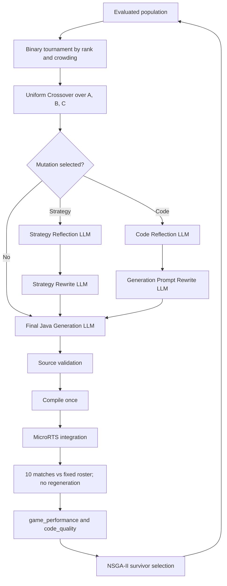

# Architecture overview

## Contract source

The normative source is [`../eagle_architecture_spec.md`](../eagle_architecture_spec.md), especially sections 1, 4, 19, and 29. This file routes implementation work; it does not replace the specification.

## System boundary

EAGLE evolves a three-component genotype that conditions generation of one complete Java MicroRTS agent. The generated source is an offline phenotype: it is validated, compiled once, and executed without an LLM during matches.

In scope:

- evolutionary prompt search;
- `Strategy Prompt`, latest evaluated `Previous Code`, and `Code Generation Prompt`;
- Uniform Crossover and two-stage Strategy/Code Mutation;
- full-file `CandidateAgent.java` generation;
- exactly 10 matches against the fixed Evolution Evaluation roster;
- `game_performance` and `code_quality` as the only NSGA-II objectives;
- failure-aware fitness, lineage, artifacts, and timing.

Out of scope:

- GEPA, ACE, MIPRO, CAPO, or general context optimization;
- surrogate-oriented research paths;
- runtime LLM-controlled agents;
- patches, diffs, fixed method bodies, or split controller/behavior generation.

## Pipeline

## Boundary invariants

- Variation changes genotype components, never Java source directly.
- Every offspring reaches final Java generation after crossover and optional mutation.
- `previous_code` inheritance uses the parent Java most recently generated and evaluated.
- Source validation enforces the external runtime/security contract, not a fixed internal coding style.
- One accepted Java source and one compiled class set serve all 10 matches.
- Failed candidates stay in the population with `game_performance = -1000`; `code_quality` records their progress through the pipeline.
- `strategy_alignment_score` is a component of successful `code_quality`, not a third optimizer objective.
- Every LLM interaction, retry, stage result, lineage decision, and duration is reconstructable from artifacts.

## Responsibility routing

- Candidate state: [`candidate_model.md`](candidate_model.md)
- Selection and generation lifecycle: [`evolutionary_flow.md`](evolutionary_flow.md)
- Crossover: [`crossover.md`](crossover.md)
- Mutation: [`mutation.md`](mutation.md)
- Java production boundary: [`java_generation.md`](java_generation.md)
- Evaluation and objectives: [`../evaluation/evaluation_pipeline.md`](../evaluation/evaluation_pipeline.md)
- Persistence: [`../artifacts/artifact_schema.md`](../artifacts/artifact_schema.md)
- Current discrepancies: [`../implementation/architecture_gaps.md`](../implementation/architecture_gaps.md)

## Post-evolution boundary

After a run completes, the optional champion Final Test selects already evaluated canonical Java from evolution artifacts and compares it with pinned TMA, Mayari, and COAC agents. This branch is terminal analysis: it has no path back to fitness, NSGA-II, crossover, mutation, generation, or any LLM.

Evolution Evaluation uses pinned TMA, Mayari, COAC, five vendored basic agents, and two historical-self agents for fitness. Final Test remains a separate post-run protocol; see [`../evaluation/final_test.md`](../evaluation/final_test.md) for selectors, both-side schedule, artifact tree, and reproducibility contract.
