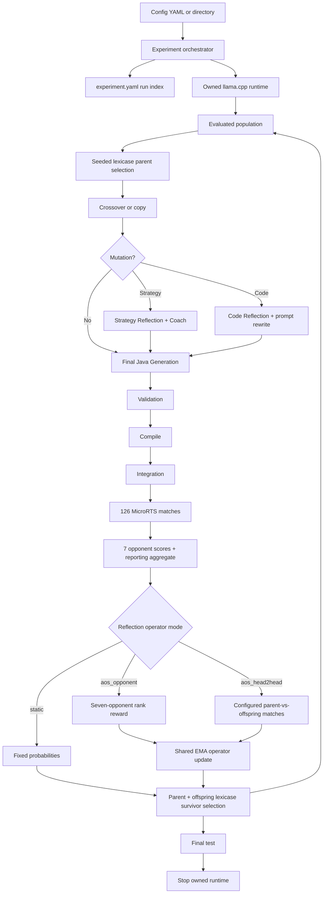

# Architecture overview

EAGLE evolves a two-component prompt genotype that generates one complete
Java MicroRTS agent. The active evolutionary contract is documented in
[`../opponent-wise-lexicase.md`](../opponent-wise-lexicase.md).

## System boundary

In scope:

- a game-playing policy prompt and a policy-to-Java code-generation prompt;
- crossover, Strategy Reflection, Code Reflection, and final Java generation;
- validation, compilation, integration, and the fixed seven-opponent evaluation;
- opponent-wise fitness, seeded lexicase selection, artifacts, and analysis.
- one resolved experiment config and one owned llama.cpp lifecycle.

Code quality, compiler output, function coverage, alignment, and match
telemetry remain diagnostics. They are not additional evolutionary objectives.

## Pipeline

```mermaid
flowchart TD
    CFG["Config YAML or directory"] --> L["Experiment orchestrator"]
    L --> RI["experiment.yaml run index"]
    L --> RT["Owned llama.cpp runtime"]
    RT --> P
    P["Evaluated population"] --> S["Seeded lexicase parent selection"]
    S --> X["Crossover or copy"]
    X --> M{"Mutation?"}
    M -->|Strategy| SR["Strategy Reflection + Coach"]
    M -->|Code| CR["Code Reflection + prompt rewrite"]
    M -->|No| G["Final Java Generation"]
    SR --> G
    CR --> G
    G --> V["Validation"] --> C["Compile"] --> I["Integration"]
    I --> E["126 MicroRTS matches"]
    E --> O["7 opponent scores + reporting aggregate"]
    O --> R{"Reflection operator mode"}
    R -->|static| F["Fixed probabilities"]
    R -->|aos_opponent| Q["Seven-opponent rank reward"]
    R -->|aos_head2head| H["Configured parent-vs-offspring matches"]
    Q --> A["Shared EMA operator update"]
    H --> A
    F --> N["Parent + offspring lexicase survivor selection"]
    A --> N --> P
    N --> FT["Final test"]
    FT --> CL["Stop owned runtime"]
```

## Invariants

- One generated source and one compiled class directory serve all 126 matches.
- Fitness is the seven-case mapping in `Candidate.fitness_objectives`.
- The reporting aggregate uses the fixed `1/2` weights and denominator `11.0`,
  but does not participate in lexicase case filtering.
- Failed candidates remain available to selection with `-1000.0` case scores.
- Survivor selection is seeded lexicase without replacement over the joint
  parent-plus-offspring (`mu_plus_lambda`) pool.
- `static` uses fixed probabilities; `aos_opponent` reuses seven-opponent rank
  changes; `aos_head2head` uses a separate direct matrix. Neither reward path
  creates another objective or changes normal selection.
- No previous-generation EAGLE opponent or dynamic EAGLE weight exists in the
  active path.

See [`evolutionary_flow.md`](evolutionary_flow.md),
[`../evaluation/evaluation_pipeline.md`](../evaluation/evaluation_pipeline.md),
and [`../implementation/current_status.md`](../implementation/current_status.md)
for ownership and artifact details.
