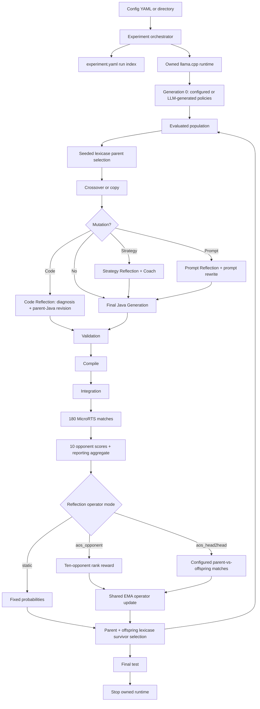

# Architecture overview

EAGLE evolves one complete Java MicroRTS agent under one of two explicit
candidate modes. The default genotype contains two prompt components; the
opt-in inherited mode adds complete Java as a third component. The active evolutionary contract is documented in
[`../opponent-wise-lexicase.md`](../opponent-wise-lexicase.md).

## System boundary

In scope:

- a game-playing policy prompt, a policy-to-Java code-generation prompt, and
  optionally inherited Java;
- crossover, Strategy Reflection, Prompt Reflection, Code Reflection, and Java
  generation;
- validation, compilation, integration, and the fixed ten-opponent evaluation;
- opponent-wise fitness, seeded lexicase selection, artifacts, and analysis.
- one resolved experiment config and one owned llama.cpp lifecycle.

Code quality, compiler output, function coverage, alignment, and match
telemetry remain diagnostics. They are not additional evolutionary objectives.

## Pipeline

```mermaid
flowchart TD
    CFG["Config YAML or directory"] --> L["Experiment orchestrator"]
    L --> RI["experiment.yaml run index"]
    L --> RT["Owned llama.cpp runtime"]
    RT --> Z["Generation 0: configured or LLM-generated policies"]
    Z --> P
    P["Evaluated population"] --> S["Seeded lexicase parent selection"]
    S --> X["Crossover or copy"]
    X --> M{"Mutation?"}
    M -->|Strategy| SR["Strategy Reflection + Coach"]
    M -->|Prompt| PR["Prompt Reflection + prompt rewrite"]
    M -->|Code| CR["Code Reflection: diagnosis + parent-Java revision"]
    M -->|No| G["Final Java Generation"]
    SR --> G
    PR --> G
    CR --> V
    G --> V["Validation"] --> C["Compile"] --> I["Integration"]
    I --> E["180 MicroRTS matches"]
    E --> O["10 opponent scores + reporting aggregate"]
    O --> R{"Reflection operator mode"}
    R -->|static| F["Fixed probabilities"]
    R -->|aos_opponent| Q["Ten-opponent rank reward"]
    R -->|aos_head2head| H["Configured parent-vs-offspring matches"]
    Q --> A["Shared EMA operator update"]
    H --> A
    F --> N["Parent + offspring lexicase survivor selection"]
    A --> N --> P
    N --> FT["Final test"]
    FT --> CL["Stop owned runtime"]
```

## Invariants

- One generated source and one compiled class directory serve all 180 matches.
- `inherited_genotype` generation zero replicates one seed policy to the fixed
  population and performs one independent Generator call per individual under
  `configured_seeds` initialization.
- `llm_generated_policies` keeps one configured policy, fills the other slots
  with independent policy-only LLM calls, and evaluates the same fixed Java seed
  for every generation-zero candidate without invoking the Java Generator.
- Policy generation and strategy-facing reflection/rewrite roles share one
  immutable closed-world MicroRTS gameplay contract; it permits strategy
  diversity while grounding every rule in legal entities, actions, and
  observable state.
- Prompt Reflection audits policy/Java alignment and changes only the reusable
  generation prompt. Code Reflection first records a structured diagnosis,
  then directly corrects the selected parent Java from that conclusion and the
  immutable gameplay/API/scaffold context; it bypasses final generation.
- In inherited mode crossover selects policy, generation prompt, and Java
  parents independently; generated child Java becomes the inheritable Java
  component available to the next generation.
- Fitness is the ten-case mapping in `Candidate.fitness_objectives`.
- The reporting aggregate uses fixed `0.5/1/2` weights and denominator `12.5`,
  but does not participate in lexicase case filtering.
- Failed candidates remain available to selection with `-1000.0` case scores.
- Survivor selection is seeded lexicase without replacement over the joint
  parent-plus-offspring (`mu_plus_lambda`) pool.
- `static` uses fixed probabilities; `aos_opponent` reuses ten-opponent rank
  changes; `aos_head2head` uses a separate direct matrix. Neither reward path
  creates another objective or changes normal selection.
- No previous-generation EAGLE opponent or dynamic EAGLE weight exists in the
  active path.

See [`evolutionary_flow.md`](evolutionary_flow.md),
[`../evaluation/evaluation_pipeline.md`](../evaluation/evaluation_pipeline.md),
and [`../implementation/current_status.md`](../implementation/current_status.md)
for ownership and artifact details.
