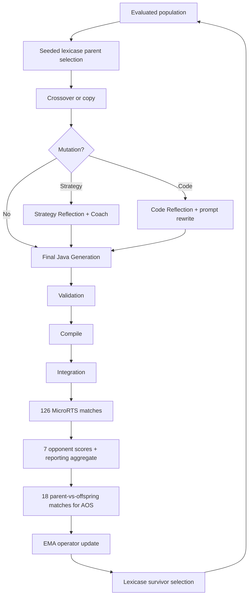

# Architecture overview

EAGLE evolves a three-component prompt genotype that generates one complete
Java MicroRTS agent. The active evolutionary contract is documented in
[`../opponent-wise-lexicase.md`](../opponent-wise-lexicase.md).

## System boundary

In scope:

- strategy prompt, previous/generated code context, and code-generation prompt;
- crossover, Strategy Reflection, Code Reflection, and final Java generation;
- validation, compilation, integration, and the fixed seven-opponent evaluation;
- opponent-wise fitness, seeded lexicase selection, artifacts, and analysis.

Code quality, compiler output, function coverage, alignment, and match
telemetry remain diagnostics. They are not additional evolutionary objectives.

## Pipeline

```mermaid
flowchart TD
    P["Evaluated population"] --> S["Seeded lexicase parent selection"]
    S --> X["Crossover or copy"]
    X --> M{"Mutation?"}
    M -->|Strategy| SR["Strategy Reflection + Coach"]
    M -->|Code| CR["Code Reflection + prompt rewrite"]
    M -->|No| G["Final Java Generation"]
    SR --> G
    CR --> G
    G --> V["Validation"] --> C["Compile"] --> I["Integration"]
    I --> E["126 MicroRTS matches"]
    E --> O["7 opponent scores + reporting aggregate"]
    O --> H["18 parent-vs-offspring matches for AOS"]
    H --> A["EMA operator update"]
    A --> N["Lexicase survivor selection"] --> P
```

## Invariants

- One generated source and one compiled class directory serve all 126 matches.
- Fitness is the seven-case mapping in `Candidate.fitness_objectives`.
- The reporting aggregate uses the fixed `1/2` weights and denominator `11.0`,
  but does not participate in lexicase case filtering.
- Failed candidates remain available to selection with `-1000.0` case scores.
- The direct parent-vs-offspring result is AOS-only evidence; it is not an
  eighth objective and the seven opponent scores do not determine AOS reward.
- No previous-generation EAGLE opponent or dynamic EAGLE weight exists in the
  active path.

See [`evolutionary_flow.md`](evolutionary_flow.md),
[`../evaluation/evaluation_pipeline.md`](../evaluation/evaluation_pipeline.md),
and [`../implementation/current_status.md`](../implementation/current_status.md)
for ownership and artifact details.
