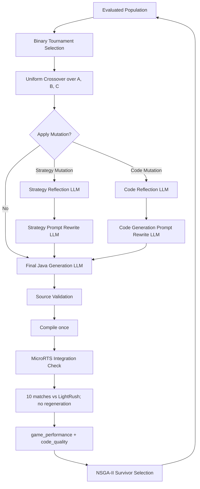

# EAGLE ?嗆?蝮質汗

> **EAGLE = Evolutionary Algorithm for Game-playing with LLM-Enabled Agents**

?遢?辣?舐策雿輻?霈€?蜇閬賬€? 
Codex 撖虫???霈€??`docs/README.md` ?????望??€銵?隞塚?  
銝?隞交?辣雿撖虫?閬靘???
EAGLE ?桀??敹璅??舫€? Evolutionary Algorithm 瞍??賢???摰 MicroRTS Java Agent ??Prompt 蝯???銝 GEPA?CE?IPRO?APO????context optimization?urrogate research嚗?銝?典??唳????LLM ??runtime agent??
## 1. 閬?瘜??辣閫

- `docs/eagle_architecture_spec.md` ?臬銝€?€擃?憡? Architecture Contract??- ?望? `architecture/`?evaluation/`?artifacts/` ?辣???潭??蝬剛風?痊隞駁???雿?敺??寡??潸?蝒€?- `implementation/current_status.md` ?芣?餈啁??撘祕??鈭?暻潦€?- `implementation/architecture_gaps.md` 閮?閬?瘜?撌桃嚗誑???潔葉撠瘙箏????柴€?- `implementation/migration_plan.md` ?芸??蝘駁?摨?銝??孵神?格??嗆???- ?祆?隞嗆鈭粹??梯???Traditional Chinese mirror嚗???Codex ?祕雿??€?
?桀?蝔?撌脩??瑕?銝??Candidate????Java file generation???Uniform Crossover???Objective ?迂??NSGA-II ?箇?嚗??迤??挾 Mutation LLM??0-match contract?迤蝣?Objective formulas?ailure-stage fitness????artifact/timing/lineage schema 蝑???蝣?implementation gaps??
## 2. Candidate嚗??典? Genotype ??Java Phenotype

瘥€?Candidate ??Genotype ???典?嚗?
| 蝚西? | 甈? | ?券€?|
| --- | --- | --- |
| `A` | Strategy Prompt | ?膩 Agent ??? MicroRTS 蝑??|
| `B` | Previous Code | Parent ?€餈?甈∪祕???€€?瘚?銝行??Evaluation ????Java source??|
| `C` | Code Generation Prompt | ?內 LLM 憒???摰?蝺刻陌?泵??MicroRTS contract ??Java file??|

?€隞?Candidate ?航”蝷箇嚗?
```text
A1 + B1 + C1
```

???典??臬?箏? Crossover???Mutation ?孵神??Genotype? Final Java Generation LLM ?Ｙ?????`CandidateAgent.java` ? Phenotype??
EAGLE 銝???

- Java patch ??diff嚗?- ?桐? method body嚗?- ?箏??剖€?function ??body map嚗?- split controller/behavior file嚗?- runtime LLM call??
### Previous Code ??啗???
?身 Parent 頛詨?荔?

```text
A1 + B1 + C1
```

Final Java Generation LLM ??銝血???Evaluation ??Java ??`B2`嚗暻澆靘?銝€隞?匱?輻? Parent state 敹??荔?

```text
A1 + B2 + C1
```

銝?蝙?刻???`B1`?Previous Code` 敹?隞?”?€餈祕?◤ validation?ompilation?ntegration?xecution ??evaluation ????Java??
## 3. End-to-End Pipeline



?€??Offspring嚗?隢??Crossover???copy嚗?????Mutation嚗敹??? Final Java Generation LLM?rossover ??Mutation 靽格? Genotype嚗???亦???靽格?€敺? Java source??
## 4. Parent Selection ??NSGA-II

Parent 雿輻 Binary Tournament Selection??頛?摨嚗?
1. Pareto rank 頛????
2. rank ?詨???crowding distance 頛????
3. 隞???冽?瘙箏???
NSGA-II ?芣?嗅???€憭批???Objective嚗?
```text
game_performance
code_quality
```

`strategy_alignment_score` ?舀??銵? `code_quality` ?????殷?銝蝚砌???Objective?仃?? Candidate 隞?? evaluated population 銝哨???failure-stage fitness 銵函內摰粥?啣銝€??畾萸€?
## 5. Uniform Crossover

Uniform Crossover 撠???Genotype components ??函??賢? Parent嚗?
```text
child.strategy_prompt   <- Parent A ??Parent B ??Strategy Prompt
child.previous_code     <- Parent A ??Parent B ?€餈?evaluated ??Generated Java
child.generation_prompt <- Parent A ??Parent B ??Code Generation Prompt
```

靘?嚗?
```text
Parent A: A1 + B1 + C1
Parent B: A2 + B2 + C2
Child:    A1 + B2 + C1
```

敹?靽? component-level provenance嚗?
- `strategy_parent_id`嚗?- `previous_code_parent_id`嚗?- `generation_prompt_parent_id`??
??甈????冽 lineage reconstruction?ebugging ??迤蝣箇? Mutation feedback???賜?rompt ???臬?詨????冽葫靘???
## 6. ?拍車 Mutation

EAGLE ?蝔?Mutation嚗trategy Mutation ??Code Mutation???Ⅱ?銝€?LLM calls嚗?
```text
1. Reflection LLM
2. Prompt Rewrite LLM
3. final Java Generation LLM
```

Reflection ?芾?鞎砍???Prompt Rewrite ?芾撓?箄◤?孵神??Prompt嚗?敺? Java Generation ??????`CandidateAgent.java`?utation 蝯?銝?湔??Java??
### 6.1 Strategy Mutation

Strategy Mutation ?芯耨??`Strategy Prompt`嚗???`Previous Code` ??`Code Generation Prompt`??
Strategy Reflection LLM 霈€???Strategy?arent Generated Java?? LightRush ????10-match evidence???渡??€in/Draw/Loss?esource/material/survival/round-state ??behavior summary嚗撓??`strategy_reflection`??
Strategy Prompt Rewrite LLM 霈€??憪?Strategy?eflection?arent Java ??Game Evaluation summary嚗頛詨?啁? Strategy Prompt??
摰 state transition嚗?
```text
??頛詨嚗?           A1 + B1 + C1
Parent ??銝西?隡?B2嚗1 + B2 + C1
Strategy Reflection嚗?R_strategy
Strategy Rewrite嚗?   A2 + B2 + C1
Final Java Generation ?Ｙ? B3
Child ?€蝯???       A2 + B3 + C1
```

?迨雿輻??瘙? `A1 + B1 + C1` ??`A2 + B2 + C1`嚗???閫??? Parent ?€??evaluated Java ?湔??`B2`嚗???Strategy Rewrite ??`A1` ?寞? `A2`嚗?敺?閬???Child ? Java `B3`??
### 6.2 Code Mutation

Code Mutation ?芯耨??`Code Generation Prompt`嚗???`Strategy Prompt` ??`Previous Code`??
Code Reflection LLM 霈€??Strategy???Generation Prompt?arent Java??賜? Child Java?aw generation response?alidation?ompiler diagnostics?ntegration?untime?ompleted match count?unction capability?trategy alignment ??failure stage/reason嚗撓??`code_reflection`??
Code Generation Prompt Rewrite LLM 霈€??憪?Generation Prompt?eflection?trategy?arent Java ??Code Quality summary嚗頛詨?啁? Code Generation Prompt??
```text
Parent evaluated state嚗?A1 + B2 + C1
Code Reflection嚗?       R_code
Prompt Rewrite嚗?        A1 + B2 + C2
Final Java Generation嚗? B3
Child ?€蝯???          A1 + B3 + C2
```

瘝??舫? gameplay evidence ??Candidate嚗??芸?雿輻 Code Mutation嚗€??臭誑 Strategy Mutation ?葫?蝑????
## 7. Final Java Generation ??Runtime Contract

Final Java Generation LLM ?撓?交摰??`A + B + C`嚗撓?箏?賣銝€隞賢???`CandidateAgent.java`嚗?
- 銝頛詨 patch?iff?SON?ethod body?artial function set ?牧??摮?
- raw response 敹???extraction ??摮?
- extracted ??normalized Java 敹???靽?嚗?- Java ?? Source Validation 敺???compile嚗?- compile output 敹???Candidate ???ｇ?
- `javac` 敹????Ⅱ warning diagnostics嚗?憒?`-Xlint`嚗?- compile 摰?敺????函???MicroRTS Integration Check??
Validation ????Runtime Contract 撌脫迤撘?獢?

```text
package: ai.generated
public class: CandidateAgent
superclass: AbstractionLayerAI
```

敹????拙€?constructor嚗?
```java
CandidateAgent(UnitTypeTable utt)
CandidateAgent(UnitTypeTable utt, AStarPathFinding pathFinding)
```

敹??臬?恬?

```java
PlayerAction getAction(int player, GameState gs)
void reset()
AI clone()
```

compile ??敺??函? Integration stage 靘??瑁?銝?瑼Ｘ嚗?
1. 敺?Candidate classpath 頛 `ai.generated.CandidateAgent`嚗?2. 蝣箄? class ?臬?瘜?MicroRTS `AI`嚗蒂蝜潭 `AbstractionLayerAI`嚗?3. ?拙€?required constructors ?質??撱箇? instance嚗?4. `reset()` ?舀???恬?
5. `clone()` ? non-null??瘜? `AI` instance嚗?6. 雿輻?€撠?瘜?`GameState` ?澆 `getAction()`嚗?7. ??潛 non-null??瘜? `PlayerAction`??
瘥?瑼Ｘ閮? `passed`?failed` ??`blocked` ????`integration_pass_ratio = passed_check_count / 7`?€€?stage 銝??遙雿??湔迤撘?Match嚗???券€?敺??脣 10-match batch??
LLM 銝?閬??摰?helper ?迂?摰?helper ?賊??摰?strategy region?摰?internal class ?摰?code layout???repository ??template/markers ??implementation state嚗??舐璅瑽??折撖急????
## 8. MicroRTS Evaluation Protocol

瘥€????? Java Candidate 敹?嚗?
1. Source Validation嚗?2. compile 銝€甈∴?
3. MicroRTS Integration Check嚗?4. 雿輻??隞?source ??銝€蝯?compiled classes嚗? `ai.abstraction.LightRush` ?瑁? 10 ??Match??
Integration Check ?芸銵?餈唬???load/type/constructor/method/result 撽?嚗???摰 Match?????券€?嚗??? 10 ??Evaluation??
10 ?港???

- 銝??澆 Java Generation LLM嚗?- 銝 regenerate Java嚗?- 銝 Mutation Candidate嚗?- 瘥雿輻?函? artifact directory嚗?- MicroRTS ?舀?蝙?其???seed嚗蒂??seed 撖怠 resolved configuration ??match metadata??
?芾?撠 10 ?湔?????撠曹??舀???Evaluation?歇摰???Match evidence 隞?靽?嚗game_performance` ??`-1000`嚗€?`code_quality` 靘?runtime progress ????
## 9. Objective 1嚗game_performance`

瘥 Result Score嚗?
```text
Win  = +100
Draw =    0
Loss = -100
```

Unit Material嚗?
```text
material_difference_t = player_material_t - enemy_material_t
mean_material_difference = mean(material_difference_t)
unit_material_score = 5 * tanh(mean_material_difference / material_scale)
```

蝭???`[-5, +5]`??
Final Resource嚗?
```text
final_resource_difference = player_final_resources - enemy_final_resources
final_resource_score = 3 * tanh(final_resource_difference / resource_scale)
```

蝭???`[-3, +3]`??
Survival / finish speed嚗?
```text
survival_ratio = final_tick / max_cycles

Loss: survival_score = 2 * survival_ratio
Win:  survival_score = 2 * (1 - survival_ratio)
Draw: survival_score = 0
```

?€敺???Result ??shaping contribution clamp ??`[-10, +10]`嚗?
```text
shaping_score = clamp(
    unit_material_score + final_resource_score + survival_score,
    -10,
    +10
)

match_score = result_score + shaping_score
game_performance = mean(match_score_1 ... match_score_10)
```

?迨 Win?raw?oss ??score bands ???`[+90,+110]`?[-10,+10]`?[-110,-90]`嚗蒂靽? `Win > Draw > Loss > Failure`?遙銝€敹? Match ?⊥???頞?10 ?湔?嚗?
```text
game_performance = -1000
```

## 10. Objective 2嚗code_quality`

`code_quality` ??鞎痊?? Candidate ??鞈芾?憭望??挾????
### ???瑁???components

```text
compilation_score = max(-500, -50 * warning_count)

function_score =
    economy_score
  + production_score
  + combat_score
  + targeting_score
  + state_aware_decision_score
```

鈭車 capability ? `0??0`嚗function_score` 蝭???`0??00`??隡啁???reachable gameplay capability嚗??臬摰?function ?迂?? code length??
?血??梁蝡?Strategy Alignment LLM 霈€??Strategy Prompt?enerated Java ???behavior summary嚗??喉?

```json
{
  "score": 0,
  "reason": "..."
}
```

`strategy_alignment_score` 蝭???`0??0`嚗雿 `code_quality` component??
Successful formula 撌脫迤撘?獢?

```text
code_quality =
    500
  + compilation_score
  + function_score
  + strategy_alignment_score
```

Component ?蜇????

```text
compilation_score:      -500 to 0
function_score:            0 to 100
strategy_alignment_score:  0 to 10
successful code_quality:   0 to 610
```

?Ⅱ??`+500` base 靽? `Successful Execution > Runtime Failure`嚗??€閬?憭?clamp ???offset?祕雿?敹??€€摰撘神??`objective_formula_version`嚗?敺??唳?冽???base ???寞???
## 11. Failure-stage `code_quality`

?€?仃??Candidate ?賭蝙??`game_performance = -1000`嚗蒂靘?甇ａ?畾萇策銝? `code_quality`嚗?
| Failure Stage | Formula / Score |
| --- | --- |
| Generation / backend / empty / extraction failure | `-1000` |
| Source Validation failure | `-950` |
| Compilation failure | `-800 - min(error_count * 5, 100)`嚗???`[-900,-800]` |
| MicroRTS Integration failure | `-600 + round(integration_pass_ratio * 100)`嚗???`[-600,-500]` |
| Runtime failure | `-400 + round((completed_matches / 10) * 199)`嚗???`[-400,-201]` |
| 摰? 10 ??| 雿輻???瑁??砍? |

敹?蝬剜?嚗?
```text
Generation / Validation
    < Compilation
    < Integration
    < Runtime
    < Successful Execution
```

Compile ??敺? class loading?onstructor?uperclass?ethod signature?nitialization ??甈?`getAction` 憭望?撅祆 Integration嚗??毽??Compilation ??Runtime Failure??
## 12. Artifact?ineage?iming ??Reproducibility

瘥€?Run 敹??賡?撱綽?Candidate Genotype?enerated Java?rossover?utation????LLM calls?alidation?ompilation?ntegration??0 Matches?bjectives?ineage ??Timing??
??閬?嚗?
- ??parsing ??摮???raw LLM responses嚗?- ??靽? pre-generation `previous_code` ?????Java嚗?- Mutation ??Reflection/Rewrite request?aw response?odel?ttempts ??error ?券靽?嚗?- Final Java Generation 雿輻?函? request/response artifacts嚗?- 瘥€?Match ?蝡?`result.json`?replay.xml`?round_states/`?tdout/stderr?elemetry?erformance breakdown ??timing嚗?- `lineage.json` 靽? Parent IDs?perator?utation type ????component source IDs嚗?- `timing.json` 雿輻 UTC timestamp嚗???selection?rossover?eflection LLM?ewrite LLM?eneration LLM?alidation?ompilation?ntegration?trategy Alignment LLM????Match ????retry attempts嚗?- `resolved_config.json` 閮?撖阡? population/generation?perator rates??0-match LightRush protocol?ap/cycles/seeds?LM/model/temperature/retry?rompt version?bjective formula version?rtifact schema version ??Git commit嚗?- schema ??formula 敹? versioned嚗??質?頛詨 YAML ?祕??runtime behavior ??銝??氬€?
摰 path tree ??雿?梯??canonical artifact documents ??嚗?辣銝?銴雁霅瑟璉?tree??
## 13. ?辣蝬剛風閬?

- Codex 銝€?砍祕雿極雿??€閬???辣??- Architecture?bjective formula?andidate state transition?utation flow?valuation protocol?rtifact schema ??docs structure ???湔?嚗???甇交?唳?辣??- 銝霈?documented behavior ?? implementation fix嚗??€閬?撖急 Architecture Overview??- ?啣???斗???賢?隞颱? active documentation file ??敹??湔銝 Documentation Map??- ?望? technical docs ????formula?chema?tate transition ???臭? canonical owner嚗隞?隞嗆????嚗???鋆賬€?
## 14. Documentation Map

| Document | Purpose | When Codex reads it | When it must be updated |
| --- | --- | --- | --- |
| `docs/README.md` | Codex ?亙??憡?摨€ask routing?wnership ?雁霅瑟蝑€?| 瘥€?蝪∪ EAGLE implementation/docs task??| ?辣蝯??wnership?outing ?雁霅瑁??霈???|
| `docs/eagle_architecture_spec.md` | ?€擃?憡?Architecture Contract??| ?€??architecture 霈嚗楊鞎砌遙撌乩????湧霈€??| ?芣??Ⅱ architecture decision ??璆??折銝€?湔€找耨甇?€?|
| `docs/architecture/overview.md` | Scope?ipeline?ystem boundaries ???invariants??| Pipeline?cope?ross-cutting architecture 撌乩???| Pipeline?cope ??boundary ?寡??€?|
| `docs/architecture/candidate_model.md` | Candidate 銝??Genotype?henotype??雿? inheritance??| Candidate?tate?enotype/phenotype?nheritance 撌乩???| Candidate data/state contract ?寡??€?|
| `docs/architecture/evolutionary_flow.md` | Population lifecycle?arent Selection?SGA-II ??LLM call accounting??| Search loop?election?urvivor flow 撌乩???| Evolution order?election ??objective boundary ?寡??€?|
| `docs/architecture/crossover.md` | Uniform Crossover input/output?rovenance?ests??| Crossover ??component inheritance 撌乩???| Crossover/provenance contract ?寡??€?|
| `docs/architecture/mutation.md` | Strategy/Code Mutation????LLM calls?eedback ??state transitions??| 隞颱? Mutation?rompt?eedback?ogging 撌乩???| Mutation flow?nputs/outputs/state ?寡??€?|
| `docs/architecture/java_generation.md` | Full-file generation?alidation?ompilation?untime/security boundary??| Java generation?arser?alidator?ompiler?ntegration 撌乩???| Java output/runtime/compile contract ?寡??€?|
| `docs/evaluation/evaluation_pipeline.md` | Evaluation stages ??10-match LightRush protocol??| Runner?tage orchestration?atch protocol 撌乩???| Evaluation stage/order/protocol ?寡??€?|
| `docs/evaluation/game_performance.md` | `game_performance` ?銝€ canonical formula??| Gameplay scoring?elemetry?ggregation 撌乩???| 閰?Objective ?撘€撓?交???寡??€?|
| `docs/evaluation/code_quality.md` | ???瑁??摰? `+500` `code_quality` formula?omponents ??`[0,610]` 蝭???| Code quality?arning?apability?lignment 撌乩???| ???砍??omponents?ange ??formula version ?寡??€?|
| `docs/evaluation/failure_classification.md` | Failure stages??憿? failure fitness??| Failure routing?ntegration/runtime?enalty 撌乩???| Failure stage??憿??砍??寡??€?|
| `docs/artifacts/artifact_schema.md` | Run/candidate/stage/match path ??payload ownership??| Writer?eader?chema?igration 撌乩???| Artifact path?ayload ??schema version ?寡??€?|
| `docs/artifacts/timing_schema.md` | Candidate/stage/LLM attempt/Match timing 甈???| Timing?etry?uration instrumentation 撌乩???| Timing fields ??measurement policy ?寡??€?|
| `docs/artifacts/lineage_schema.md` | Parent?perator?utation ??component provenance schema??| Lineage?rossover?nheritance?eedback routing 撌乩???| Lineage/provenance fields ?寡??€?|
| `docs/implementation/repository_map.md` | Active modules ??canonical docs ?痊隞餃??€?| ?曆耨?嫣?蝵格?隤踵 module ownership ?€?| 瑼??odule responsibility ??dependency boundary ?寡??€?|
| `docs/implementation/current_status.md` | Active repository ?暹?嚗? normative??| ?€??migration?iagnosis?mplementation planning??| Active code/tests/config/artifacts 銵?寡??€?|
| `docs/implementation/architecture_gaps.md` | Spec ??current behavior ?榆?啣??芣捱摰???| ?? implementation/migration ?€?| ?潛?葬撠€???gap ?憓?decision ?€?|
| `docs/implementation/architecture_traceability_matrix.md` | Architecture contract?mplementation?ests?rtifact?tatus?riority ??migration dependency ?蜓閬蕭頩斤??€?| ?豢?銝???architecture gap????migration ??霅?contract coverage ?€?| Contract?mplementation path?est?rtifact?tatus?riority?ependency ??active docs 蝯??寡??€?|
| `docs/implementation/migration_plan.md` | 靘?dependency ???蝘駁?畾萸€?| Legacy cleanup?ap closure?楊璅∠? refactor??| Dependency/order/gap status ?寡??€?|
| `docs/operations/running_eagle.md` | WSL-first command?onfig preflight ??run acceptance??| ?瑁? smoke/real mode ? CLI/config ?€?| Commands?nvironment?onfig/run checks ?寡??€?|
| `docs/operations/inspecting_runs.md` | Run analysis?andidate debugging?UI ??legacy safety??| ?? artifact?ebug failure?炎閬?Candidate ?€?| Analysis/GUI/schema-reading workflow ?寡??€?|
| `docs/testing/test_contracts.md` | Contract matrix?ixtures ??WSL validation??| ?啣?/靽格 tests ?遙雿?contract behavior??| Required coverage?ixtures ??validation command ?寡??€?|

??Documentation Map 敹???€??active English documentation files?銵冽??`docs/` 撖阡?蝯?銝??湛???靽格迤銵冽??`docs/README.md`嚗?摰??賊?霈??
## 初始雙主機 LLM 部署

初始實驗使用兩個邏輯 profile：Machine B 的 general profile（預設 alias qwen3.5-9b、本機 8080）負責 Reflection 與 Rewrite，也執行 EAGLE；Machine A 的 coder profile（預設 alias qwen2.5-coder-7b、預設 8081）只負責完整 Java Generation。Launcher 讀取實際 .gguf 路徑、以明確設定的 alias 作為 artifact model identifier，並只原子更新 endpoint config 的選定 section。Pipeline 不得把這些初始 model 名稱寫死，stage 只依賴 general 與 coder。

## 最終測試邊界

EAGLE 只有兩種評估情境：演化期間固定使用 LightRush 的 Evolution Evaluation，以及演化完成後才執行的 Final Test。Final Test 只讀取已完成 run 的演化 artifacts，選定既有 Java，對固定版本的 TMA、Mayari、COAC 在多張既有地圖、固定 seeds、雙方 player side 上比賽；結果不得回流 fitness、selection、crossover、mutation、NSGA-II，也不得呼叫 LLM 或重新生成、修復候選者。此架構沒有 validation split 或 validation selection stage。

完整 opponent pins、selector、artifact schema、計分與重現指令由 `docs/evaluation/final_test.md` 管理；該文件已加入 active documentation map。
