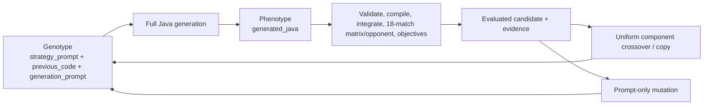
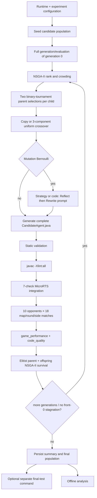
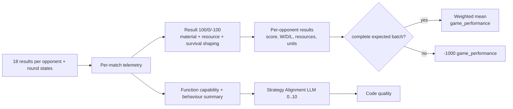
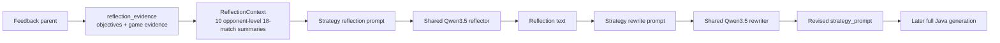
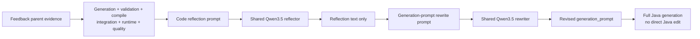
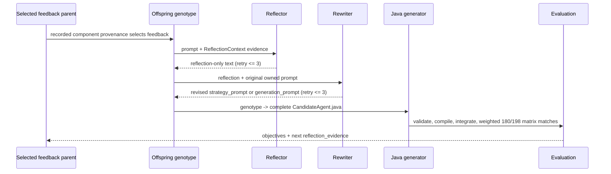

# Current EAGLE Design

## 1. Scope and Source of Truth

This document describes the code currently on `master`, not the intended architecture in older design documents. EAGLE is the **Evolutionary Algorithm for Game-playing with LLM-Enabled Agents**: it evolves prompts that cause an LLM to produce a complete Java MicroRTS `CandidateAgent`. It is not a prompt-benchmark or a runtime-LLM game agent.

**Confirmed:** the checked-in runtime path is shell-based (`run_env.sh`, `run.sh`, `analyze.sh`). Historical run folders may retain superseded opponent identities and schemas; they are not used to override current code.

Implementation:

- `eagle/__main__.py`: `main`
- `eagle/search.py`: `run_search`
- `eagle/opponents.py`: `EVALUATION_ROSTER`, `FINAL_TEST_ROSTER`
- `git log --oneline`: `e3566b5 fix(evaluation): remove historical self opponents`

## 2. Canonical Runtime

**Confirmed:** `./run_env.sh {start|stop|restart|status|check}` runs `python -m eagle runtime` inside conda environment `eagle`; it owns exactly one local llama.cpp `llama-server`. The optional `./watchdog.sh` is a separate shell local-interface monitor/recovery script and does not call `run_env.sh` or own a runtime process. `./run.sh [experiment-config] [--mock|--resume RUN]` runs the EA, and `./analyze.sh [RUN_DIR|--latest]` invokes offline static analysis. `analyze.sh` deliberately invokes the current Python directly, whereas the first two scripts use `conda run`.

`configs/runtime.yaml` is the sole model/endpoint configuration. It permits only Qwen3.5-9B, configured as model alias/name `qwen3.5-9b`, at `http://127.0.0.1:8080`, context 32,768, GPU layers `-1`, one parallel slot, eight threads, and batch size 512. Runtime startup executes the configured local `llama-server`, tracks its PID, checks that its command line matches the configured binary/model/port, and health-checks it. The runtime manager has no embedded watchdog, remote endpoint, multiple-model topology, or role-specific model selection; the optional `watchdog.sh` is an external shell monitor. Logical roles use the same endpoint/model: generation, reflection, rewrite, and strategy alignment.

The canonical experiment config is `configs/experiments/microrts.yaml`: NSGA-II, 50 generations, population 10, seed 7, crossover 0.75, mutation 0.85, 5,000 ticks, 120-second per-match timeout, the weighted ten-opponent search roster, and the adaptive previous-generation champion opponent. Search evaluation uses three fixed maps, three deterministic rounds per map, and both candidate sides: 18 matches per opponent, 180 fixed matches, or 198 when the adaptive champion is present. The CLI overwrites its endpoint/model/backend choice from the runtime config; the experiment YAML is not allowed to set them. `--mock` replaces generation and alignment backends with deterministic mocks.

`run_search` creates `runs/<timestamp>/` with `exist_ok=False`, writes input `config.yaml`, a resolved config, prompt snapshot, and a manifest before seed evaluation. `--resume` loads the greatest completed `generations/generation_####.json`; it rejects changes to population size, crossover/mutation rate, EA seed, evaluation maps, tick limit, or the resolved three-round seed schedule. The resumed RNG is seeded from `"<random_seed>:<completed_generation>"`, so resumed random draws do not reproduce a continuous fresh-run RNG stream exactly.

Implementation:

- `run_env.sh`; `run.sh`; `analyze.sh`
- `configs/runtime.yaml`: `llm`, `runtime`
- `eagle/runtime/config.py`: `load_runtime_config`, `_parse_llm`
- `eagle/runtime/processes.py`: `RuntimeManager`, `build_server_command`
- `eagle/cli/run.py`: `main`, `_validate_experiment_document`
- `eagle/search.py`: `run_search`
- `eagle/resume.py`: `resume_search`, `_validate_resume_config`
- `configs/experiments/microrts.yaml`

## 3. Candidate Representation

**Confirmed:** a `Candidate` has a three-component pre-generation genotype and a separate evaluated phenotype. `generated_java` is not a mutation target; it is the last complete evaluated Java source. Crossover inherits it as `previous_code`, and every child performs fresh full-file generation.

| Field(s) | Semantic responsibility | Created/mutated/crossed | Consumed and persisted |
| --- | --- | --- | --- |
| `id`, `generation`, `parent_ids` | stable identity and generation/parent lineage | constructor; `crossover`/copy establish parents | search, artifacts; `individual.json`, `lineage.json`, generation/final-population snapshots |
| `strategy_prompt` | natural-language MicroRTS strategy | seed; uniform crossover selects a parent; strategy mutation rewrites only this field | Java generation and strategy reflection; `genotype/strategy_prompt.txt`, `individual.json` |
| `previous_code` | inherited latest evaluated full Java, used as generation starting source when it has strategy markers | empty at seed; crossover/copy use selected parent `generated_java`; neither mutation changes it | `Candidate.generation_input`; `genotype/previous_code.java`, `individual.json` |
| `generation_prompt` | full-file generation constraints/instructions | default/seed; uniform crossover selects a parent; code mutation rewrites only this field | Java generation and code reflection; `genotype/generation_prompt.txt`, `individual.json` |
| `generated_java`, `generated_java_path` | normalized complete Java phenotype and source location | only evaluation/generation writes it | compiler, integration, matches, final test; `generation/normalized_candidate.java`, `individual.json` |
| `operator`, `mutation_type`, three component parent IDs, `source_candidate_ids` | variation/provenance | seed/copy/crossover/mutation | parent-feedback routing and artifacts; `lineage.json`, `crossover/provenance.json`, `individual.json` |
| `compile_status` | compiler stage state (`pending`, success/failed, or `not_run`) | default; evaluation copies compiler result status | inspection/reflection; `individual.json`, candidate result |
| `game_eval_result`, `code_quality_result`, `fitness_objectives` | game evidence, quality payload, and the two active numerical objectives | empty defaults; evaluation fills all three | selection, next mutation, generation metrics; individual/evaluation/snapshot artifacts |
| `status`, `failure_stage`, `failure_reason` | evaluated/failed state and canonical stage/reason | defaults; evaluation assigns stage-aware failure state | survival, analysis, final-test selection rejection; individual/result/snapshot artifacts |
| `artifacts`, `timing`, `metadata` | optional path map, stage timings, and non-schema hand-off data (including `reflection_evidence` and mutation record) | defaults; evaluation/mutation extend them | reflection, diagnostics/analysis; `timing.json`, `individual.json`, snapshots |

`generation_input` uses `previous_code` only if it begins `package ai.generated;` and contains the strategy-region markers; otherwise it loads `eagle/java_templates/CandidateAgent.java`. The generated source must be a public `ai.generated.CandidateAgent` extending `AbstractionLayerAI`, with both required constructors and `getAction`, `reset`, and `clone` methods.

Implementation:

- `eagle/candidate.py`: `Candidate`, `Candidate.generation_input`, `Candidate.lineage_to_json_dict`
- `eagle/crossover.py`: `crossover`
- `eagle/rewrite.py`: `PromptRewriteMutation.mutate`
- `generation/java_agent_generator.py`: `generate_java_agent_result`, `validate_generated_java_source`
- `eagle/artifacts.py`: `write_candidate_inputs`, `write_candidate_artifacts`



## 4. Integrated EAGLE Workflow

**Confirmed workflow:**



| Stage | Input | Main operation | Output | Implementation |
| --- | --- | --- | --- |
| configuration | runtime YAML + experiment YAML | validate and resolve forced runtime fields | `ExperimentConfig`, runtime endpoint | `eagle/cli/run.py`: `main`; `eagle/config.py`: `ExperimentConfig.from_mapping` |
| initialization | seed prompt template(s) | repeat seed prompts to population size | generation-0 genotypes | `eagle/search.py`: `initialize_population` |
| Java generation | three-part genotype | one complete-file LLM request | normalized Java or generation failure | `Candidate.generation_input`; `generate_java_agent_result` |
| validate/compile/integrate | Java source | external contract checks, `javac`, seven probe checks | diagnostics or fail-fast state | `generation/java_agent_generator.py`; `evaluation/compiler.py`; `evaluation/microrts_runner.py`: `integrate_microrts_agent` |
| evolutionary evaluation | one integrated class directory | weighted fixed-roster batch, plus one frozen previous-generation champion from generation 1 onward | evaluated/failed candidate | `eagle/evaluation.py`: `evaluate_candidate`, `evaluate_matches`; `evaluation/opponent_schedule.py` |
| parent/variation | ranked population | tournament, component crossover/copy, optional prompt mutation | population-size child genotypes | `eagle/selection.py`; `eagle/search.py`: `create_offspring` |
| replacement | parents + evaluated offspring | Pareto fronts then crowding truncation | next population | `eagle/selection.py`: `select_next_generation` |
| final test | completed run, selected already-evaluated Java | compile once then independent champion/basic schedule | final-test directory | `scripts/run_final_test.py`; `eagle/final_test/runner.py` |

Generation zero follows the same Java/evaluation boundary as every offspring. Each later iteration creates exactly `population_size` offspring, evaluates all of them, then uses parent-plus-offspring survival. `front0_stagnation_generations` stops a run when the sorted front-0 objective-vector signature does not change for the configured number of generations (10 in the canonical experiment). A failure does not remove a candidate before survival; it receives failure fitness.

Implementation:

- `eagle/search.py`: `run_search`, `create_offspring`, `front_zero_signature`
- `eagle/evaluation.py`: `evaluate_population`, `evaluate_candidate`
- `eagle/selection.py`: `assign_rank_and_crowding`, `select_next_generation`
- `eagle/run_artifacts.py`: `record_generation`, `finalize_run`

## 5. Evolutionary Algorithm

**Confirmed:** NSGA-II maximizes exactly `(game_performance, code_quality)`. Parent selection is binary tournament without replacement within a tournament: lower Pareto rank wins, then greater crowding distance, then dominance, then EA-RNG tie break. Survival non-dominated-sorts the combined parent and offspring population, accepts whole fronts while possible, and sorts the partial front by descending crowding distance. This is elitist `(mu + mu)` survival. There is no adaptive operator selection/AOS and no deduplication check.

For each child, crossover occurs with probability `crossover_rate` if the population has more than one member. It independently chooses a parent for each component:

```text
strategy_prompt       <- parent A or B independently
previous_code         <- selected parent's generated_java independently
generation_prompt     <- parent A or B independently
```

Otherwise a copy inherits all three components from parent A. Mutation is independently applied after crossover/copy with probability `mutation_rate`. The EA RNG starts from `random_seed`; MicroRTS uses the canonical round seeds `(0, 1, 2)` for every map, opponent, and side-swapped pair. No separate Java/game random seed is configured beyond that schedule.

Mutation operator selection is feedback-guided but not adaptive: a failed/incomplete candidate, warnings, function score below 50, or alignment below 5 forces code mutation. Otherwise simplicity greater than 50 selects strategy mutation with 90% probability (code 10%); remaining successful candidates use 50/50. Mutation failure keeps the original prompt components and still sends that child through Java generation/evaluation.

Implementation:

- `configs/experiments/microrts.yaml`: `generations`, `population_size`, rates, seed
- `eagle/selection.py`: `select_parent`, `better_candidate`, `dominates`, `crowding_distance`
- `eagle/crossover.py`: `crossover`
- `eagle/search.py`: `create_offspring`, `choose_mutation`
- `eagle/config.py`: `ExperimentConfig.resolved_match_seeds`

## 6. Fitness Design

### 6.1 Active Objectives

**Confirmed:** the only optimizer objectives are `game_performance` and `code_quality`, both maximized. `strategy_alignment`, compiler diagnostics, and Function Capability are diagnostic evidence, not code-quality score components. Player/enemy resources, material/state/survival values are game-performance evidence/components, not objectives.

| Component | Formula or range | Failure behaviour | Implementation |
| --- | --- | --- | --- |
| `game_performance` | pre-evaluation/default candidate vector uses `0`; evaluated mean is bounded `[-110, 110]` | `-1000` for every candidate pipeline/runtime failure or incomplete batch | `evaluation/game_performance.py`; `evaluation/game_metrics.py`; `evaluation/nsga2_objectives.py` |
| `code_quality` | pre-evaluation/default candidate vector uses `0`; valid interval `[0, 100]`: `100 - complexity_penalty` | every failure stage uses `-1000` for both objectives | `evaluation/canonical_code_quality.py` |
| compilation diagnostics | warning/error counts and raw messages are retained | compilation failure makes both objectives `-1000` | `analyze_compilation` |
| function score | five capabilities, each `0`, `10`, or `20`; sum capped at `100` | zero on failure path | `evaluation/function_capability.py` |
| strategy alignment | independent LLM JSON score `[0,10]` | a malformed non-server response returns alignment score `0` and status `failed`; a server error aborts the evaluation call | `evaluation/strategy_alignment.py` |

Implementation:

- `eagle/cli/run.py`: `_validate_experiment_document`
- `evaluation/nsga2_objectives.py`: `OBJECTIVE_DIRECTIONS`, `build_objectives`
- `evaluation/canonical_code_quality.py`: `FAILED_CODE_QUALITY`, `build_successful_code_quality`

### 6.2 Game Performance

Search evaluation uses ten fixed opponents in canonical order: `passive` (0.5), `random` (0.5), `randombias` (0.5), `lightrush` (1.0), `heavyrush` (1.0), `workerrush` (1.0), `allibot` (2.0), `mayari` (2.0), `coac` (2.0), and `tma` (2.0). Their fixed denominator is 12.5. For every opponent, `build_match_matrix` emits three maps × three rounds × candidate player 0 then 1, with round seeds 0, 1, 2: 18 records. Generation 0 therefore runs 180 fixed matches; generation 1 and later append `eagle_previous_best` using the same 18-record matrix (198 total). Historical/HOF opponents passed to `evaluate_matches` follow the same protocol. The vendored MicroRTS runtime does not ship a `WorkerRush` class, so EAGLE compiles a local adapter once per run; AlliBot uses its resolved upstream classpath. Candidate side, map ID, round index, seed, weight, and source lineage are persisted per match.

For match (i), with final/parsed tick telemetry (T_i), the implementation calculates:

\[
R_i \in \{100,0,-100\};\quad
M_i=5\tanh(\overline{V_p-V_e}/10);\quad
Q_i=3\tanh((r_p-r_e)/10)
\]

\[
S_i=\begin{cases}
2(1-t_i/T_{max}) & \text{win}\\
2t_i/T_{max} & \text{loss}\\
0 & \text{draw}
\end{cases};\quad
P_i=R_i+\operatorname{clamp}_{[-10,10]}(M_i+Q_i+S_i)
\]

Here (V) is total unit material value averaged over available telemetry ticks, using Base 10, Barracks 5, Worker 1, Light 2, Heavy 4, Ranged 2, Resource 0. (r_p-r_e) is the final resource difference. `t_i` is match end tick. A normal loss remains roughly `-100` plus shaping; it is not the `-1000` candidate-failure value. EAGLE first averages the 18 `P_i` values for each opponent, then computes `sum(weight * opponent_average) / total_weight`; it never applies an opponent weight to individual matches before that average. Any missing/failed required matrix result causes `game_performance = -1000`, while completed evidence and expected/completed/missing counts are retained.

Implementation-aligned pseudocode:

```text
for opponent in fixed_results + optional_eagle_result + historical_results:
    scores = []
    for result in opponent.matches:  # 3 maps × 3 rounds × 2 sides
        ticks = parsed_round_states or [final state from result]
        material = mean(player_total_unit_value(t) - enemy_total_unit_value(t) for t in ticks)
        material_score = 5 * tanh(material / material_scale)
        resource_score = 3 * tanh((final_player_resources - final_enemy_resources) / resource_scale)
        survival = loss ? 2 * end_tick/max_tick : win ? 2 * (1-end_tick/max_tick) : 0
        scores.append(result_score + clamp(material_score + resource_score + survival, -10, 10))
    opponent_average = mean(scores) if len(scores) == 18 else -1000
    weighted_numerator += opponent.weight * opponent_average
expected = 180 + (18 if eagle_result is present else 0) + 18 * len(historical_results)
if any required matrix result failed or completed_count != expected: objective = -1000
else: objective = weighted_numerator / (12.5 + eagle_weight + sum(h.weight for h in historical_results))
```

**Inference:** `MatchResult.ok` is the determinant for a completed match. The loop records every fixed and dynamic call even after an individual failure, because it records the first error but does not break; a setup-level exception can produce a shorter list.

Implementation:

- `eagle/opponents.py`: `EVALUATION_ROSTER`
- `eagle/config.py`: `DEFAULT_SEARCH_OPPONENTS`, `ExperimentConfig.eagle_match_seed`
- `evaluation/opponent_schedule.py`: `eagle_opponent_weight`, `select_previous_generation_champion`
- `eagle/evaluation.py`: `evaluate_matches`, `scoring_config_from_experiment`
- `evaluation/match_matrix.py`: `build_match_matrix`, `canonical_evaluation_maps`
- `eagle/evaluation.py`: `prepare_eagle_opponent`, `preflight_evaluation_opponents`
- `evaluation/game_performance.py`: `compute_performance_breakdown`, `score_result`, `DEFAULT_UNIT_VALUES`
- `evaluation/game_metrics.py`: `compute_game_metrics`, `summarize_opponent_result`
- `evaluation/nsga2_objectives.py`: `FAILED_GAME_PERFORMANCE`, `build_objectives`



### 6.3 Code Quality

**Confirmed:** the active import at the end of `evaluation/code_quality.py` replaces historical static-quality scoring with `evaluation/canonical_code_quality.py`. Successful code quality is:

\[
\texttt{code_quality}=100-(40C+25N+20L+15F)
\]

where `C`, `N`, `L`, and `F` are clamped normalized cyclomatic, nesting, logical LOC, and longest-function metrics. Compiler, capability, alignment, validation, and runtime values remain diagnostics; failure objectives are both `-1000`.

Function capability assesses economy, production, combat, target selection, and state-aware decision. For each, source regex evidence and successful-match runtime evidence are collected: both evidence types score 20, one type scores 10, none scores 0. The sum is capped at 100. It measures reachable Java/body patterns plus telemetry/scoreboard evidence, not whether candidate methods with predefined names exist.

Strategy Alignment is one independent, zero-temperature OpenAI-compatible LLM call after a completely successful 180-match fixed evaluation (or 198-match generation with the adaptive opponent). It receives the strategy prompt, complete generated Java, and opponent-level behaviour summary; it must return exactly `{"score": number 0..10, "reason": non-empty string}`. It is evaluated once per candidate, not once per opponent. Its request/raw response/result are persisted as diagnostics and do not affect `code_quality`.

Implementation:

- `evaluation/compiler.py`: `compile_generated_agent`, `parse_compiler_diagnostics`
- `evaluation/canonical_code_quality.py`: `analyze_compilation`, `build_successful_code_quality`
- `evaluation/function_capability.py`: `evaluate_function_capability`
- `evaluation/strategy_alignment.py`: `evaluate_strategy_alignment`, `parse_strategy_alignment_response`
- `config/prompt_templates.toml`: `[templates.strategy_alignment]`

### 6.4 Failure Fitness

| Failure class | Detection / status | Objectives and continuation | Persisted evidence / reflection use |
| --- | --- | --- | --- |
| LLM server request failure | `LLMServerError` in generation/reflection/alignment | re-raised; CLI/run aborts rather than creating a normal failed candidate | LLM log if stage reached; no error-pool |
| malformed/empty Java response, extraction failure | `generate_java_agent_result`; `generation` failure | game `-1000`, code `-1000`; later stages blocked | raw response, generation result, blocked validation; next code reflection can use parent failure evidence |
| forbidden behaviour/import or contract violation | `validate_generated_java_source`; `validation` failure | game `-1000`, code `-1000`; compilation/integration/matches blocked | validation result and reflection context |
| Java assembly/source writing failure | generation exception path | game `-1000`, code `-1000` | generation/validation artifacts where available |
| compiler failure | `CompileResult.ok == false`; `compilation` | game `-1000`, code `-1000` | command/stdout/stderr/diagnostics; code reflection includes them |
| integration failure | seven-check probe fails; `integration` | game `-1000`, code `-1000` | integration request/output/result; code reflection includes it |
| runtime exception, illegal action, bad/missing result, timeout | failed `MatchResult` or incomplete batch; `runtime` | game `-1000`, code `-1000` | per-match evidence and retained completed matches; code/strategy reflection context |
| evaluator/alignment malformed result | alignment catches non-server parse/runtime error | successful pipeline still has normal game score; alignment component becomes 0 | `strategy_alignment/result.json`, request/raw response |
| missing artifact | analysis/final-test loaders reject/skip according to loader | no retroactive fitness recalculation | explicit loader error; no error pool |
| unexpected `RuntimeError`/`OSError` in a match | caught in `evaluate_matches` as failed runtime match | runtime failure values as above | failed match record and candidate result |

`errors.jsonl` is initialized by the canonical run manifest but current evaluation/artifact writers do not append candidate failures to it; failures are instead represented in candidate directories, generation snapshots, and final population. This is an observability gap, not an error pool.

Implementation:

- `generation/java_agent_generator.py`: `generate_java_agent_result`, `classify_generation_error`
- `eagle/evaluation.py`: `evaluate_candidate`, `evaluate_matches`
- `evaluation/canonical_code_quality.py`: `failure_code_quality`
- `eagle/run_artifacts.py`: `initialize_run_manifest`

### 6.5 Fitness Data Flow

`evaluate_candidate` first generates and validates Java, compiles once, integrates once, then evaluates the fixed weighted matrix (180 matches in generation 0, 198 with the frozen champion thereafter). On success it derives Function Capability and calls Strategy Alignment as diagnostics, then calculates simplicity from generated-method complexity; otherwise it assigns both objective sentinels. It always builds the two-objective dictionary, embeds the complete evidence under `candidate.metadata["reflection_evidence"]`, and serializes the evaluated candidate. Selection reads only the two objective values.

Implementation:

- `eagle/evaluation.py`: `evaluate_candidate` (generation through `reflection_evidence` hand-off)
- `evaluation/nsga2_objectives.py`: `build_objectives`
- `eagle/selection.py`: `dominates`

## 7. Mutation and Reflection

### 7.1 Mutation Operators

| Operator | Feedback input | Modified field | LLM output | Implementation |
| --- | --- | --- | --- | --- |
| strategy mutation | complete evaluated game evidence, opponent-level 18-match summaries, objectives, parent Java | `strategy_prompt` only | reflection text, then revised strategy prompt | `PromptRewriteMutation(mutation_type="strategy")` |
| code mutation | generation/validation/compile/integration/runtime/code-quality evidence | `generation_prompt` only | reflection text, then revised generation prompt | `PromptRewriteMutation(mutation_type="code")` |

Both paths are exactly **Reflection LLM -> Rewrite LLM -> later full Java Generation LLM**. Neither directly edits Java. Reflection/rewrite retry up to `mutation_max_attempts` (3 in the canonical experiment) for empty/invalid local responses; both response validators reject Java. A failed reflection/rewrite returns a child with the original prompts, `applied: false`, and retained mutation artifacts; an `LLMServerError` is re-raised.

Implementation:

- `eagle/rewrite.py`: `PromptRewriteMutation`, `PromptRewriteStage.run`, `_validate_rewritten_prompt`
- `eagle/mutation.py`: `ReflectionStage.run`, `_validate_reflection`
- `eagle/search.py`: `create_offspring`, `choose_mutation`

### 7.2 Strategy Reflection

The feedback parent is the child strategy component's recorded source parent, not a prompt-text match. `mutation_context_from_candidate` maps its preserved `reflection_evidence` to a `ReflectionContext`. It provides overall objective values and opponent-level game evidence: ten `OpponentResult` records (identity/name, 18-match average, P0/P1 averages, three map averages, W/D/L, resources, units, status/failure, weight/contribution), strongest/weakest matchups, score mean/min/max/stddev, aggregate W/D/L, final resources/difference, material, survival, temporal/round-state, and behaviour summaries. These are game scores, not Strategy Alignment scores; raw 180 match rows are not the primary reflection summary.

The current search roster identity is the ten bots named in section 6.2. The strategy-reflection template tells the reflector to compare opponents, preserve behaviours that work across multiple opponents, identify opponent-specific weaknesses without overfitting, and use strongest/weakest/variance evidence. The constructed `match_summary` also includes evaluation/failure status and the two objectives.

Actual prompt structure (values are substituted at runtime):

```text
EAGLE Strategy Reflection stage.
Analyze the complete strategy using the evidence below. Return reflection text only.
Do not rewrite either prompt. Do not generate Java, a patch, a diff, or a code block.

Current strategy_prompt: $strategy_prompt
Parent generated_java: $parent_java
Opponent identity: $opponent
Complete 180/198-match matrix summary; aggregate game performance and opponent-level 18-match feedback: $match_summary
Opponent summaries (one 18-match summary for every configured opponent): $per_match_results
Wins: $wins; draws: $draws; losses: $losses
Game performance: $game_performance
The opponent summary includes P0/P1 averages, map averages, Strongest matchup, Weakest matchup, and Score consistency.
Final player resources: $final_player_resources
Final enemy resources: $final_enemy_resources
Final resource difference: $final_resource_difference
Resource evidence: $resource_breakdown
Unit material statistics: $unit_material_statistics
Survival statistics: $survival_statistics
Round-state summary: $round_state_summary
Temporal summary: $temporal_summary
Behavior summary: $behavior_summary
Compare behaviour across opponents, identify strategies that work across multiple
opponents, and identify opponent-specific weaknesses without overfitting to one matchup.
Use the strongest and weakest matchups and score variance/consistency as evidence. Propose
one coherent, concise, implementable revised strategy for intended MicroRTS behaviour.
Focus on strategy only: do not generate Java, code, patches, or diffs. The output must
remain reflection only.
```

It then asks the rewriter for only the new strategy prompt, supplying original strategy, reflection, parent Java, and game summary. The output is normalized to 4,000 characters and 80 lines before being installed as the child's `strategy_prompt`.

Implementation:

- `eagle/search.py`: `mutation_context_from_candidate`, `parent_for_component`
- `eagle/mutation.py`: `ReflectionContext`, `build_strategy_reflection_prompt`
- `eagle/rewrite.py`: `build_strategy_rewrite_prompt`, `PromptRewriteMutation.mutate`
- `config/prompt_templates.toml`: `[templates.strategy_reflection]`, `[templates.strategy_rewrite]`



### 7.3 Code Reflection

Code mutation receives the original strategy and generation prompts, parent/latest Java, raw generation response, validation result, compilation result and diagnostics, integration result, runtime result, completed match count, function capability, alignment score, and failure stage/category/reason. The code-reflection prompt explicitly asks for analysis only, including complete-file validity, API/constructor compatibility, diagnostics, missing capability, strategy alignment, and constraints for a later generation-prompt rewrite.

The rewriter receives original `generation_prompt`, reflection, strategy prompt, parent Java, and `context.compilation_result` (or static metrics fallback), then must return only a revised full-file generation prompt. This changes `generation_prompt` only; the final Java source is later regenerated from the unchanged strategy, inherited previous source, and new generation instruction.

Actual prompt structure:

```text
EAGLE Code Reflection stage.
Analyze the complete-file generation outcome using the evidence below. Return reflection text only.
Do not rewrite either prompt and do not generate replacement Java, a patch, a diff, JSON, or a code block.

strategy_prompt: $strategy_prompt
current generation_prompt: $generation_prompt
parent generated_java: $parent_java
latest generated child Java, if available: $latest_java
raw generation response: $raw_generation_response
source validation result: $validation_result
compilation result: $compilation_result
compiler errors/warnings: $compiler_errors / $compiler_warnings
MicroRTS integration result: $integration_result
runtime result: $runtime_result
completed-match count: $completed_match_count
function capability score: $function_capability_score
strategy alignment score: $strategy_alignment_score
failure stage: $failure_stage
failure category: $failure_category
failure reason: $failure_reason
Analyze complete-file validity, API/constructor compatibility, diagnostics, runtime or
match behavior, missing capabilities, strategy alignment, and constraints for a later
Generation Prompt Rewrite. Keep the output as reflection only.
```

Implementation:

- `eagle/mutation.py`: `build_code_reflection_prompt`
- `eagle/rewrite.py`: `build_code_rewrite_prompt`, `PromptRewriteMutation._result_candidate`
- `config/prompt_templates.toml`: `[templates.code_reflection]`, `[templates.code_rewrite]`



### 7.4 Error Pool

**Confirmed:** there is no active error-pool data structure, capacity, sampler, or operator that consumes pooled historical failures. The partial equivalent is each selected feedback parent's self-contained `metadata.reflection_evidence`, which carries that candidate's failure/diagnostic/match evidence into code or strategy reflection. Successful candidates also provide their own lessons through the same evidence route.

Implementation:

- `eagle/evaluation.py`: construction of `reflection_evidence`
- `eagle/search.py`: `mutation_context_from_candidate`
- `rg "error_pool|error pool" eagle evaluation generation`: no active implementation

### 7.5 Mutation Data Flow



## 8. Evaluation and Final Test

Search evaluation validates source, compiles once in `classes/<candidate_id>`, runs a separate seven-check integration probe, then starts the weighted ten-opponent matrix (18 records/opponent; plus the same 18-record dynamic matrix from generation 1 onward). Validation requires package/class/superclass, two constructors, callable methods, allowed imports/no forbidden runtime behaviours, and the overall runtime contract. The dynamic opponent is prepared once per generation by compiling the selected previous candidate under the alias `ai.generated.EaglePreviousBest`, so all candidates in that generation use the same frozen reference.

**Confirmed:** final testing is not called by EA completion. `python scripts/run_final_test.py --run-dir RUN --selector {best-game-performance|balanced|pareto}` or `--candidate-id ID` first selects evaluated candidates using completed evolution artifacts only. It copies their canonical source, recompiles/integrates it, then schedules 10 matches per final-test opponent across configured maps/seeds/sides, with 5,000 cycles per configured map. The checked-in final-test config uses external `tma`, `mayari`, `coac` plus five basic bots, ten deterministic seeds, three maps, alternating player side, and thus 80 matches per selected candidate. `--smoke` changes this to two matches/opponent (16/candidate), not an evolution result.

Implementation:

- `generation/java_agent_generator.py`: `validate_generated_java_source`
- `evaluation/microrts_runner.py`: `integrate_microrts_agent`, `run_microrts_match`
- `scripts/run_final_test.py`: `main`
- `eagle/final_test/selection.py`: `select_final_test_candidates`
- `eagle/final_test/schedule.py`: `build_schedule`, `exact_match_count`
- `configs/final_test_champions.yaml`

## 9. Artifacts and Observability

**Confirmed:** a real current run has the following canonical evidence layout (some stage directories are absent when an earlier stage blocks them):

```text
runs/<run_id>/
├── manifest.json, config.yaml, resolved_config.json, prompt_snapshot.json
├── generation_metrics.jsonl, timing.jsonl, errors.jsonl
├── generations/generation_####.json
├── final_population.json, summary.json
├── llm_logs/<sequence>_<stage>_<candidate>_*.json
├── candidates/<candidate_id>/
│   ├── individual.json, lineage.json, candidate_result.json, timing.json
│   ├── genotype/{strategy_prompt.txt,previous_code.java,generation_prompt.txt}
│   ├── generation/{request.txt,response_raw.txt,extracted_candidate.java,normalized_candidate.java,result.json}
│   ├── validation/validation_result.json
│   ├── compilation/{command.txt,stdout.txt,stderr.txt,compilation_result.json}
│   ├── integration/{request.txt,stdout.txt,stderr.txt,integration_result.json,...}
│   ├── matches/match_000..match_179/{result.json,raw_result.json,telemetry.json.gz,performance_breakdown.json,...}
│   └── match_180..match_197/ (generation >= 1: eagle_previous_best matrix)
│   ├── evaluation/{objectives.json,game_performance.json,code_quality.json,function_capability.json,matches.json,summary.json}
│   ├── strategy_alignment/{request.txt,response_raw.txt,result.json}
│   └── mutation/{metadata.json,reflection_context.json,requests,responses,original prompts...}
├── classes/<candidate_id>/
├── generated_agents/<candidate_id>/CandidateAgent.java
├── final_test/ (created by the run manifest; currently not the configured final-test output root)
└── final_tests/<final_test_id>/... (only if separately run)
```

| Artifact | Producer | Main contents | Consumer |
| --- | --- | --- | --- |
| `manifest.json`, `resolved_config.json` | search/artifacts | version, lifecycle, resolved runtime/EA/seeds/commit | resume, canonical analysis |
| generation snapshot/metrics | `record_generation` | surviving population; objective statistics and opponent summaries | resume, analysis |
| candidate genotype/lineage/individual | artifact writer | reconstructable genotype, phenotype, provenance, status, objectives | final-test selection, inspection |
| generation/mutation/LLM artifacts | generator, reflector/rewriter, `LLMCallLogger` | requests, raw responses, attempt status/timing | debugging, reflection provenance |
| compilation/integration/match artifacts | evaluation adapters | command/diagnostics/checks/telemetry/replay/results | score computation, diagnosis |
| evaluation artifacts | `write_candidate_artifacts` | objectives and all component evidence | reflection, inspection |
| `timing.jsonl` + candidate timing | all staged writers | generation, mutation, evaluation/match/alignment timings | analysis |
| `final_tests/...` | final-test runner | selection, opponents, copied source, match records, aggregates | final-test reporting |

Every completed generation persists membership through both a survivor snapshot and `generations/generation_####.json`; every evaluated candidate persists objectives, generated Java, prompt/genotype, lineage and available diagnostics. Operators and parent IDs are persisted. Prompt and raw LLM outputs are persisted. Match results and failure classifications are persisted per candidate, including map/round/side/seed and expected/completed/missing matrix counts. `evaluation/game_performance.json`, candidate reflection evidence, and `generation_metrics.jsonl` retain each opponent's 18-match average, P0/P1 and map summaries, weight, and weighted contribution, plus dynamic source generation/candidate when present. The run-level generation record also records the previous-generation champion and its score. Timing is broad but not complete: selection/crossover only appear inside candidate timing where applicable, and no candidate-level start/finish wall-clock record is guaranteed. As noted in section 6.4, initialized `errors.jsonl` is not currently populated by candidate evaluation failures.

Implementation:

- `eagle/artifacts.py`: `write_candidate_inputs`, `write_candidate_artifacts`, `write_resolved_config`, `write_summary`
- `eagle/run_artifacts.py`: `initialize_run_manifest`, `record_generation`, `finalize_run`
- `eagle/llm_logging.py`: `LLMCallLogger.write`
- `eagle/final_test/artifacts.py`: final-test artifact helpers

## 10. Analysis Workflow

`analyze.sh` with no arguments (or `--latest`) selects the newest valid direct child of the configured `runs/` root; an explicit relative path is resolved from the caller's directory and passed as `--run-dir`. It runs `python -m eagle analyze`, not a GUI.

The canonical loader accepts only `eagle-run-v1` manifests and reads compact run artifacts: manifest/resolved config, `generation_metrics.jsonl`, generation snapshots, `final_population.json`, `timing.jsonl`, and `errors.jsonl`. Missing optional files become empty/`None`; an unsupported/missing manifest or missing resolved config is an error. It does not read `results.jsonl` and does not crawl every candidate directory.

Analysis writes under `<run>/analysis/`: Markdown/JSON summary; generation, candidate, objective, operator, timing, and error CSVs; plus static PNG plots for each objective by generation, population/failures, Pareto size, operator usage/success, errors, timing, and a final Pareto scatter when both objectives exist. It can analyze initialized/running canonical runs; fields simply produce sparse/empty tables/plots where artifacts are absent.

Implementation:

- `analyze.sh`
- `eagle/cli/analyze.py`: `main`
- `eagle/analysis/loader.py`: `resolve_latest_run`, `load_run`
- `eagle/analysis/report.py`: `generate_analysis`, `OUTPUT_FILES`, `_plots`

## 11. Implementation Source Map

| Concern | Canonical code/config/tests |
| --- | --- |
| command/runtime | `run_env.sh`, `run.sh`, `analyze.sh`, `configs/runtime.yaml`, `eagle/runtime/*`, `tests/test_runtime_workflow.py` |
| EA/candidate/selection | `eagle/search.py`, `eagle/candidate.py`, `eagle/crossover.py`, `eagle/selection.py`, `tests/test_phase1_candidate_foundation.py`, `tests/test_eagle_pipeline.py` |
| generation/validation | `generation/backend.py`, `generation/java_agent_generator.py`, `eagle/java_templates/CandidateAgent.java`, `tests/test_phase3_validation.py` |
| evaluation/fitness | `eagle/evaluation.py`, `evaluation/match_matrix.py`, `evaluation/opponent_schedule.py`, `evaluation/compiler.py`, `evaluation/microrts_runner.py`, `evaluation/game_performance.py`, `evaluation/game_metrics.py`, `evaluation/canonical_code_quality.py`, `tests/test_evaluation_matrix.py`, `tests/test_phase4_*`, `tests/test_weighted_adaptive_opponents.py` |
| mutation/reflection | `eagle/mutation.py`, `eagle/rewrite.py`, `config/prompt_templates.toml`, `tests/test_phase2*.py`, `tests/test_ten_opponent_reflection.py` |
| persistence/analysis | `eagle/artifacts.py`, `eagle/run_artifacts.py`, `eagle/analysis/*`, `tests/test_canonical_run_artifacts.py`, `tests/test_canonical_analysis.py` |
| final test | `scripts/run_final_test.py`, `eagle/final_test/*`, `configs/final_test_champions.yaml`, `tests/test_final_test.py` |

## 12. Confirmed Design Decisions

- One local Qwen3.5-9B llama.cpp-compatible endpoint serves all LLM roles; `watchdog.sh` only monitors/restarts the local network interface and does not provide model routing or server lifecycle management.
- The genotype is exactly strategy prompt, inherited prior complete Java, and generation prompt; phenotype is a newly generated complete Java file.
- Evolution evaluates 180 weighted fixed-roster MicroRTS records in generation 0 and appends the same 18-record frozen previous-generation champion matrix thereafter; final test is an explicit post-evolution workflow with a different schedule.
- NSGA-II maximizes exactly game performance and code quality; alignment, function capability, compilation/warnings, and game telemetry are components/evidence, not third objectives.
- Strategy and code mutation are prompt-only two-call reflection/rewrite operators, followed by the normal third Java-generation call.
- Current code has no error pool and no AOS.

- Match Commentator (`match_commentator`, 賽評) is an auxiliary shared-client
  role. The Java match loop emits per-cycle snapshots; Python persists a
  compressed full trace and integrity report, comments contiguous trace ranges,
  and stores compact deterministic commentary aggregation for Strategy
  Reflection. Commentary never becomes a fitness objective.

Implementation:

- `eagle/runtime/config.py`: `LEGACY_RUNTIME_ERROR`
- `eagle/candidate.py`: `Candidate`
- `eagle/opponents.py`: rosters
- `evaluation/nsga2_objectives.py`: objective directions
- `eagle/rewrite.py`: component isolation

## 13. Unresolved or Ambiguous Behaviour

- **Confirmed discrepancy:** `configs/experiments/microrts.yaml` declares `generation_backend: openai` and `alignment_backend: openai`, but the run CLI forcibly selects both from runtime/`--mock`; this is benign duplication, not role routing.
- **Confirmed observability gap:** the run manifest initializes `errors.jsonl`, analysis reads it, but current evaluation code does not append candidate failures to it.
- **Confirmed:** evolution no longer writes `results.jsonl`; compact canonical generation/final-population records retain fitness and timing. The separate Final Test protocol still owns its own `results.jsonl`.
- **Confirmed historical caveat:** inspected saved runs contain older opponent/schema traces (including `eagle_policy`) that conflict with current `EVALUATION_ROSTER`; the current code and recent history establish the active roster.
- **Confirmed implementation detail:** the dynamic champion is compiled once per generation under the `ai.generated.EaglePreviousBest` alias because the candidate and reference cannot both define `ai.generated.CandidateAgent` in one JVM classpath; the alias manifest records source identity and compiled location.
- **Confirmed:** there is no separate active HOF roster in the current search configuration. `evaluate_matches` accepts optional historical opponents, and if supplied they use the same 18-record matrix, but `run_search` currently supplies only the fixed roster plus `eagle_previous_best`.
- **Confirmed:** final-test scheduling remains a separate 10-match-per-opponent protocol; it is not silently changed by the evolutionary 18-match matrix.
- **Inference:** a candidate's successful code-quality lower bound of zero is reachable only with at least ten counted warning penalties and no capability/alignment score; its formal range follows the implemented formula, not a separately enforced clamp.
