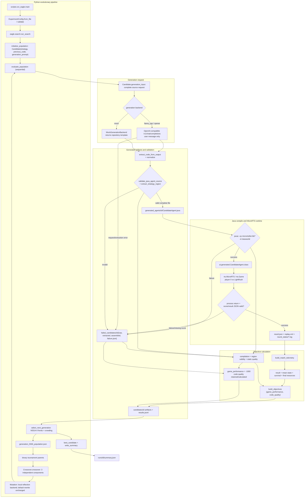

# Current EAGLE Implementation Report

Snapshot inspected: 2026-07-14, working tree at `47b0958b` (`refactor(pipeline): generate complete Java agents`). This report treats executable source and saved artifacts as authoritative. Existing prose is used only to identify possible intent. EAGLE here means **Evolutionary Algorithm for Game-playing with LLM-Enabled Agents**; the separate GEPA/ACE/MIPRO/CAPO research line is outside this report.

Evidence labels used below:

- **Confirmed** means directly implemented in source or present in an artifact.
- **Inferred** means the behavior follows from multiple implemented steps but is not asserted directly.
- **Historical** means visible only in an older artifact, ignored archive, compiled class, comment, or stale compatibility path.
- **Unknown** means the repository does not contain enough current evidence.

## 1. Executive Summary

**Confirmed:** the active pipeline evolves three Python-level candidate components—`strategy_prompt`, `previous_code`, and `generation_prompt`—then sends one LLM user message asking for an entire `ai.generated.CandidateAgent` Java source file. The complete response is token-validated, compiled with `javac`, run as MicroRTS player 0 against `ai.abstraction.LightRush`, and optimized with NSGA-II over `game_performance` and deterministic `code_quality` (`eagle/candidate.py::Candidate`, `Candidate.generation_input`; `eagle/search.py::run_search`; `generation/java_agent_generator.py::generate_java_agent_result`; `eagle/evaluation.py::evaluate_candidate`; `evaluation/nsga2_objectives.py::build_objectives`).

One evolutionary individual is a frozen `Candidate` dataclass, not a Java method or an isolated prompt. Its three inherited/evolved content components are accompanied by lineage, evaluation, status, and metadata fields (`eagle/candidate.py::Candidate`). After evaluation, `previous_code` becomes the complete generated Java source via `agent.behavior_source`, despite the legacy “behavior” property name (`eagle/evaluation.py::evaluate_candidate`; `generation/java_agent_generator.py::GeneratedJavaAgent.behavior_source`).

The Java boundary is currently a **complete single file**. `eagle/java_templates/CandidateAgent.java` is the known-good baseline and contains lifecycle code, shared fields, an editable marker-delimited strategy region, fixed action helpers, lookup helpers, and nested context classes. The LLM returns the entire file; no source assembler splices a generated region into a separately owned stable controller (`Candidate.generation_input`; `generate_java_agent_result`). Thus the comments call much of the file stable, but implementation stability is prompt- and token-validation-based rather than construction-based.

Candidates are evaluated sequentially. A valid source compiles into `runs/<run_id>/classes/<candidate_id>/`, is loaded as `ai.generated.CandidateAgent`, plays `matches_per_candidate` games, and receives an averaged game score plus a deterministic code-quality score (`eagle/evaluation.py::evaluate_population`, `evaluate_matches`; `evaluation/compiler.py::compile_generated_agent`; `evaluation/microrts_runner.py::run_microrts_match`; `evaluation/game_metrics.py::compute_game_metrics`; `evaluation/code_quality.py::build_code_quality`).

The largest current inconsistencies are:

1. **Mutation does not currently mutate content.** Both configured mutation types use `RuleBasedMutationBackend`; its rewrite branches return the existing strategy or existing generation guidance, so `strategy_prompt` and `generation_prompt` remain unchanged (`eagle/mutation.py::RuleBasedMutationBackend.generate`, `Mutation._strategy`, `Mutation._code`).
2. **The alleged stable/generated Java split is not enforced.** The LLM may change the complete file; validation checks markers, key tokens, helper names, and forbidden APIs but does not compare stable regions to the template (`Candidate.generation_input`; `generation/java_agent_generator.py::validate_java_agent_source`).
3. **Saved runs do not prove the current architecture.** All complete run directories predate commit `47b0958b` and contain older split-file/function-body agents and the obsolete `strategy_alignment` objective. The newest current-ish smoke directories also contain `CandidateBehaviors.java`, not the current one-file template (`runs/20260712_154209_634218/`; `runs/contract-smoke-3x1-final/`; `runs/code_quality_smoke/`).
4. **The game score is not centered on approximately +100/-100.** Those are only result components; survival contributes up to +200 and state/resource terms are added, so a late loss can be positive and a timeout draw at the limit receives +200 before state/resource terms (`evaluation/game_performance.py::compute_performance_breakdown`).
5. **Configuration and tooling retain stale surfaces.** `alignment_backend` is present in every YAML but ignored, YAML `opponent` is forcibly replaced with LightRush, GUI discovery retains `GeneratedAgent_*` paths, and one test still references removed function-parsing fields (`configs/*.yaml`; `eagle/config.py::ExperimentConfig.from_mapping`; `scripts/play_candidate_gui.py`; `tests/test_eagle_pipeline.py::test_non_java_response_fails_before_compile_or_matches`).

## 2. Repository Structure

### Active pipeline

| Path | Responsibility and public surface | Calls / called by | Classification |
|---|---|---|---|
| `scripts/run_eagle.py` | CLI `main()` parses `--config`, `--mock`, and `--run-id`. | Calls `ExperimentConfig.from_file` and `run_search`; invoked directly or by `run.sh`. | Active. |
| `run.sh` | Runs `python scripts/run_eagle.py --config configs/eagle_minimal.yaml --mock`. | Shell entry point. | Active smoke convenience. |
| `eagle/config.py` | `ExperimentConfig`, minimal YAML/JSON loading, defaults, template validation. | Called by CLI and GUI; calls `get_seed_prompt_template` and `validate_java_template`. | Active; ignores stale YAML keys such as `alignment_backend` and `opponent`. |
| `eagle/candidate.py` | `Candidate`, `objective_vector()`, and the complete-file LLM request in `generation_input()`. | Created by search/operators/evaluation; calls template loader. | Active; names such as `previous_code` are broad but accurate enough because the value is now a complete file. |
| `eagle/search.py` | `run_search`, initialization, offspring generation, mutation choice, run-directory lifecycle. | Called by CLI; calls backend construction, evaluation, operators, NSGA-II helpers, artifact writers. | Active orchestration. |
| `eagle/selection.py` | Binary tournament, dominance, non-dominated sorting, crowding distance, NSGA-II survivor selection, best-candidate tie-break. | Called by `eagle/search.py`. | Active. |
| `eagle/crossover.py` | Uniform independent selection of strategy, complete previous Java, and generation guidance. | Called by `create_offspring`. | Active. |
| `eagle/mutation.py` | Strategy-reflection and code-generation-reflection prompt builders plus a local mutation backend. | Called by initialization and offspring creation. | Active but behaviorally inert with its default backend. |
| `eagle/offspring.py` | `normalize_prompt()` collapses blank lines and truncates by line and character limits. | Called by search and mutation. | Active. |
| `eagle/evaluation.py` | Candidate generation, compilation, match execution, objectives, failure classification, and progress output. | Called by search; calls generation and all evaluation modules. | Active. |
| `eagle/artifacts.py` | Per-candidate JSON/text artifacts, failure debug directories, generation manifests, `results.jsonl`, and `summary.json`. | Called by search/evaluation. | Active; writes duplicate `candidate_result.json` and `result.json`. |
| `eagle/llm_logging.py` | One JSON file per actual OpenAI-compatible HTTP attempt. | Used by `generation/backend.py`, instantiated by search. | Active; mock calls are not logged. |
| `generation/backend.py` | Abstract backend, deterministic template-returning mock, OpenAI-compatible HTTP backend, retry/logging, and legacy class-name helper. | Built by search; called by Java generator. | Active, with `generated_class_name()` now used mainly by metadata/GUI compatibility. |
| `generation/agent_template.py` | Template constants, marker/helper validation, strategy-region extraction, blank seed prompt. | Called by config, candidate prompting, mock backend, generator, and tests. | Active. |
| `eagle/java_templates/CandidateAgent.java` | Known-good complete Java baseline and current generated-file contract. | Loaded into prompts and returned by the mock backend. | Active baseline; not a separately compiled immutable controller. |
| `generation/java_agent_generator.py` | Calls backend, extracts complete output, validates it, extracts the strategy region, and writes `generated_agents/<id>/CandidateAgent.java`. | Called by `eagle/evaluation.py`. | Active complete-file path; retains alias properties named `behavior_source`. |
| `evaluation/compiler.py` | `CompileResult`, `compile_generated_agent()`, `javac` invocation. | Called by evaluation and GUI. | Active. |
| `evaluation/microrts_runner.py` | Builds Java command, runs/mock-runs a match, reads result JSON, persists replay-derived telemetry and summaries. | Called by evaluation; uses `rts.MicroRTS`. | Active; has no subprocess timeout and retains unused `score_from_result_json()`. |
| `evaluation/game_performance.py` | Round-state parsing and the four-component per-match formula. | Called by runner and metrics. | Active. |
| `evaluation/game_metrics.py` | Aggregates successful matches into `GameMetrics`. | Called by evaluation. | Active; some names still say “resource difference” although the objective is total performance. |
| `evaluation/code_quality.py` | Compilation diagnostics, one-region validity, deterministic static metrics, and total code quality. | Called by generator, evaluation, artifacts, tests. | Active replacement for alignment evaluation. |
| `evaluation/nsga2_objectives.py` | Maps game/code-quality results to the two optimizer objectives; defines `FAILED_GAME_PERFORMANCE=-1000`. | Called by evaluation and mutation choice. | Active. |
| `configs/eagle_minimal.yaml`, `eagle_10x50.yaml`, `eagle_20x3.yaml`, `eagle_50x10.yaml` | Named experiment sizes/backends. | Loaded by CLI. | Active files with ignored/stale `alignment_backend` and ignored `opponent`. |
| `scripts/analyze_run.py` | Reads current candidate artifacts or legacy `results.jsonl`, classifies failures, migrates `strategy_alignment` to `code_quality` only when reading. | Manual analysis CLI and tests. | Active compatibility reader. |
| `scripts/play_candidate_gui.py` | Finds, recompiles, and launches one candidate with a visible MicroRTS window. | Manual GUI CLI; calls compiler and `rts.MicroRTS`. | Transitional: current-file discovery works through recursive fallback, but primary path/class-name logic is for `GeneratedAgent_*`. |
| `scripts/analysis/plot_game_performance_by_generation.py` | Reads generation population JSON and plots `game_performance`. | Manual analysis. | Active for runs that have flat generation manifests; not part of search execution. |
| `experiment_env/start_llama_server.sh`, `tmux_services.sh` | Starts a local llama.cpp OpenAI-compatible server on port 8080. | Operational prerequisite for `generation_backend: llama_cpp`. | Active helper; comments retain unrelated DSPy wording but no active EAGLE Python code imports that line of research. |

### MicroRTS runtime dependencies

| Path | Responsibility | Classification |
|---|---|---|
| `third_party/microrts/src/rts/MicroRTS.java` | CLI entry, `GameSettings` loading/argument override, standalone game launch. | Active runtime source. |
| `third_party/microrts/src/rts/Game.java` | Reflection-based AI construction, game loop, replay, round-state snapshots, result JSON. | Active runtime source but imports missing source `ai.eagle.EAGLE`; current generated candidates rely on the already-populated `bin/` classes rather than rebuilding all MicroRTS source. |
| `third_party/microrts/resources/config.properties` | Base map, cycles, UTT, headless state, and old standalone `AI1=ai.eagle.EAGLE`. | Transitional. CLI evaluation overrides map/cycles/headless/AI classes, but UTT and other non-overridden settings remain relevant. |
| `third_party/microrts/bin/` | Precompiled MicroRTS and stale EAGLE/surrogate classes used as compilation/runtime classpath. | Active binary dependency plus legacy residue; ignored by Git. |
| `third_party/microrts/src/ai/eagle.zip` | Tracked archive containing old runtime-LLM `eagle/EAGLE.java` and `prompt.txt`. | Legacy but indirectly referenced by `Game.java`, `config.properties`, and precompiled `bin/`; not used by current candidate evaluation because `--ai1 ai.generated.CandidateAgent` overrides it. |
| `third_party/microrts/src/tests/eagle/BehaviorStateSignatureTest.java` | Test for missing `ai.eagle.BehaviorStateSignature` source. | Legacy and not part of the Python test suite; a clean all-source Java build cannot satisfy this test from tracked Java source alone. |

### Legacy, duplicate, and generated material

- `archive/legacy_runtime/` is ignored and contains compiled Python caches and historical CSV/runtime artifacts, but no `.py` or `.java` source files in the inspected checkout. README’s claim that the old implementation is archived there is therefore only partially true (`README.md`; `git status --ignored archive`; live file inventory).
- `agents/generated/` contains ignored older `GeneratedAgent_*.java` files; no active module references this workspace (`agents/generated/`; repository-wide import/reference search).
- `runs/` and `logs/` are ignored historical evidence, not source. They contain several incompatible artifact schemas and old surrogate/runtime experiments (`runs/*`; `logs/eagle/*`; `logs/microrts/*`).
- `generation/parsing.py::extract_java_source()` is an unused permissive fenced-code parser. The active stricter parser is `generation/java_agent_generator.py::extract_code_from_output()`.
- `generation/backend.py::generated_class_name()` and the `GeneratedAgent_*` lookup in `scripts/play_candidate_gui.py` are compatibility remnants; active generation always names the class `CandidateAgent` (`generate_java_agent_result`).
- `evaluation/microrts_runner.py::score_from_result_json()` is defined but unused; active code calls `read_result_json()` and `score_from_payload()` directly.

## 3. End-to-End Execution Flow

1. **CLI entry.** `scripts/run_eagle.py::main()` loads `--config` (default `configs/eagle_minimal.yaml`), optional `--mock`, and optional `--run-id`, then calls `run_search()`.
2. **Configuration.** `ExperimentConfig.from_file()` parses JSON or a small YAML subset; `from_mapping()` expands `seed_prompt_template`, applies defaults, forces `opponent=TRAINING_OPPONENT`, and `validate()` checks numeric ranges and the Java template (`eagle/config.py`).
3. **Run setup.** `run_search()` seeds `random.Random(random_seed)`, hard-codes strategy/code mutations, uniform crossover, and binary tournament selection, creates `runs/<run_id>/{candidates,generated_agents,classes,llm_logs}`, copies the input config to `config.yaml`, and builds the generation backend (`eagle/search.py::run_search`).
4. **Initial population.** `initialize_population()` creates one `Candidate` per seed. Additional slots are “seed mutations” through strategy reflection, but the default rule-based backend returns the same strategy, so their content is duplicated under new IDs (`eagle/search.py::initialize_population`; `eagle/mutation.py`).
5. **Candidate representation.** Each candidate carries `strategy_prompt`, `previous_code`, and `generation_prompt` plus identity, lineage, results, status, and metadata (`eagle/candidate.py::Candidate`).
6. **Prompt construction.** `Candidate.generation_input()` chooses `previous_code` only if it starts with `package ai.generated;` and contains both strategy markers; otherwise it reloads the repository template. It combines overall strategy, action API guide, generation guidance, and the complete current source into one user prompt (`eagle/candidate.py`).
7. **LLM request.** `OpenAICompatibleGenerationBackend.generate()` sends a single user message to `/v1/chat/completions` with `model`, `temperature: 0.2`, no system message, 120-second request timeout, and up to two retries after the initial attempt. The mock backend returns the repository template without an HTTP request (`generation/backend.py`).
8. **Response extraction.** `extract_code_from_output()` strips whitespace/BOM later, accepts either raw Java or one complete fenced block, rejects partial/multiple fence context, and rejects empty output (`generation/java_agent_generator.py`). The separate `generation/parsing.py` helper is bypassed.
9. **Java source assembly.** There is no splice/assembly stage. `normalize_java_agent_source()` produces `source`; `assembled_java`, `extracted_code`, and the persisted agent source all receive that same complete string (`generate_java_agent_result`).
10. **Pre-compile validation.** `validate_java_agent_source()` checks required text tokens, marker ordering/counts, six helper declarations, forbidden runtime I/O/process/network patterns, and a non-empty strategy region. `evaluate_agent_strategy_region()` assigns +100 or -100 for the single region (`generation/java_agent_generator.py`; `evaluation/code_quality.py`).
11. **Persistence before compile.** A valid source is written to `generated_agents/<candidate_id>/CandidateAgent.java`; an invalid source is retained only in result/debug fields and no generated agent object is returned (`generate_java_agent_result`).
12. **Compilation.** `compile_agent_source()` calls `compile_generated_agent()` with candidate-specific output `classes/<candidate_id>`. Mock mode returns success without invoking `javac`; real mode runs `javac` with MicroRTS `bin` and `lib/*` on the classpath (`eagle/evaluation.py`; `evaluation/compiler.py`).
13. **MicroRTS execution.** On successful compile, `evaluate_matches()` calls `run_microrts_match()` sequentially `matches_per_candidate` times. The generated class is `ai.generated.CandidateAgent`, player 0; LightRush is player 1; map is fixed to `maps/8x8/basesWorkers8x8.xml` (`eagle/evaluation.py`; `evaluation/microrts_runner.py`).
14. **Result parsing.** The runner reads match `result.json`, optionally falls back to a `score=` stdout line, parses round-state logs into telemetry, computes the per-match performance breakdown, and writes `telemetry.json` and match `summary.json` (`evaluation/microrts_runner.py`; `evaluation/game_performance.py`).
15. **Objective calculation.** `compute_game_metrics()` averages successful match performance. `analyze_compilation()`, `evaluate_agent_strategy_region()`, and `analyze_static_code()` form `code_quality`. `build_objectives()` sets the game objective to -1000 for any generation/compile/runtime failure, otherwise uses averaged performance (`evaluation/game_metrics.py`; `evaluation/code_quality.py`; `evaluation/nsga2_objectives.py`).
16. **Candidate persistence.** Evaluation reconstructs a frozen `Candidate` with results/status, then `write_candidate_artifacts()` writes per-candidate files and `append_result()` appends `results.jsonl`. Failures additionally receive `failed_candidates/<id>/` debug files (`eagle/evaluation.py::evaluate_candidate`, `evaluate_population`; `eagle/artifacts.py`).
17. **Parent selection.** For later generations, `assign_rank_and_crowding()` ranks the evaluated population and `Selection.select()` performs independent binary tournaments for `parent_a` and `parent_b` (`eagle/search.py::create_offspring`; `eagle/selection.py`).
18. **Crossover.** At `crossover_rate`, uniform crossover independently chooses strategy, complete prior Java, and generation guidance from either parent. Otherwise the child is a copy of `parent_a`’s three components (`eagle/crossover.py::Crossover.crossover`; `eagle/search.py::create_offspring`).
19. **Mutation.** At `mutation_rate`, failures (`game_performance == -1000`) always choose code-generation reflection; others randomly choose strategy or code reflection. Feedback is taken from a parent inferred by comparing only the selected strategy string. The default mutation backend leaves the rewritten component unchanged (`eagle/search.py::choose_mutation`, `mutation_context_from_candidate`; `eagle/mutation.py`).
20. **Offspring evaluation and survivor selection.** Offspring are evaluated sequentially, then `select_next_generation()` combines parents and offspring, keeps whole Pareto fronts, and uses crowding distance for a partial front. This is the implementation’s elitism (`eagle/search.py`; `eagle/selection.py`).
21. **Next generation artifact.** After survivor selection, `generation_<NNN>_population.json` is written at the run root. Generation 0 is never written as a population manifest; a one-generation run has no generation manifest (`eagle/search.py::run_search`; `eagle/artifacts.py::write_generation_manifest`).
22. **Final summary.** The final population is ranked again; `best_candidate()` sorts by Pareto rank, descending sum of objectives, then descending crowding distance. `summary.json` stores best candidate, Pareto fronts, final population, and run dimensions (`eagle/selection.py::best_candidate`; `eagle/artifacts.py::write_summary`). There is no separate final-ranking file.

## 4. Candidate Data Model

`eagle/candidate.py::Candidate` is the only active optimizer individual model. `eagle/evaluation.py::CandidateResult` is a stage-result record, not a second evolutionary genotype.

| Field | Meaning | Actual use / redundancy |
|---|---|---|
| `id: str` | 12-hex default candidate ID. | Directory key, lineage key, logs, artifacts, class-output isolation. New for every seed/child. |
| `generation: int` | Birth generation. | Set during initialization/crossover/mutation; logged and persisted. |
| `parent_ids: tuple[str,...]` | One or two parent IDs. | Set for seed mutations, copies, and crossover; persisted. No referential validation. |
| `strategy_prompt: str` | Natural-language overall strategy. | Included verbatim in the Java-generation user prompt; independently crossed over and nominally strategy-mutated. |
| `previous_code: str` | Previous complete `CandidateAgent.java`. | Included as the next request’s starting source only if package/markers pass a light check; independently crossed over. Empty seeds fall back to the repository template. |
| `generation_prompt: str` | Generation requirements/guidance. | Included verbatim in the Java-generation user prompt; independently crossed over and nominally code-mutated. |
| `generated_java_agent_path` | Path to accepted source. | Set to `generated_agents/<id>/CandidateAgent.java`; informational persistence only. |
| `compile_status` | `pending`, `not_run`, `success`, or `failed`. | Used to derive mutation feedback’s `compile_success`; persisted. |
| `game_eval_result` | Serialized `GameMetrics`. | Supplies game/resource/temporal mutation feedback and artifacts. |
| `code_quality_result` | Code-quality total/breakdown and one-region validation. | Supplies compiler/static mutation feedback; `strategy_consistency` is always `None`. |
| `fitness_objectives` | `game_performance`, `code_quality`. | NSGA-II objective vector. Missing keys silently default to zero in `objective_vector()`. |
| `status` | `pending`, `evaluated`, or `failed`. | Runtime feedback and artifacts; failed individuals remain ordinary population members. |
| `metadata` | Operator, seed index, mutation text, behavior parent, Pareto rank, failure category/reason. | Carries fields that have no first-class schema. |

Requested concepts without dedicated fields:

- **Mutation type** is `metadata.mutation_method`; reflection/rewrite text are `metadata.mutation_reflection` and `metadata.mutation_rewrite` (`Mutation._copy`).
- **Crossover origin** is `parent_ids`, `metadata.operator`, and `metadata.behavior_parent`; origins of the chosen strategy and generation guidance are not recorded (`Crossover.crossover`).
- **Failure state** is split across `status`, `compile_status`, `metadata.failure_category`, `metadata.failure_reason`, and the parallel `CandidateResult.failure_*` fields (`evaluate_candidate`).
- **Stored artifacts** are not enumerated on the candidate; only `generated_java_agent_path` is stored. Match paths live inside game metrics/results (`Candidate`, `MatchResult`).

The current genotype is best described as **three candidate-level components**:

1. overall strategy text;
2. a complete prior Java agent file;
3. complete-file generation guidance.

It is not one monolithic prompt because crossover treats those three separately. It is not three prompt sections in the persisted Java representation because `previous_code` is source. It is not individual method bodies or a combined behavior-function file: the active generator accepts one complete Java file and extracts one flexible strategy region (`Candidate.generation_input`; `generate_java_agent_result`; `tests/test_function_module_contract.py::test_crossover_selects_complete_previous_java_as_one_component`).

## 5. Prompt Construction

### Actual LLM prompt: complete Java generation

- **Builder:** `eagle/candidate.py::Candidate.generation_input()`.
- **Caller/backend:** `generation/backend.py::OpenAICompatibleGenerationBackend.generate()`.
- **System prompt:** none. `messages` contains only `{"role":"user",...}`.
- **User structure:** “Generate the complete Java source file,” overall strategy, editable marker instructions, fixed action/lookup API guide, generation requirements, complete known-good source in a Java fence, and a highest-priority raw-complete-file output contract.
- **Inputs:** `strategy_prompt`, `generation_prompt`, valid `previous_code` or the template, constant `ACTION_API_GUIDE`.
- **Expected output:** one complete `CandidateAgent.java`; prompt fragment: “Never return JSON, a functions object, individual method bodies, a patch…”
- **Validation constraints:** package/class/constructor/getAction/translation tokens, marker order/count, six helper declarations, forbidden API patterns, non-empty strategy region (`validate_java_agent_source`).
- **Previous code:** yes, complete and verbatim when it passes the package/marker precheck; otherwise template.
- **Strategy text:** yes.
- **Evaluation feedback:** not directly. It can only influence a future request if mutation changes strategy/generation guidance; the default mutation backend does not.
- **Compilation errors/warnings:** not directly in this request. They appear in a separate local code-reflection prompt, whose rewrite currently returns unchanged guidance.
- **Previous failures:** no explicit failure block. A valid previous full file can be included; invalid previous code normally fails the precheck and is replaced by the template.
- **Backend/model:** `generation_backend`, `llm_base_url`, `llm_model`; `openai` and `llama_cpp` both instantiate the same OpenAI-compatible backend (`ExperimentConfig`; `build_generation_backend`).

The initial candidate has no separate strategy-generation call. Seeds come from `seed_prompts` or `MICRORTS_BLANK_STRATEGY_PROMPT`, and the first LLM call is the same complete Java generation request (`initialize_population`; `generation/agent_template.py::MICRORTS_BLANK_STRATEGY_PROMPT`).

### Strategy reflection mutation (constructed, not sent to configured LLM)

- **Builders:** `build_strategy_reflection_prompt()` and `build_strategy_rewrite_prompt()` in `eagle/mutation.py`.
- **Inputs:** current strategy, complete previous Java, game performance, resource breakdown, temporal summary, reflection, `mutation_suffix`.
- **Expected outputs:** first a reflection; then only revised overall strategy text.
- **Feedback included:** game/resources/temporal. `performance_breakdown` is present in `MutationContext` but not interpolated into this prompt.
- **Backend actually used:** default `RuleBasedMutationBackend`, not `generation_backend`. No configured model, HTTP request, retry, or LLM log is involved (`Mutation.__init__`; `run_search`).
- **Actual rewrite:** the backend detects “Rewrite the overall strategy” and extracts the unchanged “Current overall strategy” block. Therefore default strategy mutation is content-preserving.

### Code-generation reflection mutation (constructed, not sent to configured LLM)

- **Builders:** `build_code_reflection_prompt()` and `build_code_rewrite_prompt()` in `eagle/mutation.py`.
- **Inputs:** generation guidance, complete previous Java, compilation score, compiler errors/warnings, strategy-region validity and validation, static-quality score/metrics, runtime success, failure category/message, reflection, `mutation_suffix`.
- **Expected outputs:** analysis of complete-agent regeneration guidance, then revised complete generation guidance only.
- **Backend actually used:** `RuleBasedMutationBackend`.
- **Actual rewrite:** extracts unchanged current generation guidance. Compilation/runtime feedback is formatted but does not affect the resulting child with the default backend.

### Strategy alignment / code-quality evaluation

There is **no active alignment prompt**. `alignment_backend` is ignored by `ExperimentConfig.from_mapping`; `CandidateEvaluation.strategy_consistency_result` is always `None`; code quality is deterministic (`eagle/evaluation.py::evaluate_candidate`; `evaluation/code_quality.py`). Old run artifacts contain `strategy_alignment`, and `scripts/analyze_run.py::migrate_legacy_objectives()` renames it only for reading.

### Repair and retries

There is no repair prompt. `OpenAICompatibleGenerationBackend.generate()` retries the exact same HTTP request up to two times after the initial request for retryable HTTP/URL/timeout errors, with exponential sleeps of 1 and 2 seconds. HTTP 400 fails immediately. Invalid response JSON fails immediately. Java extraction/validation/compile errors do not trigger an in-candidate repair call (`generation/backend.py`; `generate_java_agent_result`; `evaluate_candidate`).

## 6. Java Agent Architecture

### Stable controller and generated boundary

The repository baseline is `eagle/java_templates/CandidateAgent.java`, a `public final class CandidateAgent extends AbstractionLayerAI` in package `ai.generated`. At runtime, however, the generated source is another complete `CandidateAgent.java`; there is no separately compiled stable main controller. **Inferred:** “stable” currently means “the prompt asks the model to preserve this text and validation checks a few invariants,” not “Python owns this region and inserts generated code” (`Candidate.generation_input`; `generate_java_agent_result`).

The editable marker region begins at `// EAGLE_AGENT_STRATEGY_START` and ends at `// EAGLE_AGENT_STRATEGY_END`. The baseline contains:

- `private void decide(AgentContext context)` — called once by `getAction`; calls economy, expansion, combat.
- `private void economy(AgentContext context)` — assigns idle allied workers to harvest or idle.
- `private void combat(AgentContext context)` — assigns idle attackers to `selectTarget` then attack/idle.
- `private void expansion(AgentContext context)` — trains one worker or light unit when affordable.
- `private Unit selectTarget(AgentContext context, Unit actor, List<Unit> candidates)` — Manhattan-nearest enemy.
- `private PathChoice findPath(AgentContext context, Unit unit, int targetX, int targetY)` — returns the target coordinates but is not called by the baseline controller or fixed helpers.

These are **baseline methods, not required signatures**. The tests explicitly assert “without fixed method contract,” and validation does not search for these six methods (`tests/test_function_module_contract.py::test_extracts_one_strategy_region_without_fixed_method_contract`; `validate_java_agent_source`). The only strategy entry implicitly required for compilation is whatever `getAction()` calls—baseline `decide(context)`—unless the model also changes `getAction()` in the complete response.

### Stable-looking helpers and shared state

Outside the strategy markers, the baseline provides:

- fields for `UnitTypeTable` and seven `UnitType` values;
- constructors/reset/clone/getAction lifecycle;
- six action helpers inside `EAGLE_ACTION_HELPERS_START/END`: `commandMove(Unit,int,int)`, `commandHarvest(Unit,Unit,Unit)`, `commandTrain(Unit,UnitType)`, `commandBuild(Unit,UnitType,int,int)`, `commandAttack(Unit,Unit)`, `commandIdle(Unit)`;
- lookups `isIdleAlly`, `nearestUnit`, `nearestEnemy`, `nearestResource`, `ownBase`;
- `applyAutoDefense`, which runs after generated strategy and can add attacks;
- nested `AgentContext` (`player`, `gs`, snapshot `units`) and `PathChoice` (`x`,`y`).

Generated strategy methods may call one another and may define arbitrary helpers inside the marker region. No validator prohibits fields, nested classes, overloads, or additional methods there. Because the whole source is returned, extra imports, fields, constructors, methods, and classes outside the region are also token-validation-permitted; only Java syntax/semantics and the small forbidden-pattern list constrain them. This conflicts with prompt language to preserve imports/lifecycle/helpers (`Candidate.generation_input`; `validate_java_agent_source`).

### Source assembly and loading

There is no replacement-region assembler. Raw response → optional whole-fence extraction → BOM/whitespace normalization → whole-file validation → write to `generated_agents/<id>/CandidateAgent.java` (`generate_java_agent_result`). `javac -d classes/<id>` produces `classes/<id>/ai/generated/CandidateAgent.class`; MicroRTS reflection constructs `ai.generated.CandidateAgent(UnitTypeTable)` with candidate-specific classes first on the classpath (`evaluation/compiler.py`; `evaluation/microrts_runner.py`; `third_party/microrts/src/rts/Game.java`). Sequential evaluation and per-candidate class directories prevent same-name candidates from sharing one classloader process.

### Intended group mismatch

The baseline exposes Decision, Economy, Combat, Expansion, Target selection, and Path selection, but current validation scores only one non-empty region and six fixed action helpers. A model can remove or merge economy/combat/expansion/target/path functions if the complete file still compiles. Conversely, a prompt or document that expects six independently returned bodies describes the July 12 transitional architecture, not current source (`runs/20260712_154209_634218/candidates/*/candidate_result.json`; current `tests/test_function_module_contract.py`).

## 7. Validation and Compilation

### Output extraction and structural validation

`generate_java_agent_result()` catches `RuntimeError`, `ValueError`, and `OSError` across template loading, backend call, extraction, validation, and strategy scoring. `extract_code_from_output()` accepts raw Java or one response wholly wrapped in a Java fence, rejects empty output and partial/surrounded fences (`generation/java_agent_generator.py`).

`validate_java_agent_source()` requires:

- source starts with `package ai.generated;`;
- literal `public final class CandidateAgent extends AbstractionLayerAI`;
- literal constructor `public CandidateAgent(UnitTypeTable utt)`;
- literal `public PlayerAction getAction(int player, GameState gs)`;
- literal `return translateActions(player, gs);`;
- one strategy marker pair before one action-helper marker pair;
- exactly one regex match for each `private boolean command*(` helper;
- no `EAGLE_BODY:` placeholder;
- a non-empty strategy region.

Forbidden regexes cover `System.getenv`, `URL`, `HttpClient`, `/v1/chat/completions`, `Socket`, `Files.`, `ProcessBuilder`, and `Runtime.getRuntime` (`validate_java_agent_source`).

Not checked before compile:

- balanced braces or general Java syntax;
- exact end-of-file after the final class brace, despite the prompt contract;
- unchanged stable text/helper bodies/imports/lifecycle;
- duplicate strategy method definitions;
- additional class/interface/enum definitions;
- additional imports, fields, constructors, or helpers;
- dangerous APIs beyond the small regex list;
- fixed decision/economy/combat/expansion/target/path signatures;
- helper call legality or whether `findPath` is used.

Therefore “duplicate method detection,” “class-definition restrictions,” and “import restrictions” are absent as dedicated validation; duplicates/syntax/import problems reach `javac`. The old failure “Generated module method must use private visibility” exists only in older run artifacts, not current validation (`runs/contract-smoke-3x1-fixed/failed_candidates/*/failure.json`).

### Compilation

`evaluation/compiler.py::compile_generated_agent()` first refuses any source containing `EAGLE_BODY`, resolves paths, creates the output directory, and runs:

```text
javac -cp <microrts>/bin:<microrts>/lib/* -d <run>/classes/<candidate_id> <run>/generated_agents/<candidate_id>/CandidateAgent.java
```

On Windows `os.pathsep` would be `;`; the preferred/validated WSL execution uses `:`. The working directory is the resolved MicroRTS directory. There are no `-Xlint`/warning flags and no compile timeout. `subprocess.run(..., check=False)` captures stdout/stderr (`evaluation/compiler.py`).

Warnings are detected only when javac output lines contain `warning:` but not `error:`. This can miss summary-only warning formats, and the default command does not request broad lint warnings. Each detected warning subtracts 50 from compilation score. A successful warning-free compile contributes 0; compile failure or no compile contributes -1000 (`evaluation/code_quality.py::analyze_compilation`).

### Outcome conditions

- **Validation failure:** any caught generation/extraction/token/marker/forbidden-pattern error; no agent, no compile, game -1000, strategy-region -100, compilation -1000, status failed (`generate_java_agent_result`; `evaluate_candidate`).
- **Compile failure:** agent exists but `javac` returns nonzero or compilation invocation raises; game -1000, compilation -1000, status failed (`compile_generated_agent`; `evaluate_candidate`).
- **Compile warnings:** compile remains successful; warnings reduce `code_quality` by 50 each and matches still run (`analyze_compilation`).
- **Successful compilation:** return code zero, regardless of warnings; matches run (`CompilerDiagnostics.compile_success`).
- **Compile artifact storage:** `.class` files under `classes/<candidate_id>/`; command/stdout/stderr/return code are stored in candidate JSON and `compile_result.json`, and concatenated stdout+stderr in `compile.log` (`eagle/artifacts.py`).

The current complete marked template compiled successfully in `tests/test_function_module_contract.py::test_complete_marked_template_compiles` during this inspection.

## 8. MicroRTS Evaluation

### Non-GUI training path

`eagle/evaluation.py::evaluate_matches()` invokes `evaluation/microrts_runner.py::run_microrts_match()` once per configured match. The command is:

```text
java
  -Dmicrorts.trace.path=<absolute match_dir>/replay.xml
  -Dmicrorts.round_state_dir=<absolute match_dir>/round_states
  -cp <absolute classes/id>:<absolute microrts>/bin:<absolute microrts>/lib/*
  rts.MicroRTS -l STANDALONE --headless true
  -m maps/8x8/basesWorkers8x8.xml
  -c <tick_limit> -i 0
  --ai1 ai.generated.CandidateAgent
  --ai2 ai.abstraction.LightRush
  --result-json <absolute match_dir>/result.json
```

The subprocess working directory is the resolved `microrts_dir` (`evaluation/microrts_runner.py::run_microrts_match`). Candidate side is always player 0. `ExperimentConfig.from_mapping()` discards any YAML `opponent` and stores `ai.abstraction.LightRush`; tests assert this (`eagle/config.py`; `tests/test_eagle_pipeline.py::test_training_config_ignores_non_lightrush_opponent`). The map is hard-coded in the runner. There is no seed argument; artifact names use `seed_none`. Match count and tick limit are configurable. No wall-clock timeout is passed to `subprocess.run`.

`rts.Game` creates AIs by reflection through a `UnitTypeTable` constructor, writes round snapshots every cycle, writes result JSON atomically if possible, writes replay XML when the system property is present, and labels a tick-limit non-winner as `timeout_draw` (`third_party/microrts/src/rts/Game.java`). Non-GUI evaluation does not pass UTT version, so `resources/config.properties` supplies its default (`UTT_version=2`) unless `GameSettings` is otherwise overridden.

### GUI path

`scripts/play_candidate_gui.py` recompiles one saved source into a temporary directory and launches the same `rts.MicroRTS` entry with `--headless false`, interval 20, configurable `--map`, `--opponent` (default `ai.PassiveAI`), `--max-cycles`, and `--utt-version` (default 1). It is manual-only and does not write the evaluation result/replay properties. Current run generation writes `generated_agents/<id>/CandidateAgent.java`; the GUI finder reaches it through recursive fallback because its preferred path still expects `src/ai/generated/GeneratedAgent_<id>.java` (`find_generated_agent_source`).

### Match artifacts and states

Each match directory is:

`candidates/<id>/matches/match_<index>_p0_vs_ai_abstraction_LightRush_maps_8x8_basesWorkers8x8_xml_seed_none/`

It may contain `result.json`, `replay.xml`, `round_states/round_<tick>.log`, `telemetry.json`, and `summary.json`. Round logs contain resource headers and rendered unit lines; `game_performance.py::parse_round_state()` derives per-tick army/building/resource values.

### Result representation

- **Win/loss/draw/tick timeout:** `result.json` fields `winner`, `result`, `final_tick`, `max_cycles`, `tick_timeout`; valid timeouts are draws, not execution failures (`Game.buildResultJson`; `result_from_winner`).
- **Successful match:** process return code zero and a score derivable from stdout or result JSON; after telemetry, `MatchResult.score` is the four-component performance total (`run_microrts_match`).
- **Runtime failure:** nonzero return or missing score makes `MatchResult.ok=False`; evaluation uses first stderr line or `match returned <code>` (`match_error_message`).
- **Missing result file:** `read_result_json()` returns `{}`. If stdout also lacks `score=`, the match is a generic runtime failure; there is no “missing artifact” category (`read_result_json`; `run_microrts_match`).
- **Persistence failure:** failure to write telemetry/summary is stored as `persistence_error` but does not make `MatchResult.ok=False`; test `test_persistence_failure_reports_error_without_false_loss` confirms this.
- **Replay/round-state absence:** missing replay merely sets `replay_path=None`; absent round states fall back to a terminal tick synthesized from result JSON (`run_microrts_match`; `build_match_telemetry`).
- **Final-cycle bug:** `final_match_values()` reads `final_cycle` or `ticks`, while `Game.java` emits `final_tick`; saved real artifacts therefore show `final_cycle: null` even though telemetry uses the correct `final_tick` (`evaluation/microrts_runner.py`; `runs/contract-smoke-3x1-final/candidates/70a87af332c9/`).

## 9. Objective Calculation

Both objectives are maximized (`Candidate.objective_vector`; `selection.dominates`).

### Game performance

For each telemetry tick `t`, from player 0’s perspective (`evaluation/game_performance.py::tick_telemetry`):

```text
combat_value(units)   = Worker*1 + Light*2 + Heavy*4 + Ranged*2
building_value(units) = Base*10 + Barracks*5
army_diff_t           = player_combat_value - enemy_combat_value
building_diff_t       = player_building_value - enemy_building_value
resource_diff_t       = player_stored_resource - enemy_stored_resource
state_score_t         = army_weight*army_diff_t
                      + building_weight*building_diff_t
                      + resource_weight*resource_diff_t
```

Default weights are all 1. Unit costs are constants in `UNIT_COSTS`, not read from the runtime `UnitTypeTable` (`evaluation/game_performance.py::UNIT_COSTS`, `GamePerformanceConfig`; `eagle/config.py`). Workers count as combat units.

For one match (`compute_performance_breakdown`):

```text
result_score = +100 if player 0 wins
               -100 if player 1 wins
                  0 otherwise, including timeout draw

average_state_score = mean(state_score_t over unique parsed tick numbers)
survival_score      = 200 * end_tick / max(1, max_tick)
final_resource_diff = 1 * final stored-resource difference

total_performance = result_score
                  + average_state_score
                  + survival_score
                  + final_resource_diff
```

The final resource term does **not** include unit material; unit material affects `weighted_resource_difference` reporting but not `final_resource_diff` in the active telemetry formula (`game_performance.py`; `game_metrics.py::summarize_match`). Unit values already affect the average state term. The terminal tick is de-duplicated by tick number (`read_tick_telemetry`; test `test_terminal_tick_appears_once_in_telemetry`).

Across matches, `compute_game_metrics()` averages each successful match’s `total_performance`, resources, weighted resource difference, and breakdown components. It reports the winner/final cycle from the last successful summary, not a win count. If any match has `ok=False`, `evaluate_matches()` marks the entire candidate as a runtime failure and `evaluate_candidate()` discards partial match metrics by calling `compute_game_metrics([])` (`eagle/evaluation.py`; `evaluation/game_metrics.py`).

Failure fallback has two layers:

- `compute_game_metrics([])` returns objective -1 and resource difference -1 (`evaluation/game_metrics.py`).
- `build_objectives(game_failure=True)` overrides the optimizer’s `game_performance` with -1000 (`evaluation/nsga2_objectives.py`).

Verification of requested expectations:

- A normal game loss is **not generally approximately -100**. Only its `result_score` is -100. A loss at the tick limit receives +200 survival before state/resource terms, so it starts at +100. An early 10%-length neutral-state loss is -80. Tests intentionally reward longer survival (`test_longer_survival_scores_higher_for_matching_losses`).
- Generation, validation, compile, and runtime failures receive `game_performance=-1000` (`FAILED_GAME_PERFORMANCE`). A backend failure and non-Java output are tested (`test_backend_failure_gets_failed_game_performance`; `test_non_java_response_fails_before_compile_or_matches`).
- A failed candidate cannot beat a valid completed match on the **game objective** under ordinary MicroRTS ranges because it is forced to -1000; the valid formula is not explicitly clamped, so the code does not prove a mathematical lower bound above -1000 for arbitrarily negative state/resource values. Code quality is separate.
- A valid timeout draw at the limit receives +200 before other terms, confirmed by `runs/code_quality_smoke/.../summary.json` and `runs/template_smoke/.../summary.json`; these smoke files exercised an older split Java architecture but the scoring artifact is concrete.

### Code quality

`evaluation/code_quality.py::build_code_quality()` computes:

```text
code_quality = compilation_score + strategy_region_score + static_quality_score
```

Compilation is -1000 when failed/not run, 0 for warning-free success, or `-50 * warning_count` for successful compilation with detected warnings. Warning count is the number of stdout/stderr lines containing `warning:` and not `error:`. `test_each_warning_subtracts_50_without_counting_errors` confirms this line rule. Because `javac` is not passed `-Xlint`, only warnings emitted by default compiler mode can be penalized.

Strategy-region validity is +100 for one non-empty extracted marker region with no recorded generation error, otherwise -100. This is not six-function coverage: `required_region_count` is 1 and `valid_region_count` is 0 or 1 (`evaluate_agent_strategy_region`).

Static quality is nominally 0–100 and is the sum of (`analyze_static_code`):

| Component | Maximum | Formula/evidence |
|---|---:|---|
| action helper coverage | 20 | `20 * distinct used helpers / 6` |
| called strategy methods | 10 | `min(10, 2 * declared methods called more than once)` |
| state-signal usage | 15 | `15 * distinct matched signals / 10` |
| control flow | 15 | saturating branch 10 + loop 5 terms |
| implementation substance | 15 | saturating statement 10 + non-whitespace-character 5 terms |
| maintainability | 25 | starts 25; subtracts complexity, nesting, duplication, size, line-length penalties; floor 0 |

The theoretical warning-free valid maximum is 200 (`0 + 100 + 100`). The current template produced `175.819136` during `test_mock_search_writes_nsga2_artifacts` in this inspection. A validation failure with no strategy text produces -1100 (`-1000 -100 +0`). Successful compilation warnings can make the total arbitrarily lower because the warning penalty has no floor.

Requested expectation checks:

- “Function coverage has a total of 100” is **false in current code**. There is one-region validity worth 100; action-helper coverage is 20 inside a separate 100-point static metric. No fixed-function coverage exists.
- “Strategy alignment is evaluated on a 0–? scale” is **not applicable**. No current alignment evaluator or scale exists. Old July 11–12 artifacts use approximately 0.0–0.72 under `strategy_alignment`, but `scripts/analyze_run.py` treats that as legacy and renames it only when reading.
- Compile warnings are counted per matching output line and penalized according to the tested rule, but the compiler command does not enable comprehensive lint warnings (`evaluation/compiler.py`; `test_code_quality.py`).
- A failed candidate’s game objective is -1000, while code quality is independent. Pathologically, a successful agent with more than about 20 warning lines could have code quality below a failed agent because there is no success floor.

## 10. Evolutionary Algorithm

### Sizes and initialization

Defaults are one generation and population four (`ExperimentConfig`). Named YAMLs specify minimal 4×2, 10×50, 20×3, and 50×10; note `eagle_10x50.yaml` is population 10, generations 50. `initialize_population()` takes seed prompts first and fills extra slots with strategy-mutated seed copies. With the default mutation backend, these have distinct IDs/lineage but identical three-part content.

### NSGA-II selection and elitism

Every initial candidate is evaluated before ranking. `assign_rank_and_crowding()` performs non-dominated sorting over maximized `(game_performance, code_quality)` and normalized crowding distance. Binary tournament compares Pareto rank, crowding, dominance, then random tie-break (`eagle/selection.py`).

Survivor selection is elitist NSGA-II: parents and offspring are concatenated, whole fronts are retained, and a partial final front is sorted by descending crowding distance (`select_next_generation`). No separate fixed elite count exists.

### Uniform crossover over three components

At `crossover_rate` (default .75), `Crossover.crossover()` independently selects:

1. `strategy_prompt` from either parent;
2. `previous_code` as the complete Java source from an independently selected `behavior_parent`;
3. `generation_prompt` from either parent.

The child stores both `parent_ids` and only the Java source origin as `metadata.behavior_parent`; it does not record strategy/guidance origins. Components can therefore come from different parents (`eagle/crossover.py`; test `test_crossover_selects_complete_previous_java_as_one_component`). When crossover is skipped, all three components come from `parent_a`. Parent tournaments may select the same candidate twice; there is no distinct-parent requirement (`create_offspring`).

### Mutation semantics

At `mutation_rate` (default .85), failed feedback parents always select `code_generation_reflection`; others choose strategy vs code uniformly (`choose_mutation`). Strategy mutation receives game/resource/temporal feedback. Code mutation receives compiler warnings/errors, region/static metrics, runtime success, and error category/message (`mutation_context_from_candidate`; `eagle/mutation.py`).

The feedback parent is `parent_b if child.strategy_prompt == parent_b.strategy_prompt else parent_a`. This ignores which parent supplied `previous_code` and `generation_prompt`; equal strategy strings bias feedback to parent B. Code mutation can therefore reflect on one parent’s evaluation while preserving another parent’s Java component (`create_offspring`).

Default mutation performs two local `RuleBasedMutationBackend.generate()` calls and returns unchanged content. `run_search()` never injects the OpenAI-compatible backend into `Mutation`. Current evolutionary variation is IDs, component recombination, and Java-generation LLM nondeterminism—not prompt-text mutation (`run_search`; `Mutation.__init__`).

### Duplicates, failures, retry, cache, parallelism, and budget

- **Duplicate handling:** none; no genotype hash or deduplication.
- **Failed candidates:** remain in pools and are ranked normally; no explicit removal.
- **Error pool:** none. Historical `component_pool.json`/surrogate/error artifacts are not read by active search.
- **Retry:** only HTTP retries; no reevaluation or regeneration retry.
- **Evaluation cache:** none; identical content is regenerated, compiled, and matched.
- **Parallelism:** none; population and match loops are sequential (`evaluate_population`; `evaluate_matches`).
- **LLM call budget:** none. Nominal requests before retry are `population_size * generations`; each may make three total attempts. Mutation calls are local.
- **Random seeds:** `random_seed` controls EA choices. No seed is passed to MicroRTS (`search.py`; `microrts_runner.py`).

## 11. Failure Handling

| Category / condition | Detection | Candidate/objectives | Artifacts and future use |
|---|---|---|---|
| Backend request failure | HTTP/URL/timeout/invalid backend response; substring classifier. | Failed, compile not run, game -1000; code quality usually includes compilation -1000 and region -100. | HTTP attempt log plus candidate/failure artifacts. No repair. |
| Context-length / HTTP 400 | HTTP 400 fails immediately with response prefix. | Same as backend failure. | No distinct context category; message becomes “Backend request failure.” |
| Empty/extraction failure | `extract_code_from_output()`. | Usually Java validation failure, game -1000, no compile/match. | Raw/extracted/assembled debug. No retry. |
| Java token/marker/forbidden API validation | `validate_java_agent_source()` / `extract_strategy_region()`. | Java validation failure, game -1000, compile `not_run`. | Debug artifacts; may later be local reflection input if candidate survives. |
| Java compilation failure | `javac` nonzero or invocation exception. | Java compile failure, game -1000, compilation -1000; region/static still contribute. | Source and compile/failure logs. No repair. |
| Runtime match failure | Any match `ok=False`, invocation exception, missing score/result. | Runtime match failure, game -1000. Partial successes are persisted but discarded from objective aggregation. | Match outputs and failure JSON. |
| Wall-clock timeout | Only if an exception/reason contains “timeout.” | Timeout, game -1000. | Compile/match subprocesses have no timeout, so hangs are not converted into this category. Backend HTTP has 120 seconds. |
| Tick-limit timeout | Valid `timeout_draw`. | Evaluated; result 0 and survival normally +200. | Normal match artifacts; not failure category Timeout. |
| Missing/invalid result JSON | Reader returns `{}`; missing stdout score yields `ok=False`. | Generic runtime failure, often `match returned 0`. | No explicit missing-artifact category. |
| Missing replay / round states | Existence checks and result fallback. | Need not fail; replay path can be `None`, one tick may be synthesized. | Reduced artifacts. |
| Telemetry/summary persistence error | `persist_match_artifacts()` catches `OSError`. | Does not invalidate an otherwise valid match. | `persistence_error`; no retry. |
| Invalid/missing numeric score | Both stdout and JSON score paths fail. | Runtime failure, game -1000. | No distinct score category. |
| Configuration/template failure | Config/template validation or run setup. | Run aborts before candidate result. | No run-level failure JSON. |
| Artifact write failure | Writers raise `OSError`. | Run aborts after evaluation. | No recovery. |

There is no active error pool, failed-candidate regeneration, or Java repair. Future reflection requires a failed individual to survive, be selected, and undergo code mutation; the default rewrite still returns unchanged guidance (`eagle/search.py`; `eagle/mutation.py`).

## 12. Artifact Layout

Current source would produce (`eagle/search.py`; `eagle/artifacts.py`; `evaluation/microrts_runner.py`):

```text
runs/<run_id>/
├── config.yaml
├── results.jsonl
├── summary.json
├── generation_001_population.json      # no generation_000 file
├── llm_logs/000001_generation_<id>_complete_java_agent.json
├── generated_agents/<candidate_id>/CandidateAgent.java
├── classes/<candidate_id>/ai/generated/CandidateAgent.class
├── candidates/<candidate_id>/
│   ├── strategy_prompt.txt
│   ├── previous_code.java
│   ├── generation_prompt.txt
│   ├── prompt.json
│   ├── CandidateAgent.java
│   ├── generated_java_source.java
│   ├── compile.log
│   ├── compile_result.json
│   ├── raw_microrts_result.json
│   ├── game_metrics.json
│   ├── code_quality.json
│   ├── objectives.json
│   ├── individual.json
│   ├── candidate_result.json
│   ├── result.json
│   └── matches/match_000_p0_vs_ai_abstraction_LightRush_maps_8x8_basesWorkers8x8_xml_seed_none/
│       ├── result.json
│       ├── replay.xml
│       ├── telemetry.json
│       ├── summary.json
│       └── round_states/round_*.log
└── failed_candidates/<candidate_id>/
    ├── raw_llm_output.txt
    ├── extracted_code.java
    ├── assembled_java.java
    └── failure.json
```

Important meanings and gaps:

- `config.yaml` is the input copy, not resolved defaults. Forced LightRush and implicit weights may be absent or contradicted (`run_search`; `ExperimentConfig.from_mapping`).
- Exact real LLM requests/responses live in `llm_logs`; mock generation logs no call. `prompt.json` stores only three components, not the rendered request (`llm_logging.py`; `artifacts.py`).
- Success raw/extracted/assembled outputs are JSON fields, not standalone files; standalone versions exist only for failures.
- `CandidateAgent.java` and `generated_java_source.java` duplicate accepted source. Because artifacts use the evaluated candidate, `previous_code.java` also contains the newly generated source, so the pre-generation source is not preserved separately (`evaluate_candidate`; `write_candidate_artifacts`).
- `raw_microrts_result.json` is serialized `MatchResult` objects; original match `result.json` remains below `matches/`.
- Mock compile writes no `.class` files despite success.
- Generation population files are flat and begin at generation 1. One-generation runs have none.
- There is no final ranking file; `summary.json` has one selected best and Pareto-front membership.

No saved run exhibits this exact tree end-to-end. Newest full runs use older `GeneratedAgent_*`/behavior files and `strategy_alignment`; current layout is confirmed by writers and temporary tests (`runs/20260712_154209_634218/`; `test_mock_search_writes_nsga2_artifacts`).

## 13. Configuration Surface

### Evolution and representation

| Option | Default | Read/use | Status |
|---|---:|---|---|
| `seed_prompts` | required unless template supplied | Seeds `Candidate.strategy_prompt`. | Active. |
| `seed_prompt_template` | none | Only `microrts_blank_strategy_agent`. | Active parser-only field. |
| `generations` | 1 | Search loop. | Active. |
| `population_size` | number of seeds; dataclass literal 4 | Population/offspring/survivors. | Active; mapping default differs from dataclass literal. |
| `random_seed` | 7 | Python EA randomness. | Active; not MicroRTS. |

### LLM and prompts

| Option | Default | Read/use | Status |
|---|---:|---|---|
| `generation_backend` | `mock` | `mock`, `openai`, or `llama_cpp`. | Active. |
| `llm_base_url` | `http://localhost:8080` | Chat-completions endpoint. | Active. |
| `llm_model` | `local-model` | Request model/logs. | Active. |
| `generation_prompt` | `DEFAULT_GENERATION_PROMPT` | Third genotype component. | Active. |
| `mutation_suffix` | “Adjust the strategy…” | Local rewrite prompts. | Read but ineffective by default. |
| `max_prompt_chars` | 4000 | Evolved strategy/guidance truncation. | Active; not a complete-request limit. |
| `max_prompt_lines` | 80 | Same. | Active. |
| `agent_template_path` | `eagle/java_templates/CandidateAgent.java` | Template validation/loading. | Active. |
| `alignment_backend` | in all YAMLs | Not a dataclass field; ignored. | Stale. |

Backend constants not exposed by config are temperature .2, timeout 120 seconds, and two retries (`OpenAICompatibleGenerationBackend`). Server helper sampling defaults (.6/.95/20) may overlap request settings (`experiment_env/start_llama_server.sh`).

### Compilation and MicroRTS

| Option | Default | Read/use | Status |
|---|---:|---|---|
| `microrts_dir` | `third_party/microrts` | Working directory/classpath. | Active. |
| `tick_limit` | 100 | Java `-c`, scoring max tick. | Active. |
| `matches_per_candidate` | 1 | Sequential loop. | Active. |
| `opponent` | LightRush | YAML value ignored; forced by parser. | Conflicting surface. |
| map | fixed 8×8 bases/workers | Runner constant. | Not configurable for training. |
| headless / interval | true / 0 | Hard-coded arguments. | Not config-driven. |
| UTT version | MicroRTS config, currently 2 | No training override. | External. |
| match seed | none | No Java flag; artifact `seed_none`. | Missing. |
| compile/match timeout | none | No subprocess timeout. | Missing. |
| warning flags | none | No `-Xlint`. | Missing. |

### Objectives

| Option | Default | Use |
|---|---:|---|
| `result_win_score`, `result_draw_score`, `result_loss_score` | 100, 0, -100 | Result component. |
| `state_army_weight`, `state_building_weight`, `state_resource_weight` | 1, 1, 1 | Tick state score. |
| `survival_weight` | 200 | End-tick ratio. |
| `final_resource_weight` | 1 | Final stored-resource difference. |

Failure -1000, compilation -1000, warning -50, region ±100, and static subweights are constants (`nsga2_objectives.py`; `code_quality.py`).

### Operators, artifacts, logging, mock

| Option | Default | Read/use | Status |
|---|---:|---|---|
| `crossover_rate` | .75 | Crossover probability. | Active. |
| `mutation_rate` | .85 | Mutation probability. | Active. |
| crossover / selection / mutation methods | uniform / binary tournament / two reflections | Hard-coded in `run_search`. | Not configurable. |
| `runs_dir` | `runs` | Run root. | Active. |
| `raw_config` | internal | Original text stored but otherwise unused. | Redundant. |
| logging directory/level | `llm_logs` / none | Hard-coded. | No config surface. |
| `mock_score_base`, `mock_score_step` | 10, 1 | Mock match input. | Active under `--mock`. |

## 14. Active, Legacy, and Duplicate Implementations

| Component | Classification | Evidence |
|---|---|---|
| Complete-file prompt → `CandidateAgent.java` | **Active** | `generation_input`, `generate_java_agent_result`, current tests. |
| One flexible marked strategy region | **Active** | Template, extractor, region score. |
| Six baseline strategy functions | **Transitional** | Present in template, deliberately not validated. |
| Fixed action helpers | **Active but weakly enforced** | Names/signatures/markers checked; bodies not compared. |
| July 12 six JSON bodies + behavior file | **Legacy, artifact-only** | `runs/20260712_154209_634218/`, `contract-smoke-3x1-*`; current tests exclude `CandidateBehaviors`. |
| Earlier monolithic `GeneratedAgent_<id>` | **Legacy / partially referenced** | July 3 runs, ignored `agents/generated`, GUI/class-name helper. |
| Runtime Java agent calling an LLM | **Legacy but referenced by MicroRTS source/config** | `src/ai/eagle.zip`, `Game.java`, `config.properties`; training CLI overrides it. |
| Surrogate path | **Legacy local residue** | ignored surrogate classes/logs/pyc; no active tracked import. |
| `archive/legacy_runtime/` | **Legacy, incomplete, unreferenced** | ignored caches/artifacts only; no readable source. |
| `generation/parsing.py` | **Duplicate/unreferenced** | Active parser is `extract_code_from_output`. |
| `candidate_result.json` and `result.json` | **Duplicate artifacts** | Same writer payload. |
| Candidate `CandidateAgent.java` and `generated_java_source.java` | **Duplicate artifacts** | Same accepted source. |
| `strategy_alignment` migration and `alignment_backend` | **Legacy still referenced** | Reader compatibility and YAMLs only. |
| `generated_class_name()` and GUI primary path | **Transitional** | Active generation uses fixed `CandidateAgent`. |
| `score_from_result_json()` | **Duplicate/unreferenced** | Active runner reads payload inline. |
| Resource-difference reporting beside total performance | **Active auxiliary metric** | Feedback/reporting, not a second optimizer scorer. |
| `logs/eagle/*`, `logs/microrts/*` | **Legacy mixed evidence** | Not read by active search. |

`eagle/candidate.py::Candidate` is the active genotype; `eagle/evaluation.py::CandidateResult` is an evaluation record, not a duplicate optimizer model. Historical records include removed `module_prompts`, `module_bodies`, and `strategy_alignment_result` fields.

## 15. Current Mismatches and Open Questions

The “intended” column below is inferred only from current names, prompts, templates, tests, and configuration; it is not a recommendation.

| Area | Intended behavior inferred from current architecture | Actual implementation | Evidence | Impact | Question requiring user decision |
|---|---|---|---|---|---|
| Stable main controller vs generated file | Lifecycle, shared context, legal action API, and helper implementations appear intended to stay stable while strategy changes. | The LLM returns the entire file, and Python does not splice a generated region into an immutable controller. | `Candidate.generation_input`; `generate_java_agent_result`; `eagle/java_templates/CandidateAgent.java`. | Any unvalidated part of lifecycle/helpers/imports can drift between candidates. | Is the evolutionary boundary the marked region only, or the complete Java file? |
| Evolving all functions simultaneously | The seed prompt and six baseline methods suggest one coherent multi-function strategy. | One complete file is generated in one request, but no fixed six-function contract remains. Functions may be removed, merged, or added. | `MICRORTS_BLANK_STRATEGY_PROMPT`; `test_extracts_one_strategy_region_without_fixed_method_contract`. | “All functions” has no stable membership for crossover, validation, or coverage. | Must Decision/Economy/Combat/Expansion/Target/Path remain named required functions? |
| Exact generated content | Comments call one marker region editable and action helpers stable. | Complete source equals extracted/assembled source; stable regions are prompt-enforced only. | `generate_java_agent_result` fields `extracted_code`, `assembled_java`; validator. | Stored “assembled” source gives a false impression that Python assembled protected regions. | Should assembly become structural, or should the entire file explicitly be evolvable? |
| Three-part candidate | Candidate appears intended to carry strategy, prior implementation, and code-generation guidance. | This is implemented, but `previous_code` is a complete file and artifact writing overwrites evidence of the pre-generation input with the new file. | `Candidate`; `evaluate_candidate`; `write_candidate_artifacts`. | Lineage cannot reconstruct exactly which prior source was shown to the LLM from candidate artifacts alone. | Which three components are heritable, and which pre/post values must be persisted? |
| Uniform crossover | Each of the three components should be independently inherited. | Implemented, but only the prior-Java origin is recorded. Feedback-parent selection uses strategy equality, not component provenance. | `Crossover.crossover`; `create_offspring`. | Mutation feedback can describe a different source/guidance than the child inherited. | Must component-level provenance drive reflection and be stored explicitly? |
| Separate strategy and code mutations | Game feedback should update strategy; compile/static feedback should update generation guidance. | Two prompt pairs exist, but both use a local backend whose rewrite returns unchanged content. | `Mutation`, `RuleBasedMutationBackend`. | Mutation rate and mutation method metadata do not correspond to content variation. | Are mutation prompts supposed to call an LLM, use deterministic rules that actually rewrite, or be removed? |
| Error pool | Failure metadata and older artifacts suggest errors may be pooled for learning. | No active error pool; failures remain ordinary candidates. | Repository-wide active-source search; `search.py`; historical `component_pool.json`. | Repeated failures are not centrally summarized or sampled for future prompts. | Is an error pool part of the intended individual/evolution design? |
| Failure score | Invalid/non-running candidates should be clearly worse than valid play. | Game objective is forced to -1000 for all candidate-stage failures; code quality is still independently calculated. | `FAILED_GAME_PERFORMANCE`; `build_objectives`. | Correct separation exists for game score, but NSGA-II still considers failed candidates on two axes. | Should any failure be dominated/removed unconditionally, or remain a two-objective individual? |
| Game +100/-100 scale | Result constants imply a win/loss scale near ±100. | ±100 is only one term; survival up to +200 plus unbounded state/resource terms changes scale and can make losses positive. | `compute_performance_breakdown`; `test_longer_survival_scores_higher_for_matching_losses`. | Result may not dominate shaping; timeout draws receive a large positive base. | What should the exact game objective range and relative term weights be? |
| Code quality replaces alignment | Current optimizer and summary name `code_quality`; no evaluator LLM should be required. | Active source uses deterministic code quality, but YAMLs/CLI help/old artifacts still say alignment. | `evaluation/code_quality.py`; `configs/*.yaml`; CLI `--mock` help; old runs. | Operators/users can believe an alignment model is active when none is. | Is deterministic code quality the final second objective, and should all alignment compatibility be retired? |
| Compilation warnings | Warnings should lower code quality predictably. | `-50` per line containing `warning:`, but javac has no `-Xlint` and no warning floor. | `compile_generated_agent`; `analyze_compilation`. | Warning coverage depends on compiler defaults and could dominate total score. | Which warning categories, flags, normalization, and cap are intended? |
| Function coverage | A function-based architecture suggests coverage across required functions totaling 100. | Current validity is one region ±100; action helper usage is only 20/100 static points. | `evaluate_agent_strategy_region`; `analyze_static_code`. | The metric does not establish presence or behavior of six intended functions. | Is coverage about required functions, used action APIs, the marked region, or something else? |
| LLM strategy match | Candidate strategy text appears intended to align with generated Java. | No strategy-alignment call or deterministic strategy/code consistency score exists; `strategy_consistency=None`. | `evaluate_candidate`; `CandidateEvaluation`. | `strategy_prompt` can become semantically disconnected from inherited/generated source without direct penalty. | Should strategy/code consistency be an objective, diagnostic, mutation input, or absent? |
| Generated-method restrictions | Prompt says preserve lifecycle/helpers and return one file; older architecture prohibited helpers/imports/classes. | Current validator permits additional imports/classes/fields/constructors/helpers and changes outside the region if required tokens remain. | `DEFAULT_GENERATION_PROMPT`; `validate_java_agent_source`; old run prompts. | Prompt constraints and accepted language differ. | Which additions/changes are allowed, and which stable parts require exact comparison? |
| Path selection | Baseline exposes `findPath`/`PathChoice`, suggesting path policy is evolvable. | `findPath` is unused by `getAction` and fixed action helpers; `commandMove` calls abstraction-layer `move` directly. | `CandidateAgent.java`. | Evolution of `findPath` has no behavioral effect unless generated code also changes callers. | Is path selection a required behavior function or obsolete scaffolding? |
| Auto-defense | Strategy region appears to own decisions. | `applyAutoDefense()` runs after `decide()` outside the marker region and may issue attacks. | `CandidateAgent.getAction`, `applyAutoDefense`. | Stable behavior can mask or override the phenotype attributed to evolved strategy. | Is auto-defense part of fixed controller policy or should all behavior be evolvable? |
| Match opponent config | YAML exposes `opponent`; configs disagree on values. | Parser always forces LightRush. | `ExperimentConfig.from_mapping`; `eagle_20x3.yaml`; tests. | Recorded config can misstate actual opponent. | Should opponent be fixed by design or configurable and faithfully recorded? |
| Match timeout and reproducibility | Failures include Timeout and configs include random seed. | Java subprocess has no wall timeout and MicroRTS receives no seed. | `run_microrts_match`; `run_search`. | Hung games can block the run; repeated runs need not be deterministic. | What wall timeout and game-seed protocol are required? |
| Which code evolution changes | Candidate and prompt names imply mutation/crossover progressively change code behavior. | Crossover can select a complete prior source; default mutation changes no prompt; every evaluation asks the LLM for another complete file. | `Crossover`, `Mutation`, `generation_input`. | Java variation is mainly fresh model sampling conditioned on recombined unchanged components. | Is the phenotype meant to be directly inherited Java, regenerated Java, or both under explicit rules? |

## 16. Recent Run Evidence

### Evidence boundary

Current complete-file source was last changed on 2026-07-13 (`47b0958b`). All retained full run directories were last written by 2026-07-12. Their JSON schemas contain removed fields (`module_bodies`, `strategy_alignment`) and their Java artifacts contain `GeneratedAgent_*`/`CandidateBehaviors`, so they are historical evidence for match/scoring/artifact behavior, not proof of the current generation boundary (`git log`; live timestamps; run artifacts).

### Runs inspected

| Run | Mode and architecture | Candidates | Outcomes | Objective evidence |
|---|---|---:|---|---|
| `runs/20260712_154209_634218` | `summary.mock=true`; two generations × four; old six-body JSON + split wrapper/behavior files. | 8 evaluations, 8 success, 0 failure. | Mock compile and mock matches; no backend errors. | Game scores: 315.0×2, 316.5×2, 318.0×2, 319.5×2. All legacy alignment scores 0.3591. |
| `runs/contract-smoke-3x1-final` | `summary.mock=false`, but generation backend mock; real compile and real MicroRTS; old split architecture. | 3, all success. | All reached MicroRTS and produced match artifacts. | Game 195.0, 195.0, 199.0; alignment 0.7203 each. |
| `runs/contract-smoke-3x1-fixed` | Same transitional contract. | 3: 1 success, 2 failure. | Both failures are Java validation failures: “Generated module method must use private visibility.” | Failures game -1000/alignment 0; success game 198/alignment 0.7203. |
| `runs/contract-smoke-3x1` | Earlier transitional contract. | 3: 1 success, 2 failure. | Same private-visibility validation error. | Failures -1000/0; success 195/0.7246. |
| `runs/code_quality_smoke` | Manual real-match smoke, no run summary/candidate schema; still split `CandidateAgent.java` + `CandidateBehaviors.java`. | Not representable as population; one match artifact tree. | Valid Java reached MicroRTS; timeout draw. | Match summary performance 200 = 0 result + 0 state + 200 survival + 0 final resources. |
| `runs/template_smoke` | Same split-file manual smoke. | Not a population. | Valid Java reached MicroRTS; timeout draw. | Same performance 200. |

Representative saved evidence:

- `contract-smoke-3x1-final/candidates/70a87af332c9/.../result.json` reports a tick-100 timeout draw, p0 stored resources 0 vs p1 5. Its match `summary.json` and candidate `final_score.game_performance` both equal 195 (`0 + 0 + 200 - 5`).
- `contract-smoke-3x1-final/candidates/fb8c35fab9fa/.../result.json` reports a tick-100 timeout draw, stored resources 4 vs 5. Match summary and candidate score both equal 199 (`0 + 0 + 200 - 1`).
- `contract-smoke-3x1-fixed/candidates/25d32f2f7cc1/` is a representative validation failure; `failed_candidates/25d32f2f7cc1/failure.json` preserves the category/reason.
- `20260712_154209_634218/candidates/acdd49c02af6/candidate_result.json` shows synthetic mock match output and the obsolete two-file/function-body representation.

Observed distributions and errors:

- Common validation error in the two failing contract runs: generated module method visibility, four examples total across the two runs.
- Common compile errors: none in the inspected July 11–12 runs; candidates either failed pre-compile or compiled.
- Common backend errors: none; inspected generation used the mock backend.
- Valid candidates did reach MicroRTS in `contract-smoke-3x1-final`, `code_quality_smoke`, and `template_smoke`; saved `result.json`, `replay.xml`, `round_states`, `telemetry.json`, and `summary.json` are present below match directories.
- Candidate scores match saved match summaries in the representative real cases above.
- `final_cycle` is null in candidate records because the Python runner looks for `final_cycle`/`ticks`, while result JSON provides `final_tick`.

**Unknown/current gap:** there is no retained real or mock run created after the complete-file migration. The current template does compile in the unit suite, and temporary mock search exercises current Python artifacts, but no saved artifact proves current `ai.generated.CandidateAgent` played MicroRTS end-to-end.

## 17. Minimal Reproduction Commands

These commands use WSL, which matches the classpath/path format used in recent artifacts. Commands that create output place single-candidate artifacts in `/tmp` unless they intentionally demonstrate the normal `runs/` workflow.

### Minimal evolutionary run

```bash
cd /mnt/d/Project/EAGLE
python3 -m scripts.run_eagle --config configs/eagle_minimal.yaml --mock --run-id handoff-smoke
```

This is the supported current CLI and writes `runs/handoff-smoke/`. It was not executed during this documentation-only task because the request allowed creation of only this report (`scripts/run_eagle.py`; `run.sh`).

### Generate one candidate with the current complete-file mock backend

There is no dedicated one-candidate CLI. The public modules support:

```bash
cd /mnt/d/Project/EAGLE
python3 -c 'from pathlib import Path; from eagle.candidate import Candidate; from generation.backend import MockGenerationBackend; from generation.java_agent_generator import generate_java_agent; a=generate_java_agent(Candidate(strategy_prompt="balanced"), MockGenerationBackend(), Path("/tmp/eagle-one-agent")); print(a.source_path)'
```

For a real LLM, construct `build_generation_backend("llama_cpp", base_url="http://localhost:8080", model="local-model")` instead; this cannot work unless the compatible server and model are already running (`generation/backend.py`; `experiment_env/start_llama_server.sh`).

### Compile one current candidate/template

```bash
cd /mnt/d/Project/EAGLE
CLASSES_DIR="$(mktemp -d /tmp/eagle-classes.XXXXXX)"
javac -cp 'third_party/microrts/bin:third_party/microrts/lib/*' \
  -d "$CLASSES_DIR" eagle/java_templates/CandidateAgent.java
printf '%s\n' "$CLASSES_DIR"
```

To compile a current run candidate, replace the final source path with `runs/<run_id>/generated_agents/<candidate_id>/CandidateAgent.java` (`evaluation/compiler.py`).

### Run one compiled candidate against RandomAI, headless

In the same shell after setting `CLASSES_DIR`:

```bash
MATCH_DIR="$(mktemp -d /tmp/eagle-match.XXXXXX)"
cd /mnt/d/Project/EAGLE/third_party/microrts
java \
  -Dmicrorts.trace.path="$MATCH_DIR/replay.xml" \
  -Dmicrorts.round_state_dir="$MATCH_DIR/round_states" \
  -cp "$CLASSES_DIR:$PWD/bin:$PWD/lib/*" \
  rts.MicroRTS -l STANDALONE --headless true \
  -m maps/8x8/basesWorkers8x8.xml -c 100 -i 0 \
  --ai1 ai.generated.CandidateAgent --ai2 ai.RandomAI \
  --result-json "$MATCH_DIR/result.json"
python3 -m json.tool "$MATCH_DIR/result.json"
```

The evolutionary CLI cannot select RandomAI because `ExperimentConfig.from_mapping()` forces LightRush; the lower-level runner/Java CLI supports RandomAI (`eagle/config.py`; `microrts_runner.py`).

### Run with GUI

For a candidate produced by the current run schema:

```bash
cd /mnt/d/Project/EAGLE
python3 -m scripts.play_candidate_gui runs/<run_id> <candidate_id> \
  --opponent ai.RandomAI --max-cycles 100
```

The retained July 11–12 split-file candidates are not reliable inputs to this current GUI script: it may select only the wrapper Java file without its companion behavior file. No retained current-schema candidate exists to substitute literally (`scripts/play_candidate_gui.py`; recent run tree).

### Inspect a candidate result or run

```bash
cd /mnt/d/Project/EAGLE
python3 -m json.tool runs/<run_id>/candidates/<candidate_id>/candidate_result.json
python3 -m scripts.analyze_run runs/<run_id>
```

### Run existing tests

```bash
cd /mnt/d/Project/EAGLE
python3 -m unittest discover -s tests -v
```

Current result on 2026-07-14: 68 run, 67 passed, one error described in Section 18.

### Commands/flows that cannot currently work as a clean proof

- A real LLM run without an already running compatible server fails as “Backend request failure”; the repository does not bundle a model/server process into `run_eagle.py`.
- Rebuilding all tracked MicroRTS Java source from scratch is not self-contained: `Game.java` imports `ai.eagle.EAGLE`, and `BehaviorStateSignatureTest.java` imports `ai.eagle.BehaviorStateSignature`, while tracked source supplies only `src/ai/eagle.zip`; current compilation relies on ignored/prebuilt `third_party/microrts/bin`.
- The saved July 11–12 run artifacts cannot prove the current complete-file path because they use removed split/function-body schemas.

## 18. Test Coverage

### Test files and current coverage

`tests/test_eagle_pipeline.py` covers configuration defaults/forced opponent, prompt normalization, selection/crossover choice, mock generation/search artifacts, generation validation failures, match command/path construction, game metric perspectives and formulas, replay/telemetry uniqueness, persistence failure, -1000 backend/validation failure behavior, dominance, and legacy run analysis. Its tests use mock matches except artifact-level parsing helpers; it does not launch a real current candidate into MicroRTS.

`tests/test_function_module_contract.py` is the clearest current-boundary suite. It verifies one complete marked template, six action helpers, no fixed strategy method contract, marker/helper rejection, complete-file prompt wording, mock one-file generation, complete-Java crossover, strategy mutation preserving previous Java, and real `javac` compilation of the template. The real compile test passed under WSL during this inspection.

`tests/test_code_quality.py` covers compile -1000, warning-free zero, -50 per warning line, region ±100, deterministic static metrics, comment/whitespace neutrality, action/state reporting, arbitrary helper connectivity, duplication penalty, total component sum, optimizer vector, and legacy alignment-name migration.

`tests/test_llm_logging.py` covers independent Unicode JSON call files, exact HTTP generation prompt/response logging, and one log per retry attempt. HTTP is mocked; no live backend is tested.

### Current result

The command in Section 17 ran 68 tests in WSL. **67 passed and one errored.** The failing test is `EaglePipelineTests.test_non_java_response_fails_before_compile_or_matches`: after correctly asserting no agent/compile/matches, status failed, Java validation category, compile `not_run`, and game -1000, line 754 accesses removed `CodeQualityBreakdown.function_parsing_errors`. Current `CodeQualityBreakdown` has `strategy_region_validation` and no such attribute (`tests/test_eagle_pipeline.py`; `evaluation/code_quality.py`).

### Important uncovered or incomplete behaviors

- No retained/tested real end-to-end current complete-file LLM → compile → MicroRTS run.
- No test proves default mutation changes a component; it currently does not. Existing mutation tests only verify prior Java preservation.
- No test checks the feedback-parent/provenance mismatch after three-way crossover.
- No duplicate-genotype, cache, error-pool, retry/regeneration, parallelism, or LLM-budget tests because those mechanisms are absent.
- Failure -1000 is tested for backend and validation paths, but compile and runtime failure objective mapping are not equivalently end-to-end tested.
- Warning logic is tested with synthetic `CompileResult.stderr`; no real javac warning case or `-Xlint` behavior is tested.
- Current generated strategy function signatures are intentionally not required, so there is no signature-coverage test for Decision/Economy/Combat/Expansion/Target/Path. Tests instead assert absence of a fixed method contract.
- Match artifact paths are tested for absolute Java-process arguments and non-overwrite across matches, but missing/invalid `result.json`, missing replay, and the `final_tick`/`final_cycle` mismatch lack focused tests.
- Scoring edge cases cover wins/losses/draws, survival, unit material reporting, trace averaging, perspective, and total component sum. They do not assert an overall loss near -100 because implementation intentionally adds shaping terms.
- No test compares stable regions of a generated file byte-for-byte with the template or rejects extra imports/classes/fields/helpers.
- No test verifies generation-zero manifest absence or final ranking semantics.

## 19. Consolidated Current-State Diagram



## 20. Discussion Checklist

Decisions required before implementation continues, in discussion order:

1. **Exact evolutionary individual representation:** confirm the heritable components and whether pre-generation and post-generation Java are distinct fields.
2. **Exact generated Java boundary:** choose complete file versus structurally inserted marked region versus another explicit boundary.
3. **Function list and signatures:** decide whether Decision, Economy, Combat, Expansion, Target selection, and Path selection are mandatory, optional baseline helpers, or obsolete.
4. **Prompt responsibilities:** assign what the seed strategy, generation guidance, previous Java, evaluation feedback, and any repair prompt each control.
5. **Mutation and crossover semantics:** define component provenance, feedback-parent selection, whether mutation uses an LLM, and what must actually change.
6. **Validation rules:** decide stable-region equality, allowed imports/fields/classes/helpers, required signatures, forbidden APIs, and syntax/semantic checks.
7. **Failure and retry behavior:** decide HTTP/Java/runtime retry limits, error-pool use, failed-individual eligibility, wall timeouts, and missing-artifact categories.
8. **Game-performance formula:** settle the intended scale, survival role, state/material/resource terms, aggregation across matches, opponent, seeds, and timeout treatment.
9. **Code-quality formula:** settle compilation/warning policy, region/function coverage, static metrics, strategy/code consistency, ranges, and weights.
10. **Artifact and reporting format:** define resolved config, generation-zero population, pre/post source retention, match paths, schema version, final ranking, and compatibility policy.
11. **Legacy-code removal:** decide disposition of alignment keys/readers, `GeneratedAgent_*` GUI paths, unused parsers/helpers, split-file artifacts, runtime-LLM archive, surrogate residue, and missing tracked Java sources.
12. **Implementation migration order:** after the preceding contracts are fixed, agree on the order in which code, tests, configs, runner, artifacts, and historical readers move to the chosen architecture.
