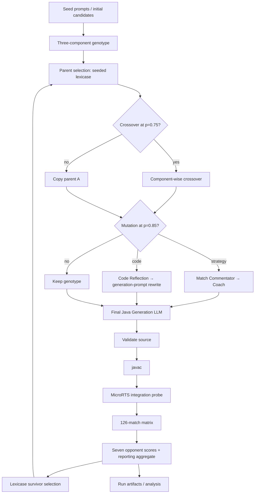
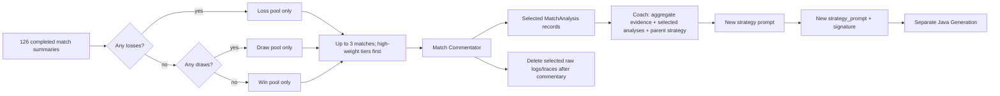
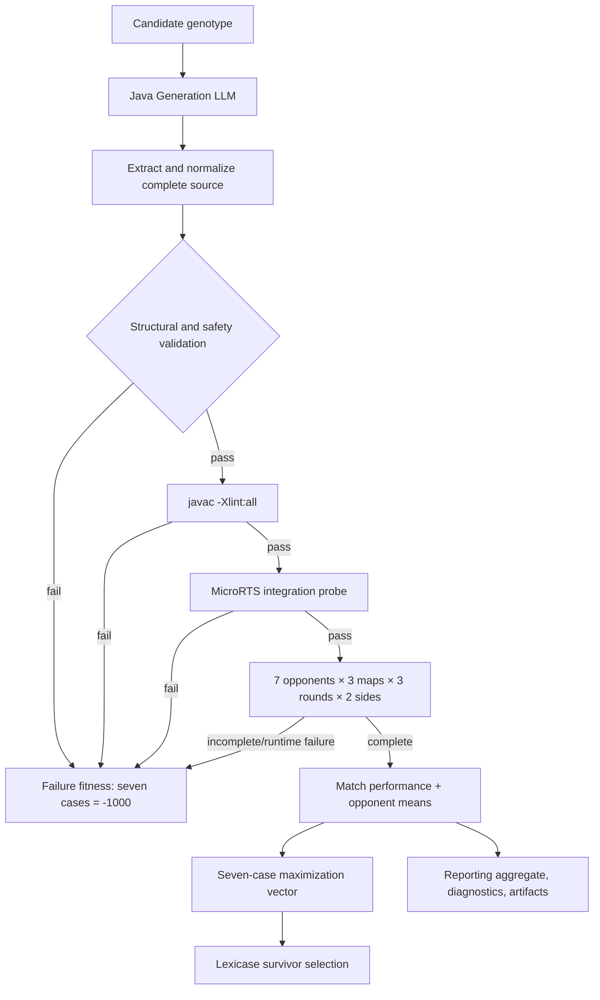

# EAGLE: Current Implementation Audit for Research Slides

**Audit date:** 2026-08-12  
**Scope:** executable repository behavior in `/home/mhlab/EAGLE`  
**Evidence rule:** source and active call paths take precedence over older design documents.

EAGLE here means **Evolutionary Algorithm for Game-playing with LLM-Enabled Agents**. It evolves prompt state that is used to generate Java MicroRTS agents. This audit does not describe GEPA, ACE, MIPRO, CAPO, surrogate search, or runtime LLM-controlled agents.

## Executive summary

The live system is a generational evolutionary search over complete Java-agent genotypes. The canonical command is `python -m eagle run`, normally launched by `run.sh`. Generation 0 is initialized from seed prompts and evaluated before any offspring are made. Each later generation creates exactly `population_size` offspring by selecting two parents with seeded lexicase, optionally applying three-component uniform crossover, optionally applying one prompt mutation, then sending every child through the same Java-generation → validation → compilation → integration → MicroRTS evaluation pipeline.

The active evolutionary fitness representation is **seven independent opponent scores**, all maximized and all used as lexicase cases. The weighted Game Performance aggregate is reporting-only. `code_quality`, function capability, strategy alignment, compiler warnings, and diversity metadata are diagnostics or analysis signals; they are not additional selection objectives. There is no active NSGA-II loop and no separate post-evolution final-test executable.

The production experiment configuration is 50 generations, population size 10, crossover rate 0.75, mutation rate 0.85, three maps, three rounds per map, both player sides, and seven fixed opponents: 126 MicroRTS matches per candidate. The runtime configuration starts one local llama.cpp-compatible server using the configured Qwen GGUF model at `127.0.0.1:8080`. All active LLM roles use that one endpoint and model.

## 1. Actual runtime entrypoint and call path

### Entry points

| User action | Actual owner | Result |
| --- | --- | --- |
| `./run.sh configs/experiments/microrts.yaml` | `run.sh` → `python -m eagle run` | Preflight and evolutionary search |
| `./run_env.sh start\|stop\|restart\|status\|check` | `run_env.sh` → `python -m eagle runtime` | One local llama-server lifecycle |
| `./analyze.sh ...` | `analyze.sh` → `python -m eagle analyze` | Offline CSV/JSON/Markdown/PNG analysis |
| `python -m eagle ...` | `eagle/__main__.py::main` | Dispatches only `runtime`, `run`, and `analyze` |

Implementation:

- `eagle/__main__.py::main`
- `eagle/cli/run.py::main`
- `eagle/cli/runtime.py::main`
- `eagle/cli/analyze.py::main`
- `run.sh`, `run_env.sh`, `analyze.sh`

### Evolutionary runtime trace

The active call sequence is:

```text
run.sh
  → eagle.cli.run::main
  → load_runtime_config + ExperimentConfig.from_file
  → runtime values override experiment LLM URL/model
  → ExperimentConfig.validate + opponent preflight
  → eagle.search::run_search
      → initialize run/artifact directories and LLM backends
      → initialize_population
      → evaluate_population(generation=0)
          → evaluate_candidate for each seed candidate
              → generate_java_agent_result
              → source validation
              → javac compilation
              → MicroRTS integration probe
              → 126-match matrix
              → metrics and objectives
              → candidate artifacts
      → for generation = 1 ... generations-1:
          → create_offspring
              → lexicase parent A and parent B
              → crossover or one-parent copy
              → optional Strategy or Code mutation
          → evaluate_population(offspring)
          → update archives/error memory/timing
          → select_next_generation
          → persist surviving generation
          → optional stagnation stop
      → write_summary + finalize_run
```

Implementation:

- `eagle/cli/run.py::main`
- `eagle/search.py::_run_search_impl`
- `eagle/search.py::initialize_population`
- `eagle/search.py::create_offspring`
- `eagle/evaluation.py::evaluate_population`
- `eagle/evaluation.py::evaluate_candidate`
- `eagle/selection.py::select_next_generation`
- `eagle/run_artifacts.py::record_generation`, `finalize_run`

`--resume` follows `eagle/resume.py::resume_search`: it loads the latest persisted surviving population, validates the resolved configuration, reconstructs the same operator/evaluation plumbing, and continues at the next generation. It does not start a separate algorithm.

### Overall pipeline



| Block | Input → output | LLM? | MicroRTS? | Owner |
| --- | --- | --- | --- | --- |
| Initialization | Seed prompt(s) → `Candidate` genotype(s) | No | No | `eagle/search.py::initialize_population` |
| Parent selection | Evaluated population → two parents | No | No | `eagle/selection.py::select_parent`, `lexicase_select` |
| Crossover/copy | Parents → child genotype | No | No | `eagle/crossover.py::crossover`, `eagle/search.py::create_offspring` |
| Strategy mutation | Evaluated evidence → new `strategy_prompt` and strategy metadata | Yes, commentator/coach | Uses retained match evidence; does not run new matches | `eagle/strategy_reflection.py::StrategyReflectionPipeline.run` |
| Code mutation | Structured code evidence → new `generation_prompt` | Yes, Code Reflection and Rewrite | No new matches | `eagle/rewrite.py::PromptRewriteMutation.mutate` |
| Java generation | Complete genotype → complete `CandidateAgent.java` phenotype | Yes, unless mock | No | `generation/java_agent_generator.py::generate_java_agent_result` |
| Validation | Raw response → extracted/validated source or stage failure | No | No | `generation/java_agent_generator.py::validate_generated_java_source` |
| Compilation | Valid source → candidate class directory | No | `javac`, not a game | `evaluation/compiler.py::compile_generated_agent` |
| Integration | Class directory → seven ordered integration checks | No | MicroRTS classes/probe | `evaluation/microrts_runner.py::integrate_microrts_agent` |
| Match evaluation | Integrated agent → 126 match results | No | Yes | `eagle/evaluation.py::evaluate_matches`, `evaluation/match_matrix.py` |
| Strategy Alignment | Successful evaluation evidence → diagnostic score 0–10 | Yes | Consumes summary only | `evaluation/strategy_alignment.py::evaluate_strategy_alignment` |
| Objective construction | Match/opponent summaries → seven-case fitness vector | No | No | `evaluation/objectives.py::build_objectives` |
| Survival | Parent + offspring populations → fixed-size survivors | No | No | `eagle/selection.py::select_next_generation` |

## 2. Candidate representation

### Genotype, phenotype, and identity

One `Candidate` is a frozen dataclass in `eagle/candidate.py::Candidate`. The three inherited/genotypic components are:

1. `strategy_prompt`: natural-language strategy instructions.
2. `previous_code`: the selected parent’s latest evaluated Java phenotype, used as generation context.
3. `generation_prompt`: instructions for complete-file Java generation.

The generated phenotype is separate: `generated_java` and `generated_java_path` contain the newly generated complete Java file. `previous_code` is not overwritten during evaluation; it remains the pre-generation code inherited by the child. After successful generation, `generated_java` becomes the candidate’s latest evaluated phenotype and is the code inherited by a later child’s `previous_code` when that component is selected.

Important fields:

| Field group | Current fields / meaning |
| --- | --- |
| Identity | `id` (default 12-character UUID-derived hex string), `generation` |
| Lineage | `parent_ids`, `strategy_parent_id`, `previous_code_parent_id`, `generation_prompt_parent_id`, `source_candidate_ids`, `operator` |
| Genotype | `strategy_prompt`, `previous_code`, `generation_prompt` |
| Phenotype | `generated_java`, `generated_java_path`, `compile_status` |
| Fitness | `fitness_objectives`: seven opponent IDs; `game_eval_result`: match/aggregate evidence; `code_quality_result`: diagnostic payload |
| Strategy metadata | `strategy_signature`, `strategy_niche`, `mutation_intent`, `parent_strategy_niche`, `niche_changed` |
| State/failure | `status`, `failure_stage`, `failure_reason` |
| Persistence | `artifacts`, `timing`, compact `metadata` including reflection evidence and mutation status |

The parent/component IDs are first-class provenance, not inferred by comparing prompt text. `Candidate::to_json_dict` serializes the resumable snapshot as schema `eagle-candidate-v2`; `Candidate::lineage_to_json_dict` serializes lineage schema `1.0`.

### Is the prompt divided into logical sections?

The **candidate strategy prompt is not parsed into fixed logical sections** by the active implementation. It is bounded to 4,000 characters and 80 lines by configuration when mutation output is committed. The Coach is asked to emit a replacement strategy prompt and a categorical signature, but the signature is metadata, not a structured prompt genotype.

The Java-generation request does have three explicit candidate inputs—strategy prompt, generation prompt, and previous/current Java source—through `Candidate::generation_input` and the `java_generation` template. This is a prompt assembly contract, not a multi-module function genotype.

### Candidate structural diagram

```text
Candidate
├── id, generation
├── lineage: parent_ids + component-parent IDs + operator
├── genotype
│   ├── strategy_prompt
│   ├── previous_code          [parent phenotype context]
│   └── generation_prompt
├── phenotype: generated_java + compiled classes path
├── fitness_objectives: {lightrush, ..., tma}
├── diagnostics: game_eval_result + code_quality_result
├── strategy metadata: signature / niche / intent
└── status, failures, artifacts, timing, mutation metadata
```

Implementation/tests: `eagle/candidate.py::Candidate`, `tests/test_phase1_candidate_foundation.py`, `tests/test_phase2c_mutation_pipeline.py`, `tests/test_canonical_run_artifacts.py`.

## 3. Evolutionary algorithm

### Population and termination

- Production configuration: `generations: 50`, `population_size: 20` in `configs/experiments/microrts.yaml`.
- Smoke configuration: one generation and population size 1 in `configs/experiments/microrts-smoke.yaml`.
- Generation 0 is the seed population, evaluated immediately.
- `initialize_population` creates one candidate per seed prompt, then cycles seed prompts until population size is reached. There is no explicit duplicate-prevention mechanism; repeated seed prompts can therefore produce distinct IDs with identical genotype text.
- Each later generation creates exactly `population_size` offspring.
- `stagnation_generations: 10` can stop the loop early when the sorted seven-case population signature is unchanged for ten iterations. The signature is based on opponent fitness vectors, not candidate IDs or code quality.
- Finalization writes the current evaluated population and summary; there is no additional match evaluation at termination.

### Parent selection and survivor selection

The active parent selector is **seeded lexicase**, not tournament selection, Pareto selection, or NSGA-II.

`eagle/selection.py::lexicase_select`:

1. Starts with all candidates in the supplied population.
2. Randomly permutes all seven cases using `rng.sample`.
3. Computes the maximum exact score among current survivors for the next case.
4. Keeps only candidates whose score equals that maximum.
5. Stops when one candidate remains, otherwise continues through the case order.
6. Uses `rng.choice` if a tie remains after all cases.

There is no epsilon/tolerance, no approximate comparison, and no fallback case order. Each offspring requests parent A and parent B independently, so the two parent IDs may be identical.

Survival in `select_next_generation` is opponent-wise lexicase replacement:

1. Fill the fixed population by seeded lexicase selection from distinct offspring.
2. If offspring are insufficient, fill remaining slots by seeded lexicase selection from the old population.
3. If there are no offspring, retain the current population up to the fixed size.
4. Truncate to the fixed population size.

Aggregate Game Performance affects reporting and `best_candidate` only; it is not a lexicase case and never selects survivors. `code_quality` is not consulted by either parent or survivor selection. A capability winner can be retained through parent fallback or lost when a replacement offspring is selected; there is no implicit elitism.

The seven cases and their reporting weights are:

| Case | Opponent | Reporting weight |
| --- | --- | ---: |
| `lightrush` | LightRush | 1.0 |
| `heavyrush` | HeavyRush | 1.0 |
| `workerrush` | WorkerRush compatibility adapter | 1.0 |
| `allinbot` | AllInBot upstream runtime | 2.0 |
| `mayari` | Mayari | 2.0 |
| `coac` | COAC | 2.0 |
| `tma` | TMA | 2.0 |

Weights are **not lexicase probabilities**. They are used for the reporting aggregate and for reflection’s within-outcome weight tiers.

### Crossover

`eagle/search.py::create_offspring` applies crossover when `len(population) > 1` and `rng.random() < crossover_rate`; production probability is 0.75. `eagle/crossover.py::crossover` chooses a parent independently for each of three components:

- `strategy_prompt` and its strategy signature/niche;
- `previous_code`, taken from the selected parent’s `generated_java`;
- `generation_prompt`.

This is uniform crossover at **component granularity**, not token, sentence, method, or Java-line granularity. Provenance records the selected component-parent IDs. If crossover is not applied, the child copies parent A’s three components and records `operator: copy`.

### Mutation operators

At most one mutation is attempted per offspring, after crossover/copy, with production trigger probability 0.85.

| Operator | Routing | LLM sequence | Genotype change |
| --- | --- | --- | --- |
| Strategy Reflection | `eagle/aos.py::AdaptiveOperatorSelection` selects `strategy_reflection` | selected match Commentator calls → Coach | Changes only `strategy_prompt` plus strategy metadata |
| Generate-Code Reflection | `eagle/aos.py::AdaptiveOperatorSelection` selects `generate_code_reflection` | Code Reflection → prompt Rewrite | Changes only `generation_prompt` |

AOS starts at Strategy `0.20` / Generate-Code `0.80`, enforces a `0.10`
exploration floor, and learns from execution-first parent-child rewards and
opponent-wise LOSS/DRAW/WIN changes. It is updated once per generation; no
win-rate or code-quality schedule controls operator choice.

Strategy mutation additionally samples one intent from the EA RNG distribution: `REFINE` 0.40, `COUNTER` 0.25, `STRUCTURAL` 0.20, `ALTERNATIVE` 0.15. The active sports-role Coach directly emits the replacement strategy prompt; the generic two-call `PromptRewriteMutation` strategy path exists but is not the strategy operator wired by `eagle/search.py`.

### EA pseudocode

```text
population ← seed candidates
evaluate(population, generation=0)

for generation = 1 .. configured_generations-1:
    offspring ← []
    while len(offspring) < population_size:
        parent_a ← lexicase(population)
        parent_b ← lexicase(population)
        child ← component_crossover(parent_a, parent_b) with probability crossover_rate
                otherwise copy(parent_a)
        if random() < mutation_rate:
            operator ← AOS.select(current_generation_probabilities)
            child ← operator(child, structured evidence)
        offspring.append(child)

    evaluate(offspring)  # generation → validation → compile → integration → 126 matches
    reward each selected operator from parent-child execution/case changes
    update AOS credits and probabilities once for the next generation
    population ← lexicase-selected distinct offspring, then parent fallback
                    + old-population fallback if needed
    persist generation
    stop if configured stagnation threshold is reached

persist final population and summary
```

Relevant tests: `tests/test_lexicase_opponents.py`, `tests/test_eagle_pipeline.py::test_crossover_uniform_selects_complete_java_source`, `tests/test_strategy_reflection_pipeline.py`, `tests/test_strategy_diversity.py`.

## 4. Strategy Reflection pipeline

### Active roles and responsibilities

The active Strategy Mutation is `eagle/strategy_reflection.py::StrategyReflectionPipeline.run`, instantiated as `StrategyReflectionMutation` by `eagle/search.py`. Its active role sequence is:

```text
selected match log + compact match record
    → Match Commentator
    → Coach (directly consumes diagnoses + aggregate metadata)
    → replacement strategy_prompt
    → separate final Java Generation stage
```

| Active role | Input | Responsibility | Output / next consumer |
| --- | --- | --- | --- |
| `match_commentator` | One selected match record, candidate strategy text, opponent identity/class, bounded tick-log chunks | Describe both strategies, turning points, strengths, weaknesses, and win/loss causes for that match only | `MatchAnalysis`; Coach consumes selected analyses |
| `coach` | Parent `strategy_prompt`, selected `MatchAnalysis` records, aggregate opponent results, selection metadata, one mutation intent | Convert evidence into concrete conditional strategic rules and a replacement prompt; emit categorical signature | New `strategy_prompt`, signature/niche, and strategy mutation metadata |
| Generator | The complete mutated genotype | Generate full Java phenotype | Separate `generation/java_generation` stage; not called inside `strategy_reflection.py` |

`CANONICAL_ROLES` also lists `generator`, but the strategy-reflection module does not invoke a generator role. The actual generator is `generation/backend.py` through `eagle/evaluation.py` after mutation. The inline prompts use `ROLE: match_commentator` and `ROLE: coach`.

### Evidence selection policy

`select_reflection_matches` operates globally over the candidate’s completed match summaries:

1. Partition matches by candidate-perspective outcome into `loss`, `draw`, and `win`.
2. Select exactly one outcome pool using strict priority: losses if any exist; otherwise draws if any exist; otherwise wins.
3. Sample up to three matches without replacement from that one pool.
4. Within the selected outcome pool, consume descending `opponent_weight` tiers first and sample randomly within each tier. Weights are categorical tier priority, not probabilities.

Thus `loss > draw > win` means **only losses are eligible when any loss exists; draws are not backfilled; wins are considered only when no losses or draws exist**. Sampling is not independent per opponent. It is one global sample over all available opponents/maps/sides, with a deterministic seed derived from run seed, generation, candidate ID, and reflection invocation.

The active production evaluator makes 126 match records available, so the requested sample is at most 3 of 126. If fewer eligible matches exist, it uses the smaller number; there is no outcome-class backfill.

### Strategy Reflection diagram



The diagram shows strict outcome-pool priority, not probabilistic loss/draw/win weighting. The deletion boundary is after commentary handling; durable summaries and structured reflection artifacts remain.

### What each LLM sees

- Match Commentator sees the candidate strategy prompt, opponent name/class, complete compact match record, candidate side, map and other match metadata, and bounded non-overlapping tick records from `match_log.jsonl.gz`. It does not receive the parent Java source and is instructed not to calculate fitness or write Java.
- Coach sees the parent strategy prompt, aggregate Game Performance, all opponent summaries, selected analyses, selection metadata, and selected mutation intent. It does not receive raw tick logs or Java.
- Final Java Generator sees the new strategy prompt, unchanged/inherited generation prompt, previous code context, action API guide, and complete current source template/context.

### Log retention and deletion

During `_finish_match`, MicroRTS round states are converted to compact telemetry, a lossless compressed match trace, and a temporary compressed match log. In `match_artifact_mode: compact` (the production default), raw `round_states/` and replay files are removed after telemetry/trace/log persistence. In `full` mode they initially remain.

When Strategy Reflection starts, all unselected matches have their `match_log_path`, `match_trace_path`, replay, and round-state directory removed. Selected matches are passed to the Commentator and their raw files are deleted after terminal commentary handling, including on commentary failure. The durable evidence that survives is:

- compact match and opponent summaries under `candidates/<id>/evaluation/`;
- `evaluation/matches.json`, `game_performance.json`, and objective artifacts;
- selected `commentary/<match_id>/match_analysis.json` and role request/response artifacts;
- `reflection/match_selection.json`, Coach input/result, and failure status;
- run-level generation metrics, candidate snapshots, timing, and error memory.

This is an intentional evidence bottleneck: the raw trace is temporary, while structured summaries and selected analysis survive.

Implementation: `eagle/strategy_reflection.py::select_reflection_matches`, `StrategyReflectionPipeline::_commentate`, `_delete_raw_match_artifacts`; `evaluation/runtime_evaluation.py::_finish_match`; `evaluation/match_logs.py`.

## 5. LLM architecture and runtime configuration

### Active LLM roles

| Role/stage | Active call location | Prompt source | Output | Model/backend configuration |
| --- | --- | --- | --- | --- |
| Final Java Generator | `generation/backend.py::OpenAICompatibleGenerationBackend.generate` | `config/prompt_templates.toml::templates.java_generation`, via `Candidate::generation_input` | Complete Java source | Shared `LLMClient`, operation `generation` |
| Code Reflection | `eagle/mutation.py::ReflectionStage.run` | `eagle/reflection_prompts.py::build_code_reflection_prompt_bundle` + TOML `code_reflection` | Structured diagnosis + revised generation prompt proposal | Shared OpenAI-compatible backend, operation `reflection` |
| Code Rewrite | `eagle/rewrite.py::PromptRewriteStage.run` | TOML `code_rewrite` | Prompt-only generation-prompt text | Shared OpenAI-compatible backend, operation `rewrite` |
| Match Commentator | `eagle/strategy_reflection.py::StrategyReflectionPipeline::_call_role` | Inline `_commentator_prompt` | `MatchAnalysis` JSON | Shared OpenAI-compatible backend created with operation `match_commentator` |
| Coach | Same `_call_role` | Inline `_coach_prompt` | New strategy prompt + signature | Same endpoint/model/backend object as sports roles |
| Strategy Alignment diagnostic | `evaluation/strategy_alignment.py::evaluate_strategy_alignment` | TOML `strategy_alignment` | JSON score in [0,10] and reason | Shared endpoint/model; one call after successful matrix |

The mock path replaces these calls with deterministic mock backends. The production CLI chooses `openai` unless `--mock` is given. The name `openai` here means the repository’s small OpenAI-compatible HTTP transport; the configured server is llama.cpp.

### Current backend and endpoint contract

`configs/runtime.yaml` is the source of truth for the active runtime:

- model: `/home/mhlab/EAGLE/experiment_env/model/qwen3-5-9b-ud-q4-k-xl-q4-k-xl-bbcc0f54/model.gguf`;
- server: the configured local llama.cpp `llama-server` binary;
- host/port: `127.0.0.1:8080`;
- context size: 32768;
- GPU layers: -1;
- parallelism: 1, threads: 8, batch size: 512.

`eagle/cli/run.py::main` loads the experiment YAML, then replaces its LLM URL/model values with the runtime config’s base URL and model path. Experiment configs cannot select endpoints, ports, models, role mappings, or server lists. All calls resolve to `<base_url>/v1/chat/completions`; structured reflection/alignment requests request JSON output and all calls disable Qwen thinking via `chat_template_kwargs.enable_thinking: false`.

The code accepts an HTTP(S) URL at the client layer, and runtime host validation accepts an IP or resolvable hostname, but the supported operational workflow starts exactly one local server from `runtime.yaml`. There is no active per-role model topology, remote-server mode, LAN discovery, fallback model, or role-specific endpoint selection. Different stage operation labels and the commentator temperature do not create different model instances.

Relevant source/tests: `eagle/runtime/config.py`, `eagle/runtime/processes.py`, `eagle/llm.py`, `eagle/cli/run.py`, `tests/test_canonical_run_cli.py::test_experiment_rejects_model_and_endpoint_overrides`.

## 6. Java agent generation architecture

The active generator produces **one complete file**, not separate generated function files or modules:

```text
Candidate strategy_prompt + generation_prompt + previous/current Java
        ↓
OpenAI-compatible Java Generation LLM
        ↓
complete ai.generated.CandidateAgent.java
        ↓
source validation → javac → integration probe
        ↓
same compiled class directory for all matches
```

### Fixed template and generated area

The seed/template file is `eagle/java_templates/CandidateAgent.java`. It contains:

- package `ai.generated` and imports;
- `CandidateAgent extends AbstractionLayerAI`;
- two required constructors;
- `reset`, `clone`, and `getAction`;
- `AgentContext` and `PathChoice` nested classes;
- fixed action helpers: `commandMove`, `commandHarvest`, `commandTrain`, `commandBuild`, `commandAttack`, `commandIdle`;
- fixed lookup/defense support including `isIdleAlly`, `nearestEnemy`, `nearestResource`, `ownBase`, and `applyAutoDefense`;
- one marked strategy region containing the seeded `decide`, `economy`, `expansion`, `combat`, `selectTarget`, and `findPath` behavior.

The generation prompt tells the LLM to preserve the package, class, lifecycle methods, helpers, and strategy markers while changing the strategy region. The actual output is nevertheless a complete file. There is no separate Decision/Economy/Combat/Expansion/Target-Selection/Path-Selection genotype or source module. Those names are only functions present in the checked-in seed template and diagnostics.

`generation/java_agent_generator.py::validate_generated_java_source` enforces the external package/class/superclass/constructor/method contract, allowed imports, and prohibited behavior patterns. It does **not** enforce fixed internal helper names or the strategy markers as a hard runtime contract; missing strategy markers can pass external validation but receive a failing strategy-region diagnostic. The generator’s structure is therefore a strong prompt/template convention plus external contract validation, not a fully immutable scaffold.

### Restrictions on generated code

The validator rejects network imports/APIs, file I/O APIs, process creation, environment access, process control, LLM endpoint references, reflection/class-loader APIs, and imports outside `ai.*`, `rts.*`, `util.*`, `java.util.*`, and `java.lang.*`. Java is extracted from an optional complete Markdown fence; partial fences, surrounding prose, empty output, JSON, patches, and isolated method bodies are rejected.

## 7. Validation, compilation, integration, and failure handling

The exact stage order in `eagle/evaluation.py::evaluate_candidate` is:

1. Call the Java generation backend and retain raw response.
2. Extract and normalize one complete source file.
3. Run structural/prohibited-behavior validation.
4. Compile once with `javac -Xlint:all` into `classes/<candidate_id>/`.
5. Run the MicroRTS integration probe.
6. Run the configured complete match matrix using the same source/classes.
7. Build diagnostics, Game Performance summaries, code quality, and objectives.

The integration probe checks, in order: class loading, AI inheritance, both constructors, `reset`, `clone`, `getAction`, and non-null/resource-valid `PlayerAction`. A failed check blocks later checks and all matches. A successful candidate is not regenerated between matches.

### Candidate evaluation diagram



The same compiled candidate classes are reused for all matrix entries. A normal completed loss is a valid Game Performance value; the `-1000` sentinel is reserved for blocking or incomplete evaluation failure.

### Failure categories and penalties

The major recorded stages are:

- `generation`: backend failure or no usable source;
- `validation`: package/class/superclass/constructor/method/prohibited-behavior failure;
- `compilation`: `javac` failure with structured errors/warnings;
- `integration`: class loading/contract/probe failure;
- `runtime`: match crash, illegal action, deadlock, exception, timeout, missing/invalid result, or incomplete matrix;
- candidate-level persistence and commentary failures are retained separately and do not silently become normal game losses.

If any generation/validation/compilation/integration/runtime stage blocks completion, or if the complete matrix is not present, `evaluation/objectives.py::build_objectives` assigns every one of the seven opponent cases `-1000.0`. This is distinct from a normal completed MicroRTS loss, whose Game Performance is a valid score centered around -100 plus shaping. Partial completed match records and failure diagnostics are retained.

Code quality uses the same `-1000.0` failure sentinel, with `failure_stage` recorded. It is not an extra fitness coordinate.

Relevant tests: `tests/test_phase3_validation.py`, `tests/test_phase3_compilation.py`, `tests/test_phase3_integration.py`, `tests/test_phase4_evaluation_pipeline.py`, and `tests/test_eagle_pipeline.py::test_backend_failure_gets_failed_game_performance`.

## 8. Exact game-evaluation matrix

### Active opponents

The active roster is resolved by `eagle/opponents.py::SEARCH_OPPONENT_REGISTRY` in the fixed order from `eagle/opponent_cases.py::LEXICASE_CASES`:

```text
LightRush, HeavyRush, WorkerRush, AllInBot, Mayari, COAC, TMA
```

`WorkerRush` is not supplied by the vendored runtime; `eagle/evaluation.py::_prepare_worker_rush_adapter` compiles a run-local subclass of `LightRush` under the canonical class identity `ai.abstraction.WorkerRush`.

AllInBot, Mayari, COAC, and TMA are external/bundled dependencies. The code performs preflight checks for their JARs/manifests in a real run. In this checkout, only the manifest/source marker files are present under `third_party/final_test_opponents`; the external JARs are not present. Therefore:

> **NOT VERIFIED:** a real, non-mock 126-match run against all seven opponents cannot be verified from this checkout alone; the active code path and required roster are verified, but the external runtime assets must be installed.

There is **no previous-generation EAGLE opponent** in the active matrix. The field `ExperimentConfig.opponent` still defaults to `ai.abstraction.LightRush` and the resolved config records it, but `evaluate_matches` uses the seven fixed roster entries, not that scalar field.

### Maps, rounds, sides, and seeds

Production configuration uses:

```text
maps/8x8/basesWorkers8x8.xml
maps/16x16/basesWorkers16x16.xml
maps/24x24/basesWorkers24x24.xml
```

Each opponent runs 3 rounds per map. Each round uses a deterministic seed schedule `(0, 1, 2)`. The candidate is p0 once and p1 once for each map/round/seed; the opponent is on the other side. `evaluation/match_matrix.py::build_match_matrix` emits opponent-major → map-major → round-major → candidate-player-0-then-1 order.

The exact count is:

```text
7 opponents × 3 maps × 3 rounds × 2 candidate-side configurations
= 126 MicroRTS matches per candidate
```

The candidate source and compiled classes are hashed once and reused across the matrix. There is no deterministic-match deduplication.

## 9. Fitness and objectives

### Evolutionary fitness vector

The optimizer vector is:

```text
fitness(c) = (
  score_lightrush, score_heavyrush, score_workerrush, score_allinbot,
  score_mayari, score_coac, score_tma
)
```

All seven coordinates are maximized. Each coordinate is the mean of the candidate’s 18 match scores against that opponent: 3 maps × 3 rounds × 2 sides. If the opponent group is incomplete, that opponent score is `-1000.0`; if the overall evaluation fails, all seven objective coordinates are `-1000.0`.

The aggregate used for reporting is:

```text
GamePerformance_reporting(c)
  = (1.0 P_lightrush + 1.0 P_heavyrush + 1.0 P_workerrush
     + 2.0 P_allinbot + 2.0 P_mayari + 2.0 P_coac + 2.0 P_tma) / 11.0
```

It is stored as `game_eval_result.game_performance`; it is not an evolutionary objective and is not a Pareto/lexicase coordinate.

### Per-match Game Performance formula

For a candidate-perspective match `i`, let:

- `R_i = +100` for a candidate win, `0` for draw/timeout draw, `-100` for candidate loss;
- `D^unit_i` be the mean over available telemetry ticks of candidate total unit material minus opponent total unit material;
- `D^resource_i` be final candidate resource minus opponent resource;
- `T_i = clip(end_tick / max(1, max_tick), 0, 1)`;
- unit values be Resource 0, Base 10, Barracks 5, Worker 1, Light 2, Heavy 4, Ranged 2.

The implementation in `evaluation/game_performance.py::compute_performance_breakdown` is:

```text
M_i = 5 · tanh(D^unit_i / 10)
Q_i = 3 · tanh(D^resource_i / 10)

S_i = 2 · T_i                 if R_i < 0
      2 · (1 - T_i)           if R_i > 0
      0                       if R_i = 0

H_i = clip(M_i + Q_i + S_i, -10, +10)
P_i = R_i + H_i
```

The valid per-match range is therefore `[-110, +110]`; the result component dominates and the shaping component is bounded to `[-10,+10]`. Match score aggregation is:

```text
18 match scores for one opponent → opponent score
7 opponent scores → seven-case objective vector
seven-case vector → weighted reporting aggregate only
```

The code also persists result/material/resource/survival breakdowns, temporal telemetry summaries, win/draw/loss counts, map averages, side averages, and standard deviation diagnostics.

### Code quality / simplicity diagnostic

The active successful code-quality value is a deterministic simplicity score over the single extracted `candidate_generated_methods` strategy region:

```text
normalized_cyclomatic = clip(max(0, C - 1) / 39, 0, 1)
normalized_nesting    = clip(max(0, N - 1) / 9,  0, 1)
normalized_logicalLOC = clip(max(0, L - 1) / 299, 0, 1)
normalized_longest    = clip(max(0, F - 1) / 119, 0, 1)

complexity_penalty = min(100,
    40·normalized_cyclomatic
  + 25·normalized_nesting
  + 20·normalized_logicalLOC
  + 15·normalized_longest)

code_quality = 100 - complexity_penalty
```

For successful compilation the range is `[0,100]`, where 100 is the simplest measured implementation. For failure it is `-1000.0`. Compiler warning count, function capability, strategy alignment, and strategy-region validity are persisted in the breakdown but do not alter the successful score. `evaluation/code_quality.py` re-exports the active implementation from `evaluation/canonical_code_quality.py`.

The active Strategy Alignment call produces a 0–10 score and reason from strategy prompt + generated Java + behavior summary. It is a diagnostic used by Code Mutation routing/context; it is not a third objective. Function capability similarly produces a 0–100 diagnostic from static and runtime evidence.

## 10. Selection pressure and diversity

### Explicit mechanisms

- Ten distinct opponent cases in lexicase create case-wise selection pressure.
- Independent random case order is used for each lexicase selection.
- Two-parent component-level crossover is active at rate 0.75.
- Prompt mutation is active at rate 0.85, with failure-aware routing.
- Strategy mutation has four explicit intent probabilities.
- Random sampling within reflection’s selected outcome/weight tier is deterministic from recorded provenance.
- Aggregate reporting does not retain an elite; survivor capability is selection-dependent.
- Random initialization cycles seed prompts to the configured population size.
- `strategy_archive.json` and `opponent_archive.json` preserve representatives for later inspection.
- Strategy signatures/niches and generation diversity metrics quantify niche counts, dominant niche, distance, new/revisited niches, and mutation niche changes.

### Incidental stochasticity

- EA `random.Random` controls parent selection, crossover component choices, mutation trigger/routing, and intent selection.
- The LLM temperature is 0.2 in the production config, so non-mock LLM responses may add sampling variability.
- MicroRTS itself is run with fixed round seeds and side-swapped paired matches.

### Not implemented as an optimizer mechanism

- No novelty objective, archive-based survivor pressure, duplicate prevention, Pareto front, crowding distance, or explicit population diversity constraint.
- Strategy niche/archive/diversity values do not change parent selection, survivor selection, or fitness.
- Opponent weights do not change lexicase case scores; they affect reporting and reflection tier ordering.

The practical consequence is that diversity is encouraged primarily by lexicase case diversity, component recombination, prompt mutation, and stochastic routing, while the niche archive is observational rather than selective.

## 11. Artifacts and experiment logging

### Run-level structure

The active run layout is approximately:

```text
runs/<run_id>/
├── manifest.json
├── config.yaml                       # source experiment file copy
├── resolved_config.json               # post-default/runtime-resolved settings
├── prompt_snapshot.json               # seed/meta prompts and template hashes
├── summary.json
├── final_population.json
├── generation_metrics.jsonl
├── errors.jsonl                       # bounded failure memory
├── timing.jsonl                       # generation and LLM timing events
├── llm_logs/                          # generation/reflection/rewrite request envelopes
├── generations/generation_####.json
├── strategy_archive.json              # analysis-only niche representatives
├── opponent_archive.json              # best valid candidate per opponent case
├── candidates/<candidate_id>/
├── generated_agents/<candidate_id>/
└── classes/<candidate_id>/
```

### Candidate-level structure

```text
candidates/<id>/
├── genotype/
│   ├── strategy_prompt.txt
│   ├── strategy_signature.json
│   ├── previous_code.java
│   └── generation_prompt.txt
├── lineage.json
├── crossover/provenance.json           # only for crossover children
├── generation/
│   ├── request.txt
│   ├── response_raw.txt
│   ├── extracted_candidate.java
│   ├── normalized_candidate.java
│   └── result.json
├── validation/validation_result.json
├── compilation/compilation_result.json + command/stdout/stderr
├── integration/integration_result.json + stdout/stderr
├── mutation/                           # reflection/rewrite requests, raw responses, metadata
├── strategy_alignment/                # request, raw response, parsed result
├── evaluation/
│   ├── game_performance.json
│   ├── matches.json
│   ├── objectives.json
│   ├── code_quality.json
│   ├── function_capability.json
│   ├── commentary_aggregation.json
│   ├── summary.json
│   └── runtime_failure.json             # when runtime evaluation is partial/failed
├── matches/match_####/                  # compact match result, telemetry, trace/integrity, logs while retained
├── timing.json
├── individual.json
└── candidate_result.json
```

The match runner persists source/class hashes, command, process output, result, timing, telemetry, performance breakdown, map/side/seed/opponent metadata, and trace integrity. Compact mode intentionally removes raw replay and round-state directories after compact evidence is durable; Strategy Reflection later removes the temporary match log/trace artifacts after commentary handling. This means later analysis is rich but cannot reconstruct every raw tick after reflection cleanup.

LLM requests/responses are persisted before downstream parsing where the mutation/generation artifact owners control the stage. `LLMCallLogger` writes JSON envelopes and timing events for generation, Code Reflection, and Rewrite. Sports-role calls persist their role-specific request/response envelopes under candidate `commentary/` and `reflection/` paths.

Implementation: `eagle/artifacts.py`, `eagle/run_artifacts.py`, `eagle/llm.py::LLMCallLogger`, `evaluation/runtime_evaluation.py::_persist_result`, `evaluation/match_trace.py`, `evaluation/match_logs.py`.

## 12. Analysis tooling and GUI status

### Implemented and wired

`python -m eagle analyze` / `analyze.sh` loads a versioned canonical run and produces:

- `summary.md`, `run_summary.json`;
- generation metrics CSV;
- candidate summary CSV;
- individual agent Game Performance CSV and scatter plot;
- individual agent win-rate CSV and one opponent-specific scatter plot per opponent;
- single-match Game Performance CSV used for the light distribution overlay;
- AOS operator statistics CSV and probability plot;
- aggregate Game Performance best/mean/median/worst line plot;
- code-quality diagnostic line plot;
- per-opponent generation CSV and one line plot per opponent;
- objective, operator, timing, error, strategy-diversity, and strategy-niche CSVs.

CLI views can print one candidate’s Game Performance history and selected match commentary. `eagle/analysis/loader.py` restricts run loading to valid direct child run directories with supported manifests/resolved config.

The retained `scripts/run_gui_match.py` is a visual inspection launcher for a single match, not an EA entrypoint. It is useful for replay/visual inspection when its optional GUI opponent assets are installed. There is no current run browser, prompt editor, multi-objective Pareto plot, or active final-test browser in the canonical analysis command.

### Partial or unavailable

- Commentary inspection is implemented for persisted selected commentary, but raw traces may already have been intentionally deleted.
- The GUI utility depends on optional external assets and is not part of the evolutionary loop.
- **NOT VERIFIED:** a real GUI match or non-mock analysis of an actual run was not executed during this repository audit.

Implementation/tests: `eagle/analysis/report.py`, `eagle/analysis/loader.py`, `eagle/cli/analyze.py`, `scripts/run_gui_match.py`, `tests/test_canonical_analysis.py`, `tests/test_gui_match.py`.

## 13. Final-test evaluation

There is **no separate final evaluation mode** in the current executable repository. `eagle/__main__.py` exposes no final-test command; `eagle/final_test/` and `configs/final_test_champions.yaml` are absent; the active search terminates after its last survivor snapshot and summary.

The directory `third_party/final_test_opponents/` is a misleading historical name. Its external opponent assets are referenced by the normal seven-opponent evolution roster (`mayari`, `coac`, `tma`), not by a separate champion-validation split. Any results from those opponents during the run feed the ordinary seven opponent cases. There is no post-evolution result that can feed back into evolution because no post-evolution executor exists.

Evidence: `eagle/__main__.py`, `eagle/opponents.py`, `eagle/evaluation.py::preflight_evaluation_opponents`, `docs/implementation/architecture_traceability_matrix.md` final-test row, and the absence of `eagle/final_test/`.

## 14. Removed / Legacy / No Longer Active

| Item | Status | Evidence |
| --- | --- | --- |
| NSGA-II / Pareto survivor selection | **Legacy/unreachable** | Active calls are `eagle/search.py::_run_search_impl` → `eagle/selection.py::select_next_generation`; no NSGA-II implementation is imported. `docs/architecture/EAGLE_SEARCH.md` still contains an older NSGA-II numbered lifecycle, but its own preamble and the active source contradict that section. |
| Two optimizer objectives `game_performance` + `code_quality` | **Documented in older material, not active** | `evaluation/objectives.py::build_objectives` returns seven opponent keys; `Candidate::objective_vector` returns seven cases; code quality remains `code_quality_result`. |
| `strategy_alignment` as a third objective | **Diagnostic only** | `evaluate_strategy_alignment` runs after successful matrix, but `evaluation/objectives.py` excludes it and `eagle/selection.py` never reads it. |
| Previous-generation EAGLE opponent/self-play | **Removed from active evaluation** | `ExperimentConfig.from_mapping` rejects `eagle_opponent`; `SEARCH_OPPONENT_REGISTRY` has fixed seven cases only. |
| Dynamic opponent weights | **Not active** | Fixed `OPPONENT_WEIGHTS` and validation enforce the canonical IDs/weights; weights are reporting/reflection metadata. |
| Standalone final-test executor | **Removed** | No `eagle/final_test` or final-test CLI; `third_party/final_test_opponents` is reused by active evolution. |
| Runtime LLM-controlled generated agent | **Prohibited/not active** | `DEFAULT_GENERATION_PROMPT` and `FORBIDDEN_BEHAVIOR_PATTERNS` reject network, file, process, environment, and LLM endpoint behavior in generated Java. |
| Surrogate search / GEPA / ACE / MIPRO / CAPO | **Not present in active path** | `eagle/__main__.py`, `eagle/search.py`, and the generation/evaluation dependency closure contain no such operator or surrogate. |
| Multi-model/per-role endpoint topology | **Rejected legacy config** | `eagle/runtime/config.py::_contains_legacy_runtime_key` and `eagle/cli/run.py::_validate_experiment_document` reject server lists, role mappings, and per-role endpoint fields. |
| Old split function/module generation | **Not active** | `GeneratedJavaAgent.source_paths` contains one source path; `CandidateAgent.java` is complete-file generation. |
| Generic Strategy Prompt Rewrite path | **Still optional/reachable as a library, not active EA wiring** | `eagle/rewrite.py::PromptRewriteMutation` supports `mutation_type="strategy"`, but `eagle/search.py` wires `StrategyReflectionMutation` for the strategy operator. |
| Old one-call/no-reflection mutation | **Not active** | Active Code Mutation calls `ReflectionStage` then `PromptRewriteStage`; active Strategy Mutation uses Commentator → Coach. |
| GUI/legacy plotting as canonical analysis | **Not active** | `eagle/analysis/report.py` defines the current compact plots; GUI remains a retained inspection utility. |

## 15. Known implementation limitations grounded in the current code

| Limitation | Why it occurs now | Relevant implementation |
| --- | --- | --- |
| High evaluation cost | Every candidate runs 126 MicroRTS processes/matches, plus source generation, compile, integration, and successful-candidate alignment | `eagle/config.py`, `evaluation/match_matrix.py`, `eagle/evaluation.py` |
| Reflection evidence bottleneck | At most three matches are selected globally, strictly from one outcome class; raw logs/traces are then deleted | `eagle/strategy_reflection.py::select_reflection_matches`, `_delete_raw_match_artifacts` |
| Opponent overfitting risk | Lexicase preserves specialists on fixed opponent cases; the same deterministic maps/seeds are reused each generation | `eagle/selection.py`, `evaluation/match_matrix.py` |
| Weak exploration pressure outside cases | Diversity archive/niches are analysis-only; there is no novelty objective or duplicate prevention | `eagle/strategy_diversity.py`, `eagle/selection.py`, `initialize_population` |
| Expensive and fragile LLM mutation | Strategy mutation can issue multiple commentator calls per log chunk plus Coach; Code Mutation uses Reflection and Rewrite; all depend on one server | `eagle/strategy_reflection.py`, `eagle/rewrite.py`, `eagle/runtime/*` |
| Compilation and runtime failures remove a candidate from useful fitness | Any blocking failure maps all seven cases to -1000, even though partial evidence is retained | `evaluation/objectives.py`, `eagle/evaluation.py` |
| Alignment is a diagnostic LLM dependency | Successful candidates make an additional alignment call; invalid alignment yields a failed diagnostic score, while server errors can propagate from the candidate evaluation | `evaluation/strategy_alignment.py`, `eagle/evaluation.py` |
| Generated architecture is not fully structurally protected | The prompt asks for a marked strategy region and fixed helpers, but validator enforces external contract rather than all internal names/markers | `generation/agent_template.py`, `generation/java_agent_generator.py` |
| Real external roster availability is a deployment dependency | Mayari, COAC, TMA, and AllInBot assets are required by preflight but are not included as complete JARs in this checkout | `eagle/evaluation.py::preflight_evaluation_opponents`, `eagle/opponents.py`, `third_party/*` |
| No held-out final test | The repository ends at evolution artifacts; the fixed evaluation matrix is both search fitness and the available evaluation protocol | `eagle/__main__.py`, `eagle/search.py`, removed final-test surface |

These are architectural consequences visible in the implementation, not redesign proposals.

## 16. Accuracy checklist

| Required audit point | Result |
| --- | --- |
| CLI/run entrypoint | Verified: `run.sh` → `python -m eagle run` |
| Active population loop | Verified: `eagle/search.py::_run_search_impl` |
| Selection algorithm | Verified: seeded exact lexicase for parents and replacement fill |
| Lexicase active | Verified by direct call from `create_offspring` and `select_next_generation` |
| Crossover | Verified: active three-component uniform crossover, rate 0.75 in production config |
| Mutation operators | Verified: Strategy Reflection path and Code Reflection/Rewrite path, trigger 0.85 |
| Reflection roles | Verified: Match Commentator, Coach; final Generator is separate |
| Match sampling | Verified: at most three, strict loss/draw/win pool, descending weight tiers |
| Active opponents | Verified in code: seven fixed cases; PassiveAI/RandomAI/RandomBiasedAI excluded from EA; real external asset availability not verified |
| Previous-generation EAGLE opponent | Verified absent from active matrix |
| Maps / sides / repetitions / seeds | Verified: 3 × 2 sides × 3 rounds, seeds 0/1/2 |
| Matches per candidate | Verified: 7 × 3 × 3 × 2 = 126 |
| Game Performance formula | Verified in `evaluation/game_performance.py` |
| Per-opponent fitness | Verified: seven means, all maximize |
| Code-quality formula | Verified: 100 minus bounded complexity penalty; failure -1000 |
| Failure penalties | Verified: blocking/incomplete evaluation → seven `-1000` cases |
| Java architecture | Verified: one complete `CandidateAgent.java` source path |
| Artifacts | Verified in `eagle/artifacts.py`, `eagle/run_artifacts.py`, runner modules |
| Final-test separation | Verified absent; no post-evolution executor |
| Legacy/dead architecture | Verified against active imports/calls and current repository tree |
| Real non-mock experiment | **NOT VERIFIED** in this audit; external JARs/model/server are deployment dependencies |

## Presentation Outline

The following 10-slide outline is based on the implementation above.

## Slide 1 — Research problem: evolving MicroRTS agents with LLM-generated Java

Purpose: Introduce the search problem and the EAGLE objective.

Key points:

- EAGLE evolves prompts, not runtime LLM behavior.
- Each prompt state is converted into a complete Java MicroRTS agent.
- The challenge is improving game performance while preserving executable, analyzable agents.

Suggested visual: MicroRTS match screenshot beside the prompt → Java → match loop.

Important numbers/formulas: One candidate produces one complete `CandidateAgent.java` phenotype.

## Slide 2 — EAGLE concept and candidate state

Purpose: Explain what an individual is.

Key points:

- Three genotype components: `strategy_prompt`, `previous_code`, `generation_prompt`.
- `generated_java` is the evaluated phenotype, separate from inherited `previous_code`.
- IDs, component-level parent provenance, fitness, failure state, and artifacts are first-class fields.

Suggested visual: Candidate structural diagram from Section 2.

Important numbers/formulas: Candidate fitness has 7 opponent coordinates.

## Slide 3 — Full active architecture

Purpose: Show the end-to-end runtime path.

Key points:

- CLI/configuration initializes one local llama.cpp runtime.
- Generation 0 is evaluated; later children go through variation then the shared evaluator.
- The same compiled Java classes are reused across the complete matrix.

Suggested visual: Overall Mermaid pipeline redrawn as a horizontal architecture flow.

Important numbers/formulas: `generation → validation → compile → integration → 126 matches → selection`.

## Slide 4 — Candidate-to-Java generation

Purpose: Explain how prompts become executable agents.

Key points:

- One complete `ai.generated.CandidateAgent.java` file is generated.
- The repository template supplies the MicroRTS lifecycle and action API.
- Static validation rejects malformed source, unavailable imports, network/file/process/runtime-LLM behavior.

Suggested visual: Fixed outer controller/action API with editable strategy region highlighted.

Important numbers/formulas: Seven integration checks follow compilation; generation output is one file.

## Slide 5 — Evaluation design

Purpose: Establish the experimental matrix and reproducibility protocol.

Key points:

- Seven active opponents: three rush cases and four external opponents. PassiveAI, RandomAI, and RandomBiasedAI are excluded from EA.
- Three maps × three rounds × both candidate sides for every opponent.
- Deterministic round seeds 0, 1, 2; no match deduplication.

Suggested visual: Opponent × map × round × side matrix.

Important numbers/formulas: `7 × 3 × 3 × 2 = 126 matches/candidate`.

## Slide 6 — Fitness design

Purpose: Define exactly what evolution optimizes and what is reporting-only.

Key points:

- Each opponent contributes one mean score over 18 matches.
- All seven opponent scores are maximized and used as lexicase cases.
- Weighted Game Performance with denominator 11.0 is reporting-only; code quality is a diagnostic.

Suggested visual: Ten-dimensional case vector feeding lexicase, with weighted aggregate drawn as a side output.

Important numbers/formulas: `P_i = R_i + clip(5 tanh(D_unit/10) + 3 tanh(D_resource/10) + S_i, -10, 10)`.

## Slide 7 — Evolution, selection, and diversity

Purpose: Explain selection pressure and variation.

Key points:

- Parent selection is exact seeded lexicase over a random order of seven cases.
- Crossover independently chooses strategy, previous code, and generation prompt parents.
- Survivor rule is lexicase-selected offspring with parent fallback; niches/archives are analysis-only.

Suggested visual: Lexicase filtering diagram followed by three-component crossover.

Important numbers/formulas: crossover `p=0.75`, mutation `p=0.85`, population size 10 in production.

## Slide 8 — Strategy Reflection and mutation

Purpose: Show how evidence becomes a new strategy prompt.

Key points:

- Strict selection: losses, else draws, else wins; at most three detailed matches.
- Match Commentator analyzes selected logs, Coach directly consumes aggregate + selected evidence and rewrites strategy.
- Code mutation separately uses Code Reflection + generation-prompt Rewrite.

Suggested visual: Reflection Mermaid diagram with the temporary-log deletion boundary marked.

Important numbers/formulas: `loss > draw > win` is categorical priority, not probabilistic weighting; sample size ≤ 3.

## Slide 9 — Artifacts and analysis

Purpose: Demonstrate reproducibility and post-run analysis.

Key points:

- Resolved config, prompt snapshot, lineage, raw LLM envelopes, generation/compile/integration evidence, match summaries, objectives, and timing are persisted.
- Compact mode deletes raw replay/round-state output after durable summaries; reflection deletes temporary logs/traces after use.
- Analysis produces per-generation, per-agent, per-opponent, timing, failure, and diversity CSVs plus plots.

Suggested visual: Run directory tree with `candidates/<id>/evaluation/` expanded.

Important numbers/formulas: Run artifacts use versioned schemas such as `eagle-run-v1` and `phase4-v3`.

## Slide 10 — Current limitations and next experiment

Purpose: Close with evidence-based limitations and a research direction.

Key points:

- 126 matches per candidate still makes evaluation expensive.
- Fixed maps/seeds and lexicase cases can encourage opponent overfitting.
- Reflection sees at most three worst-class matches and diversity metadata does not affect selection.
- There is no held-out post-evolution final test in the current repository.

Suggested visual: Cost/evidence bottleneck diagram: 126 matches → ≤3 detailed reflection matches → next prompt.

Important numbers/formulas: production run requests up to 50 generations × 10 candidates × 126 matches, before early stagnation or failures.

## Evidence index

Primary implementation owners used in this audit:

- Runtime/EA: `eagle/cli/run.py::main`, `eagle/search.py::_run_search_impl`, `eagle/search.py::create_offspring`.
- Candidate/lineage: `eagle/candidate.py::Candidate`, `Candidate::to_json_dict`, `Candidate::lineage_to_json_dict`.
- Selection/variation: `eagle/selection.py::lexicase_select`, `select_next_generation`; `eagle/crossover.py::crossover`.
- Mutation/reflection: `eagle/strategy_reflection.py::StrategyReflectionPipeline`, `select_reflection_matches`; `eagle/rewrite.py::PromptRewriteMutation`; `eagle/mutation.py::ReflectionStage`.
- Java: `generation/java_agent_generator.py::generate_java_agent_result`, `validate_generated_java_source`; `eagle/java_templates/CandidateAgent.java`.
- Evaluation: `eagle/evaluation.py::evaluate_candidate`, `evaluate_matches`; `evaluation/match_matrix.py::build_match_matrix`; `evaluation/microrts_runner.py::integrate_microrts_agent`; `evaluation/runtime_evaluation.py::_finish_match`.
- Formulas: `evaluation/game_performance.py::compute_performance_breakdown`; `evaluation/game_metrics.py::compute_game_metrics`; `evaluation/objectives.py::build_objectives`; `evaluation/canonical_code_quality.py::build_successful_code_quality`.
- Persistence/analysis: `eagle/artifacts.py`, `eagle/run_artifacts.py`, `eagle/analysis/report.py`, `eagle/analysis/loader.py`.
